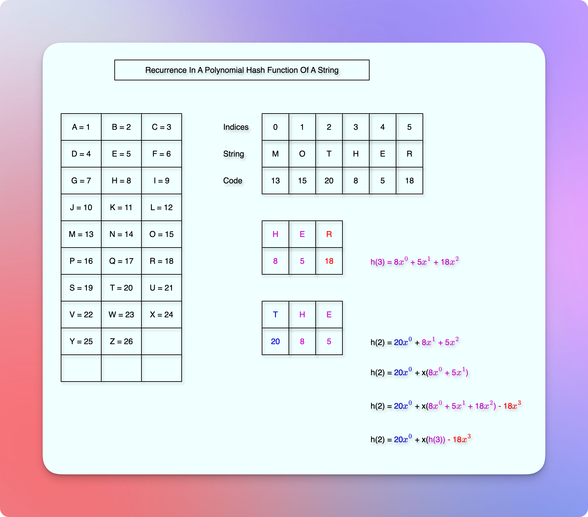

# Find Substring

<!-- TOC -->
* [Find Substring](#find-substring)
  * [Prerequisites](#prerequisites)
  * [Problem Statement](#problem-statement)
  * [Examples](#examples)
  * [Naive Approach](#naive-approach)
    * [Time Complexity](#time-complexity)
    * [Problems](#problems)
  * [Rabin-Karp Algorithm](#rabin-karp-algorithm-)
    * [Initial Implementation (Without optimization)](#initial-implementation-without-optimization)
    * [Explanation](#explanation)
    * [Realistic Analysis](#realistic-analysis)
      * [Recurrence Of A Polynomial Hash Function Of A String](#recurrence-of-a-polynomial-hash-function-of-a-string)
  * [Next](#next)
<!-- TOC -->

## Prerequisites

* [Hash Tables](05hashTables.md)
* [Universal Family Of Hash Functions](10universalFamilyOfHashFunctions.md)
* [Load Factor And Rehashing](15loadFactorAndRehashing.md)
* [Formula Of Universal Family Of Hash Functions](20formulaOfUniversalFamilyOfHashFunctions.md)
* [String Hashing](25stringHashing.md)

## Problem Statement

* Given a string `s` and a pattern `p`, we need to print the starting indices of `p` that we find within `s`.
* For example, if `s = abcdefabcdef`, and `p = abc`, then we can find the pattern `p` at `indices = 0, 6` in `s`.  

## Examples

* Searching for a word in a browser.
* Matching a pattern while studying genes.
* Matching a pattern in a computer system. 
* Etc.

## Naive Approach

```kotlin

fun findString(s: String, p: String) {
    val startingIndices = mutableListOf<Int>()
    for(i in 0..<(s.length - p.length)) {
        if (s[i] != p[0]) break
        if (s.substring(i, i + p.length) == p) {
            startingIndices.add(i)
        }
    }
    println(startinIndices)
}
```

* The comparison of the substring `S'` and `P` can be represented as below.

```kotlin

private fun areEqual(sub: String, p: String): Boolean {
    if (sub.length != p.length) return false
    for (i in 0..<sub.length) {
        if (sub[i] != p[i]) {
            return false
        }
    }
    return true
}
```

### Time Complexity

* The outer `for loop` iterates through almost every character of the given string `s` in the worst-case.
* And then when we compare the substring with the given pattern `p`, it checks each character.
* So, if the length of the string `s` is `n`, and the length of the pattern `p` is `m`, then it becomes `O(n * m)`.

### Problems

* The running time is inefficient.
* We get many false alarms (also known as spurious hits).
* For example, suppose `S` is `aaaa.....a`, where the length of `S` is 1000. 
* And the pattern `P` is `aaaa....b`, where the length of `P` is 10.
* Now, in this case, we would compare many substrings of `S` only to find that it is different from the pattern `P` when we reach the last character.
* We can do better than this.

## Rabin-Karp Algorithm 

* The idea is to use **string hashing** to compare each substring `S'` of the given string `S` with the pattern, `P`.
* Because we know that the collision probability of two different strings in string hashing is very low, if we take the prime number $p \geq (m * L)$, where `m` is the cardinality, and `L` is the length of the string.
* Reference: [String Hashing](25stringHashing.md#collision-probability-).
* So, we can reduce at least the number of false alarms.

### Initial Implementation (Without optimization)

* Find the hash code of the pattern, `P`.
* Find the hash code of each substring of `S`.
* If the hash code of a substring matches the hash code of the pattern `P`, compare the substring with the pattern.
* If it is a match, add the position `i` to the result list.

### Explanation

* Brute force works in $O(|T| * |P|)$ where `|T|` is the length of the given text and `|P|` is the length of the pattern. 
* Now, we try with hashing. 
* Instead of comparing the actual substring with the pattern, character by character, we compare the hash codes. 
* We calculate and compare the hash code of each substring with the hash code of the pattern. 
* We can calculate the hash code of the pattern once, and then reuse it every time while comparing it with the hash code of each substring. 
* Also, we get fewer false alarms (spurious hits) due to the property of a good polynomial hash function and a large prime number. 
* The probability of collision is: $\frac{|P|}{p}$. 
* Each comparison gets this probability of collision. 
* How many comparisons do we have? 
* We have a total of $|T| - |P| + 1$ comparisons. 
* So, expected number of false alarms are: $(|T| - |P| + 1) * \frac{|P|}{p}$. 
* If the big prime number $p >> |T||P|$, then the total false alarms are almost negligible. 
* It becomes less than 1. 
* Time of calculating the hash code of the pattern `P`:

$$
O(|P|) ----------(1)
$$

* Time of calculating the hash code of each substring of `T` * Number of substrings of `T`: 

$$
O(|P|) * O(|T| - |P| + 1) ---------(2)
$$

* If we combine (1) and (2), (2) is the dominant term. 
* Hence, the total running time becomes $O(|T| * |P|)$, which is the same as we have seen for the brute force.
* Calculate: `Time of "areEqual" * Number of times we call “areEqual”`. 
* Each `areEqual` call takes the running time of $O(|P|)$. 
* And the number of times we call the `areEqual` function can be split into two parts: Actual match and False alarms (Spurious hits). 
* Let us assume that “actual match” happens at “q” times.

$$
\text{ Actual match happens at "q" times} --------(3)
$$

* And we know how many times the “false alarms” can happen. 
* It is `Total substrings * probability of false alarm`.
* Each substring comparison has the probability of “false alarm” (collision) as:

$$
\frac{|P|}{p}
$$

* The total substrings are: 

$$
(|T| - |P| + 1)
$$

* Hence, the total possible collisions (false alarms) are:

$$
\left\lbrace(|T| - |P| + 1) * \frac{|P|}{p}\right\rbrace ------------(4)
$$

* So, the total number of times we call the `areEqual` method becomes:

$$
\text{ Actual Matches + False Alarms}
$$
$$
= q + \left\lbrace (|T| - |P| + 1) * (\frac{|P|}{p}) \right\rbrace .
$$

* Each `areEqual` method takes the running time of $O(|P|)$.
* Hence, the total running time of `areEqual` method becomes:

$$
O \left( \left[ q + \left\lbrace (|T| - |P| + 1) * (\frac{|P|}{p}) \right\rbrace \right] |P| \right) ———————————(5)
$$

* For the big prime number $p >> (|T| * |P|)$, We can simplify it as:

$$
O \bigg( (q + 1) |P| \bigg) ————————(6)
$$

* Now, we have the total time of the `areEqual` method and the total time of the `findSubstring` method.

$$
O \bigg( (|T| * |P|) + \left\lbrace (q + 1) |P| \right\rbrace \bigg) ———————(7)
$$

* Which seems worse than the naive algorithm, if not better than that!
* But the good thing is, we have control to improve this algorithm using a good hash function.
* Also, due to the polynomial property, the first part (where we calculate and compare hash codes) can be improved. 

### Realistic Analysis

* We know that calculating the hash code of the pattern takes $O(|P|)$ time.

$$
\text{ Calculating the hash code of the pattern = } O(|P|) -------------(8)
$$

* Now, we can improve the $O( |T| * |P| )$ part of the expression (7).
* It comes from the expression (2): 

$$
\text{Total substrings of T * Time of calculating the hash code of each substring}
$$

#### Recurrence Of A Polynomial Hash Function Of A String




* Let us take a mathematical example.
* Suppose we have the number `582793`, and the pattern length is `3`.
* The base is `10`.
* Now, the first window is `582`.
* So, $h(S_1) = (5 * 10^2) + (8 * 10^1) + (2 * 10^0) $.
* Note that the highest degree (power) of $h(S_1)$ is $2$.
* Now, the second window is `827`.
* We can reuse the previous hash code to calculate the hash code of this new window.
* We will use three constant-time operations instead of the full polynomial calculation from scratch.
* Subtraction, multiplication, and addition.
* We subtract the outgoing character `5`, multiply the remaining part `82` by the base, and add the new character `7`.
* **Subtract the outgoing character as $T[i] * x^{\text{highest power of }h(S_1)}$**
* $T[i] = 5$ and the highest power of $h(S_1)$ is $2$.
* So, the subtraction term is: $(5 * 10^2)$.
* $h(S_1) - (5 * 10^2) = 582 - 500 = 82$
* **Multiply by the base**
* $82 * 10 = 820$
* **Add new (next) character**
* $820 + 7 = 827$
* We calculated the hash code of the first window only.
* And then, we just do three constant-time operations: Subtraction, Multiplication, and Addition.
* We do not calculate the hash code of each window.
* The realistic analysis proves that the average running time of calculating each substring is $O(1)$, not $O(|P|)$.
* This is due to the property of the polynomial hash function. 
* It allows us to calculate a hash code of the next substring in $O(1)$ using the hash code of the previous substring.
* So, if 1 substring takes $O(1)$, then the total of `T` substrings, take $O(|T|)$ time. 
* Hence, the first part came down from $O( |T| * |P| )$ to $O( |T| )$.

$$
\text{ Time of calculating the hash code of 1 substring of T = } O(1)
$$
$$
\text{ Time of calculating the hash code of all the substrings of T = } O(T) -------(9)
$$

* If we use these expressions in (7), it becomes:

$$
O \bigg( ( |T| + |P| ) + \left\lbrace (q + 1) |P| \right\rbrace \bigg) ———————(10).
$$

* If the actual matches “q” is small, then the dominant term is: 

$$
\text{Time of finding matching substrings using hash code = } O ( |T| + |P| ) -----(11)
$$

* Now, this is a great improvisation compared to the naive algorithm that gives the running time of $O( |T| * |P| )$.

## Next

* [Hash Questions](35hashQuestions.md)
* [Hashing In Blockchain](40hashingInBlockchain.md)
* [Precomputed Prefixed Hashes](45precomputedPrefixHashes.md)
* [String Hashing Revision](50stringHashingRevision.md)
* [Relevant DSA Problems](60relevantDsaProblems.md)