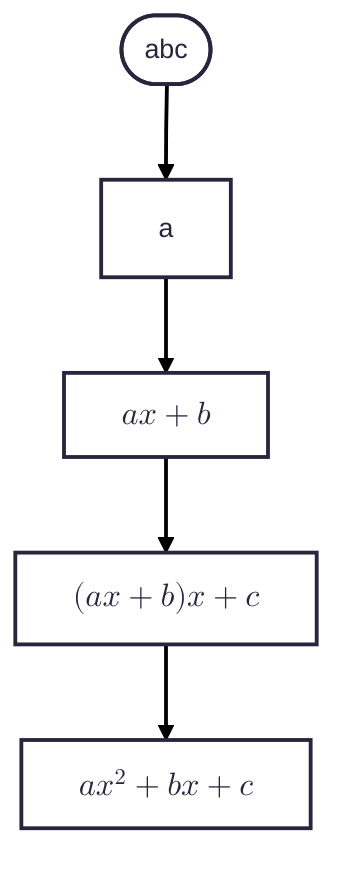

# String Hashing Revision

<!-- TOC -->
* [String Hashing Revision](#string-hashing-revision)
  * [Horner's Method Of Polynomial String Hashing](#horners-method-of-polynomial-string-hashing)
  * [Calculating The Highest Degree Base](#calculating-the-highest-degree-base)
  * [Substring Hashing From The Previous Substring Hash (Rabin-Karp, Rolling Hash, Sliding Window)](#substring-hashing-from-the-previous-substring-hash-rabin-karp-rolling-hash-sliding-window)
  * [Precomputed Prefix Hashing](#precomputed-prefix-hashing)
<!-- TOC -->

## Horner's Method Of Polynomial String Hashing

* Character by character
* Horner's Method to make it a polynomial


$$
hash = \left( (hash * xBase) + S[i].code.toLong() \right) \text{ % prime}
$$

```kotlin

var hash = 0
for (i in 0 until text.length) {
    hash = ( (hash * xBase) + text[i].code.toLong() ) % prime
}

```



## Calculating The Highest Degree Base

```kotlin
private val prime = 1_000_000_007L
private val xBase = 263L
private fun highestDegreeOfBase(substring: String): Long {
    // x^0 = 1
    var highestDegreeOfBase = 1L
    for (i in 1..<substring.length) {
        highestDegreeOfBase = (highestDegreeOfBase * xBase) % prime 
    }
    return highestDegreeOfBase
} 
```

## Substring Hashing From The Previous Substring Hash (Rabin-Karp, Rolling Hash, Sliding Window)

* Calculate the [Highest degree of the base](#calculating-the-highest-degree-base)
* Calculate the [hash](#string-hashing) of the first substring = $h(i)$
* Subtraction (Outgoing character):

$$
h(i + 1) = \left(h(i) - (T[i].code.toLong() * x^{\text{|P| - 1}}) \right) \text{ % prime}
$$

* Multiplication (by base):

$$
h(i + 1) = \left(h(i + 1) * xBase \right) \text{ % prime}
$$

* Addition (Incoming character):

$$
h(i + 1) = \left( h(i + 1) + T[i + |P|].code.toLong() \right) \text{ % prime}
$$

* Ensure Positive Values Within Prime Range:

$$
h(i + 1) = \left(h(i + 1) \text{ % prime + prime} \right) \text{ % prime} 
$$

## Precomputed Prefix Hashing

* Quick revision (Pseudocode)

$$
H(a, l) = \left( H(a + l) - ( H(a) * x^l ) \right) \text{ % prime}
$$

```kotlin
private val actualFullString = "inputString"
private val n = actualFullString.length

private val prime1 = 1_000_000_007L
private val prime2 = 1_000_000_009L
private val xBase = 263L

private val prefixHash1 = LongArray(n + 1)
private val prefixHash2 = LongArray(n + 1)
private val prefixBase1 = LongArray(n + 1)
private val prefixBase2 = LongArray(n + 1)

init {
    // x^0 = 1
    prefixBase1[0] = 1L
    prefixBase2[0] = 1L
}

private fun precomputePrefixHash(inputString: String) {
    // Horner's string polynomial hashing method
    for (i in 1..inputString.length) {
        // Two hash codes for each substring
        prefixHash1[i] = ( prefixHash1[i - 1] * xBase + inputString[i - 1].code.toLong() ) % prime1 
        prefixHash2[i] = ( prefixHash2[i - 1] * xBase + inputString[i - 1].code.toLong() ) % prime2
        
        // Powers of base
        prefixBase1[i] = ( prefixBase1[i - 1] * xBase ) % prime1
        prefixBase2[i] = ( prefixBase2[i - 1] * xBase ) % prime2
    }
}

private fun substringHash(startingIndex: Int, length: Int): Pair<Long, Long> {
    // Formula: H(a, l) = H(a + l) - H(a) * powersOfBase(l)
    val longHash1 = prefixHash1[startingIndex + length]
    val shortHash1 = prefixHash1[startingIndex]
    val power1 = prefixBase1[length]
    val subtract1 = ( shortHash1 * power1 ) % prime1
    
    var hash1 = ( longHash1 - subtract1 ) % prime1
    hash1 = (hash1 % prime1 + prime1) % prime1
    
    val longHash2 = prefixHash2[startingIndex + length]
    val shortHash2 = prefixHash2[startingIndex]
    val power2 = prefixBase2[length]
    val subtract2 = ( shortHash2 * power2 ) % prime2
    
    var hash2 = ( longHash2 - subtract2 ) % prime2
    hash2 = (hash2 % prime2 + prime2) % prime2
    
    return hash1 to hash2
}

private fun areEqual(startingIndex1: Int, startingIndex2: Int, length: Int): Boolean {
    val (hash1a, hash2a) = substringHash(startingIndex1, length)
    val (hash1b, hash2b) = substringHash(startingIndex2, length)
    return hash1a == hash1b && hash2a == hash2b
}
```