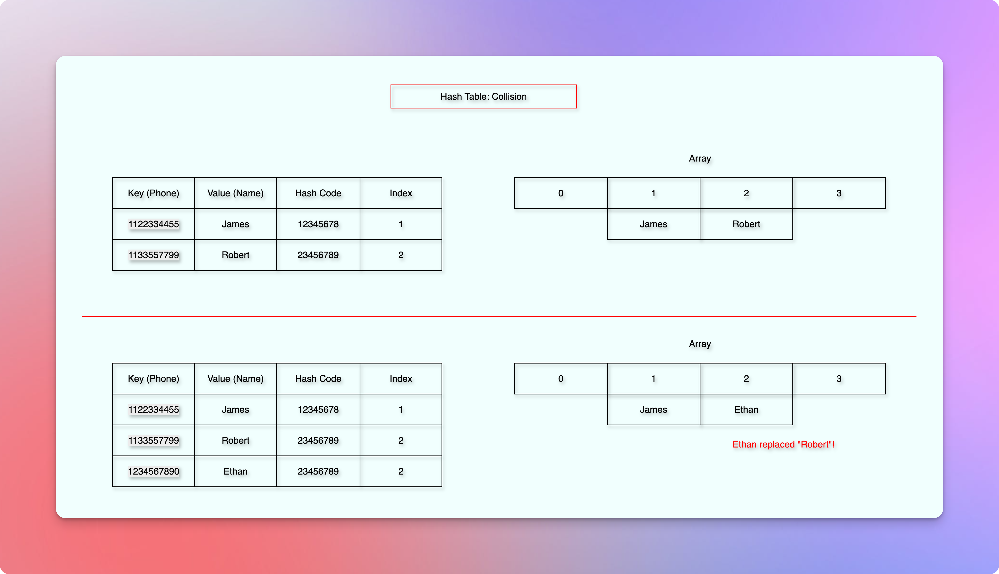
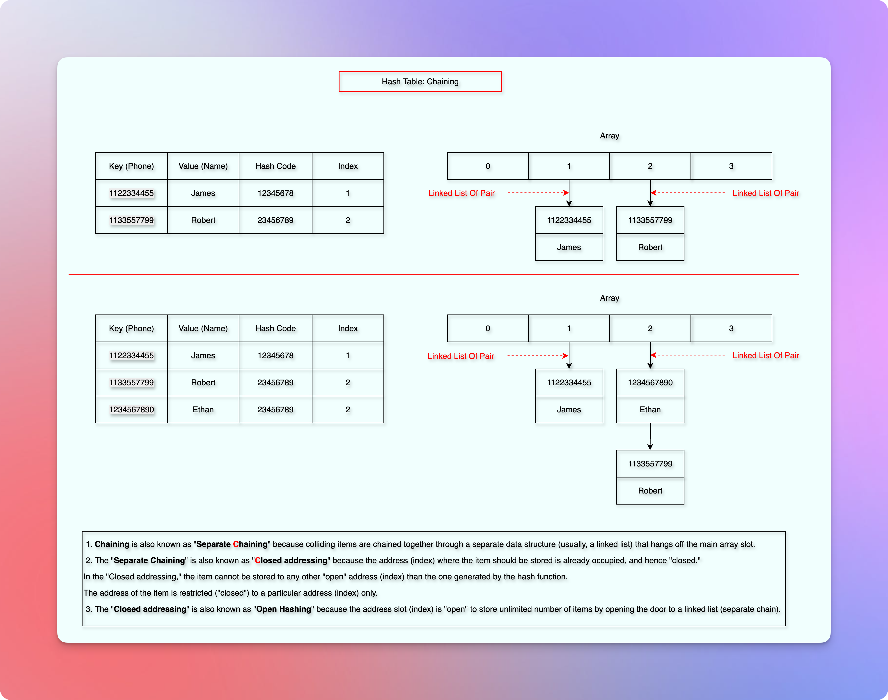
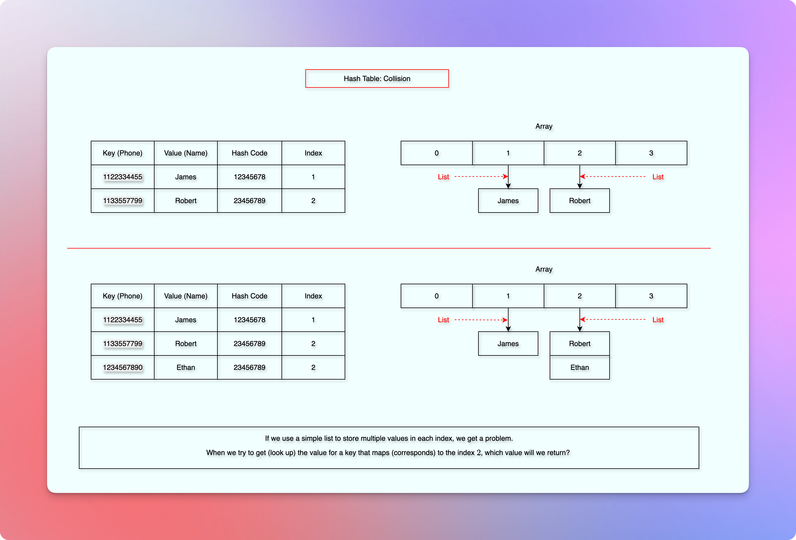

# Hash Tables

<!-- TOC -->
* [Hash Tables](#hash-tables)
  * [Resources / References](#resources--references)
  * [Time complexity in various data structures](#time-complexity-in-various-data-structures)
  * [Problem/Requirement](#problemrequirement)
  * [ToDo](#todo)
  * [Direct Addressing](#direct-addressing)
  * [Hash Function](#hash-function)
    * [Introduction](#introduction)
    * [Technical Definition](#technical-definition)
      * [Formula](#formula)
      * [Definition](#definition)
    * [Load Factor](#load-factor)
    * [Properties](#properties)
  * [Map](#map)
    * [Methods](#methods)
    * [Technical Definition](#technical-definition-1)
    * [Examples](#examples)
  * [Collision](#collision)
  * [Chaining](#chaining)
  * [Asymptotic Analysis with Pseudocode](#asymptotic-analysis-with-pseudocode)
    * [HasKey(key)](#haskeykey)
    * [Get(key)](#getkey)
    * [Set(key, value)](#setkey-value)
    * [Analysis](#analysis)
<!-- TOC -->

## Resources / References

**Overview**
* Very good overview - short and sweet - clear and concise: Gate Smashers
* [Gate Smashers](https://youtu.be/W5q0xgxmRd8?si=3rhBhehtPSW5O-7w)

**Application**
* [Monis Yousuf](https://youtu.be/pMM9cIAFAug?si=4dtGaEEywYDxLPiP)
* [Simplilearn](https://youtu.be/jmtzX-NPFDc?si=dCNRHOF93cFlI4w7)

**Internals**
* [Arpit Bhayani](https://youtube.com/playlist?list=PLsdq-3Z1EPT2UnueESBLReaVSLIo_BuAc&si=mbgu-ku-Zw5_9nil)

## Time complexity in various data structures

* ToDo: A table to show various time complexities for various data structures for various operations like insert, search(access, get), update, delete, etc.  
* Maybe in the form of tables? with notes?
* [WIP - Comparison](../revision/comparison.md)

## Problem/Requirement

* Faster search. 
* Faster insertion and deletion.
* Storing key-value pairs.

## ToDo

* We need to ensure that this document does not introduce `disconnection`.
* What problem does it solve? (Why do we need it? Benefits?)
* How? (How does it work? Implementation. Analysis.)
* When to use it?
* Comparison.
* Completeness of this document as per our defined standard.
* Correctness of this document.

## Direct Addressing

* ToDo: Explain the problem with an example.
* Add approximate size to store $2^{32}$ values!
* Explain the memory waste problem. 

## Hash Function

### Introduction

* A `hash function` takes a `key` as an argument, and generates a unique `hash code` for the given key.
* The `hash function` is a deterministic function. 
* It means that it always generates the same `hash code` for the same key.
* Also, the type and size of the input key can be anything.
* So, the domain and size of the input key can be anything.
* This is the reason we often call the domain of the key a `universe`.
* But the domain and size of the `hash code` remain the same.
* A `hash code` is always a `whole number`.
* And the size of the `hash code` remains the same for all the different keys.
* We then compress this `hash code` to produce an index from `[0,..,m-1]`, where `m` is the size of the `hash table`.  
* To compress the `hash code`, we use `hashCode % size of the hash table`.
* So, `index = hashCode % m,` where `m` is the size of the hash table.
* So, this is how the given `key` becomes an `index`.
* The range of this index is called **cardinality**.
* It means that the total number of possible unique outputs.
* We know that this range is limited. `R = [0,..,m-1]`, where `m` is the size of the hash table. 
* But the domain and size of the input `key` are almost infinite.
* It means that we might end up getting the same `index` for different `keys`.
* This incident is called `collision`.
* Technically, if more than one `keys` get the same `index` value, we call it `collision`.
* For example, we have only two seats, but we have sold them to 10 different people.
* Clearly, more than one person will try to claim the seat.
* So, we have limited seats for an unlimited number of people. 
* We will be learning more about the `collision` a bit later.
* We will also see that it should be impossible to produce the input `key` from the output.
* It means that the `hash function` should be `irreversible`. 
* But for now, let us see the technical definition of the `hash function`.

### Technical Definition

#### Formula

$$
h: U \to [0, \dots, m - 1]
$$

* `h` The hash function.
* `:` Read as: "is a function that maps".
* `U` The domain, the universe of all possible keys.
* `->` Read as `to`
* `[0,..,m - 1]` The range, the set of all possible array indices.

#### Definition

* A hash function `h` is a deterministic function that maps an input key `k` of arbitrary size from a large domain `U` (the universe of keys) to a fixed-size output `h(k)` (also known as a `hash code`), which is then compressed to a smaller index within the range `R = [0,..,m - 1]`, where `m` is the size of the `hash table`. 

### Load Factor

* We might think that if we have a large hash table (so, a higher cardinality), we might get fewer collisions.
* But then we spend more memory. Right?
* And if we have a smaller cardinality, we increase the possibility of collision, right?
* So, how do we manage this? Is there a standard ratio or measurement?
* Yes. We call it a **load factor**.

$$
\text{Load factor } \alpha = \frac{n}{m}, \text{ where n is the number of items, and m is the hash table size}
$$

* We try to maintain this ratio at around `0.75`.
* We will also learn more about it.

### Properties

* A hash function should be deterministic.
* It means that the same input should produce the same output.
* The output must be of fixed size.
* The hash function should be irreversible.
* It means that it should be impossible to get the input key from the output.
* The hash function should be fast enough. 
* So that we can perform various operations such as find, insert, update, delete, etc., fast enough.
* The possibility of collision should be minimized.

## Map

* A [hash function](#hash-function) ultimately leads us to an `index` where we can save the data.
* But, how do we save the data?
* We save the data as a pair of key and value.
* To store data in a key-value pair, we use a `Map`.
* A `Map` is an abstract data structure that maps (connects) two sets: A set of `keys` to a set of `values`.
* Let us say the set of `keys` is `S`, and the set of `values` is `V`.
* Then, a `Map` is an abstract data structure that maps (connects) from set `S` of objects (keys) to set `V` of values.
* If there is a `map` from set `S` to `V`, the objects of the set `S` are called `keys` and the objects of the set `V` are called `values`.
* Duplicate `keys` are not allowed. 
* Hence, each possible `key` appears at most once.
* There can be multiple `key-value` pairs.
* Hence, the `map` stores a collection of such `key-value` pairs.

### Methods

**HashKey(object)**

* Checks whether there is any value corresponding to the given object (key).

**Get(object)**

* Returns the value corresponding to the given object (key) if any.

**Set(object, value)**

* It takes two arguments: `object` (key) and `value`.
* And sets the `value` corresponding to the given `object` (key) in the `map`.

### Technical Definition

* A `Map` is an Abstract Data Type (ADT) that stores a collection of key-value pairs, where a duplicate key is not allowed, and it offers various operations such as `HashKey`, `Get`, `Set`, etc.

### Examples

* A name is a key, and a phone number is a value.
* A roll number is a key, and a student name is a value.
* An account number is a key, and the account balance is a value.
* A word in a dictionary is a key, and the definition is a value.
* An item ID is a key, and the item price is a value.
* Etc.

## Collision

* Collision is an incident when we get the same `index` for different unique `keys`.



* It happens because we map a larger set of keys to a smaller set of indices.
* The domain and size of the key are almost infinite.
* But the size of our `hash table` is limited to achieve better performance than the [direct addressing](#direct-addressing).
* If we have more pigeons than the pigeonholes, then at least one pigeonhole will share more than one pigeon.
* This is known as the pigeonhole principle.
* If we have more `keys` than `indices`, then at least one `index` will share more than one `key`.
* When multiple `keys` share the same `index`, we want to ensure we don't unintentionally overwrite the old value. 
* We don't want to lose any value during such an incident.
* We want to adjust and fit multiple values during such an incident.
* So, how do we do that?
* [Chaining](#chaining) is one of the many ways to do that.
* So, let us start with [chaining](#chaining).

## Chaining

* We have already learned in the [hash function](#hash-function) how a `key` becomes an `index`.
* In this section, we will be storing the `value`, and handling the `collision`.



* Let us assume that we have a phone number, `1122334455` as a key.
* We use the [hash function](#hash-function) to get the corresponding `index` to save the `value`.
* Suppose we got the index `1`.
* Without considering the [collision](#collision), we might directly insert the `value` at the generated `index`.
* But when [collision](#collision) happens, it might overwrite the old value.
* So, we need a better structure.
* As a chaining solution, we expand the capacity of each index in such a way that it can contain more than one value.
* So, instead of storing a single value, each index stores a list.



* But if we use a simple list of values for each index, we still have a problem.
* Suppose, at index `2`, we have multiple values.
* Now, for a `key` that maps to index `2`, which value will we return?
* So, we use a list of pairs.


* Each index stores a list of pairs.
* To avoid the `shifting` problem, we use a `linked list` instead of a simple `list`.
* And to avoid the worst-case search time of the `linked list`, that is `O(n)`, we switch to a `balanced binary tree` (For example, a Red-Black Tree) when we hit a threshold.

## Asymptotic Analysis with Pseudocode

* If the array is `chains`, then at any particular `index`, it gives us a `chain` of a linked list.

### HasKey(key)

```kotlin
fun <T> hashKey(key: T): Boolean {
    //The index of the `chains` array gives us a linked list at that position
    val chain = chains[hash(key)]
    // We iterate through the entire linked list `chain` to find the `key-value`
    for ((_key, value) in chain) {
        if (key == _key) {
            return true
        }
    }
    return false
}
```

### Get(key)

```kotlin

fun <T, V> get(key: T): V? {
    val chain = chains[hash(key)]
    for ((_key, value) in chain) {
        if (key == _key) {
            return value
        }
    }
    return null
}
```

### Set(key, value)

```kotlin

fun <T, V> set(key: T, value: V) {
    val chain = chains[hash(key)]
    // If we already have this `key`, we replace the value.
    for ((_key, _value) in chain) {
        if (key == _key) {
            chain[_key] = value
        }
    }
    // Otherwise, we add this new key-value pair.
    chain.add(key to value)
}
```

### Analysis

**Time Complexity**

* If we have `n` keys, the size of a particular `chain` can be `n` in the worst-case, where all the `keys` go at the same `index`.
* So, the worst-case time complexity is `O(n)`.

**Space Complexity**

* We take `key-value` pairs.
* Hence, if we have `n` keys, then we would have `n` key-value pairs.
* Also, we use an array of size, `m`, where each index contains a linked list.
* The maximum size of any linked list can be at most `n` in a array of size `m`.
* Hence, the space complexity is `O(n + m)`.


