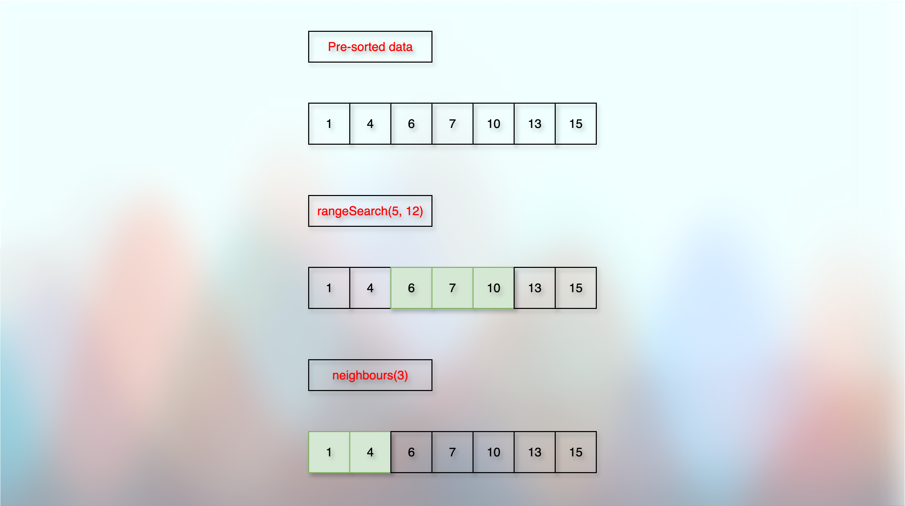

# Binary Search Trees

<!-- TOC -->
* [Binary Search Trees](#binary-search-trees)
  * [Prerequisites/References](#prerequisitesreferences)
  * [Introduction](#introduction)
  * [Examples](#examples)
    * [Why `BST`?](#why-bst)
      * [Post-sorted Operations](#post-sorted-operations)
      * [Problems with the known data structures](#problems-with-the-known-data-structures)
        * [Arrays](#arrays)
        * [Linked Lists](#linked-lists)
        * [Hash Table](#hash-table)
      * [Search](#search)
    * [`In-Order(Left-Parent-Right)` Traversal is sorted](#in-orderleft-parent-right-traversal-is-sorted)
    * [Building a BST (Binary Search Tree)](#building-a-bst-binary-search-tree)
    * [Terminologies](#terminologies)
      * [Successor](#successor)
      * [Predecessor](#predecessor)
  * [Questions](#questions)
    * [What is the difference between a binary tree and a binary search tree?](#what-is-the-difference-between-a-binary-tree-and-a-binary-search-tree)
  * [ToDos](#todos)
  * [Next](#next)
<!-- TOC -->

## Prerequisites/References

* [Trees](../module01BasicDataStructures/section03trees/010trees.md)
* [Basic Data Structure Questions](../module01BasicDataStructures/questionsOnBasicDataStructures.md)
* [Priority Queues](../module03priorityQueuesHeapsDisjointSets/section01priorityQueuesIntroduction/priorityQueues.md)
* [Binary Heap Trees](../module03priorityQueuesHeapsDisjointSets/section02priorityQueuesUsingHeaps/topic02BinaryHeapTrees/binaryHeapTrees.md)
* [Complete Binary Tree](../module03priorityQueuesHeapsDisjointSets/section02priorityQueuesUsingHeaps/topic03CompleteBinaryTrees/completeBinaryTrees.md)
* [Heap Sort](../module03priorityQueuesHeapsDisjointSets/section03HeapSort/heapSort.md)


## Introduction


* Left child < Parent < Right Child.
* Left child is less than the parent.
* Parent is less than the right child.
* For a node `N`, its value is larger than the descendants of its left child, and smaller than the descendants of its right child.

```kotlin

data class TreeNode(
    var key: Int,
    var parent: TreeNode? = null,
    var leftChild: TreeNode? = null,
    var rightChild: TreeNode? = null
)

```

## Examples


* A and C are not proper binary search trees.
* In `C`, `4` is at the right subtree of the node `5`.
* But `4 < 5`. So, `4` should have been at the left subtree of the node `5`.
* B is a proper binary search tree.

### Why `BST`?

#### Post-sorted Operations



* **Any operation that works faster on a pre-sorted data.** 
* We might want to get the list of all the students with marks between **a particular range.**
* We might want to get the list of a few students with marks below and above **a particular range**. So, a list of students with marks **near the given range**.
* We might want to get the list of all the emails between **a particular date range**.
* We might want to return **all the words** from a dictionary that starts with the **first letter of a given string**.

#### Problems with the known data structures

* Reference: [Priority Queue](../module03priorityQueuesHeapsDisjointSets/section01priorityQueuesIntroduction/priorityQueues.md)


##### Arrays

* An unsorted array would take `O(n)` time to find a range or neighbours.
* A sorted array would take `O(n)` time for `insert`, and `delete` operations.

##### Linked Lists

* An unsorted linked list would take `O(n)` time to find a range or neighbours.
* A sorted linked list would take `O(n)` time for the `insert` operation.
* We cannot perform the `Binary Search` on a linked list.
* Because a linked list is not a contiguous data structure.

##### Hash Table

* Look up is fine in a hash table. We can do it in `O(1)`.
* But comparing and searching for a particular range, or neighbour, is almost impractical. We have to compare each element with all the other elements.

#### Search

* A normal binary tree can take `O(n)` (linear time) for searching a node, because we have to check each node. Reference: [Trees](../module01BasicDataStructures/section03trees/010trees.md).
* Whereas, a BST takes `O(Tree Height) = O(log n)` for searching.


* For example, in the given image, we want to find `6`.
* We may start with the root node: `3`.
* We compare `3` and `6`. 
* We find that `6 > 3`. 
* It means that `6` must be at the right side.
* So, we completely discard the left side of `3`.
* We check the right child of `3`.
* We find the right child of `3` is `5`.
* We compare `5` and `6`.
* We find that `6 > 5`.
* It means that `6` must be at the right side.
* So again, we completely discard the left side of `5`.
* We check the right child of `5`.
* We find the right child of `5` is `6`.

### `In-Order(Left-Parent-Right)` Traversal is sorted


* We may start the traversal with the root (parent) node `3`.
* The `In-order` traversal follows `Left-Parent-Right` order.
* So, we always prioritize and cover the `Left` children first.
* Then, we cover the `parents`.
* And in the end, we cover the `Right` children.
* The process looks like below:
---
> Start: Standing at a node. This is the current parent.     
> Cover the left child. Repeat from the start until there is no more left child.    
> Cover the node itself.    
> Cover the right child. Repeat from the start.    
---
* So, standing at `3`, we ask: Do we have a `left` child? 
* Yes, we have: `2`. It becomes the current parent.
* Again, standing at `2`, we ask: Do we have a `left` child?
* Yes, we have: `1`. It becomes the current parent.
* Again, standing at `1`, we ask: Do we have a `left` child?
* No. 
* So, we cover the current `parent`, that is `1`. 
```
1
```
* After covering the parent, we ask: Do we have a `right` child?
* No. 
* So, it is time to cover the `immediate parent` of the `current parent`.
* The immediate parent of the current parent `1` is `2`.
* Now, the the current parent is `2`.
* Did we cover the left child of the current parent? Yes.
* So, we cover the current parent, `2`.
```
1 --> 2
```
* After covering the parent, we ask: Do we have a `right` child?
* No. 
* So, it is time to cover the `immediate parent` of the `current parent`.
* The immediate parent of the current parent, `2` is `3`.
* Now, the current parent is `3`.
* So, we cover `3`.
```
1 --> 2 --> 3
```
* After covering the parent, we ask: Do we have a `right` child?
* Yes.
* The right child is `5`.
* So, it becomes the current parent.
* Standing at the parent, we ask: Do we have a `left` child?
* Yes.
* The left child is `4`.
* So, it becomes the current parent.
* Standing at the parent, we ask: Do we have a `left` child?
* No.
* So, we cover the current parent, `4`.
```
1 --> 2 --> 3 --> 4
```
* After covering the parent, we ask: Do we have a `right` child?
* No.
* Cover the immediate parent, `5`.
```
1 --> 2 --> 3 --> 4 --> 5
```
* After covering the parent, we ask: Do we have a `right` child?
* Yes. 
* Go to the right child, `6`.
* Ask: Do we have a `left` child?
* No.
* Cover the current parent, `6`.
```
1 --> 2 --> 3 --> 4 --> 5 --> 6
```
* After covering the parent, we ask: Do we have a `right` child?
* No.
* Done.

### Building a BST (Binary Search Tree)

* Let us say, we have an array: {3, 2, 1, 5, 6, 4}.
* We want to build a binary search tree (BST) for it.
* We cover each element of the array, one by one, one at a time.
* We compare each element of the array with the BST using the `in-order` traversal.
* The first element is: `3`.
* The BST does not have any node yet. 
* There is no root node in the BST yet.
* So, in that case (a base case), the incoming element becomes the root.


* Then, we get `2`.
* So, we compare it with the root: `3`.
* `3` > `2`. So, `2` goes to the left.
* There is no element to the left of the `3`.
* So, we set `2` to the left of `3`.


* Then, we get `1`.
* We start with the root, `3`. 
* We compare it with the root, `3`.
* `3` > `1`. So, `1` goes to the left of `3`.
* When we go to the left of `3`, we find `2`.
* So, we compare `1` with `2`.
* `2` > `1`. So, `1` goes to the left of `2`.


* Then, we get `5`.
* We compare it with the root, `3`.
* `3` < `5`. So, `5` goes to the right of `3`.
* When we go to the right of `3`, we don't find any node.
* So, we set `5` to the right of `3`.


* Then, we get `6`.
* We compare it with the root, `3`.
* `3` < `6`. So, we travel to the right of `3`.
* We get `5`. We compare it with `6`.
* `5` < `6`. So, `6` goes to the right of `5`.
* We travel to the right of `5`.
* We find nothing.
* So, we place `6` to the right of `5`.


* Then, we get `4`.
* We compare it with the root, `3`.
* `3` < `4`. So, we travel right to `3`.
* We get `5`. We compare it with `4`.
* `5` > `4`. So, we travel left to `5`.
* We find nothing.
* So, we place `4` to the left of `5`.


* We processed all the elements.


### Terminologies


#### Successor

* The next large node of the current node is called a successor.
* For example, if we are at `5`, then the successor is `6`.

#### Predecessor

* The previous small node of the current node is called a predecessor.
* For example, if we are at `5`, then the predecessor is `3`.

## Questions

### What is the difference between a binary tree and a binary search tree?

* A binary tree has no strict rules regarding the left child, parent, and right child values.
* Any node having at most two children (one left and one right) is an enough condition for a binary tree.
* However, for a binary search tree, the left subtree must be strictly smaller (less) than the parent node, and the right subtree must be strictly greater than the parent node.
* In a binary search tree, we cannot have any node in the left subtree greater than or equal to the parent node.
* Similarly, we cannot have any node in the right subtree smaller than or equal to the parent node.

## ToDos

* Standard proofread

## Next

* [Basic Operations Of A Binary Search Tree (BST)](10binarySearchTreesBSTsBasicOperations.md)
* [Binary Tree Implementation](../../../../../src/courses/uc/course02dataStructures/module05binarySearchTrees/010binarySearchTree.kt)
* [BST: Self-Balancing = AVLTree](15binarySearchTreesBSTBalance.md)
* [AVLTree: Insert Operation](20avlTreeInsertOperation.md)
* [AVLTree: Delete Operation](25avlTreeDeleteOperation.md)
* [AVLTree: Implementation](../../../../../src/courses/uc/course02dataStructures/module05binarySearchTrees/030avlTreeImplementation.kt)
* [AVLTree: Merge Operation](30avlTreeMergeOperation.md)
* [AVLTree: Split Operation](40avlTreeSplitOperation.md)
* [AVLTree: Kth Small Key](50avlTreeFindKthSmallKey.md)
* [Flip (Replace) Using An AvlTree](60flipReplaceWithAvlTree.md)
* [Splay Trees](70splayTrees.md)
* [Red-Black Trees](80redBlackTrees.md)