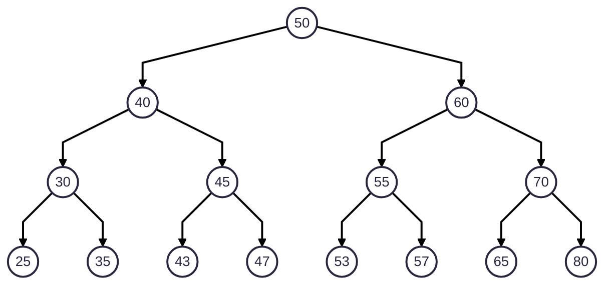

# Binary Search Tree (BST) Traversal: Quick Revision

<!-- TOC -->
* [Binary Search Tree (BST) Traversal: Quick Revision](#binary-search-tree-bst-traversal-quick-revision)
  * [Prerequisites/References](#prerequisitesreferences)
  * [Example](#example)
    * [Depth-First-Search](#depth-first-search)
      * [Depth-First-Search: Pre-Order: Parent(Root)-Left-Right](#depth-first-search-pre-order-parentroot-left-right)
      * [Can a particular order of push and pop operations of a stack produce DFS-Pre-Order traversal of a BST?](#can-a-particular-order-of-push-and-pop-operations-of-a-stack-produce-dfs-pre-order-traversal-of-a-bst)
      * [Depth-First-Search: In-Order: Left-Parent(Root)-Right](#depth-first-search-in-order-left-parentroot-right)
      * [Depth-First-Search: Post-Order: Left-Right-Parent(Root)](#depth-first-search-post-order-left-right-parentroot)
    * [Breadth-First-Search (Level-By-Level-Top-To-Bottom-Left-To-Right)](#breadth-first-search-level-by-level-top-to-bottom-left-to-right)
  * [Next](#next)
<!-- TOC -->

## Prerequisites/References

* [Trees](../module01BasicDataStructures/section03trees/010trees.md)
* [Tushar Roy: Binary Search Tree-BST: Pre-Order Traversal Using A Stack](https://youtu.be/elQcrJrfObg?si=0mJhLS3Z-k05a6O0)
* [Tushar Roy: Binary Search Tree-BST: In-Order Traversal Using A Stack](https://youtu.be/nzmtCFNae9k?si=6imsFFpH3wHfZzbx)
* [Tushar Roy: Binary Search Tree-BST: Post-Order Traversal Using A Stack](https://youtu.be/xLQKdq0Ffjg?si=3GOfPN1gVtUu7Daz)

## Example



### Depth-First-Search

#### Depth-First-Search: Pre-Order: Parent(Root)-Left-Right

> 50, 40, 30, 25, 35, 45, 43, 47, 60, 55, 53, 57, 70, 65, 80 

---
* Visit the current node eagerly.
* Then, keep going on the left side.
* Cover the left side.
* Then, cover the right side.
---
* Standing at any current node, we can ask, look, and check:
* Did I cover the parent first?
  * Does the parent come first before the left side?
* After me as a parent, do I cover the left side?
* After covering my left side, do I cover the right side?
  * Does the right side come after the left side?
---

#### Can a particular order of push and pop operations of a stack produce DFS-Pre-Order traversal of a BST?

* A stack follows LIFO.
* So, the node we want to process (output, print, etc.) first, should be added last in the stack.
* We start our journey with the root.
* We add it to the stack.

```ascii

|      |
|      |
|      |
|      |
+------+
|  50  |
+------+
```

* And then, we pop it, we get `50`, and we process it.
> 50, 
* But after we pop it, we add its right child first, followed by the left child.

```ascii

|      |
|      |
|      |
+------+
|  40  |
+------+
|  60  |
+------+
```

* We pop it, we get `40`, and we process it.
> 50, 40,
* After we pop it, we add its right child, and then its left child.

```ascii

|      |
|      |
+------+
|  30  |
+------+
|  45  |
+------+
|  60  |
+------+

```

* We pop `30`, and process it.
> 50, 40, 30
* Then, we add its right child followed by the left child.

```ascii

|      |
|      |
+------+
|  25  |
+------+
|  35  |
+------+
|  45  |
+------+
|  60  |
+------+

```

* We pop `25`, and process it.
> 50, 40, 30, 25,
* Then, we add its right child followed by the left child.
* It doesn't have any child.
* So, we pop the next element.

```ascii

|      |
|      |
|      |
|      |
+------+
|  35  |
+------+
|  45  |
+------+
|  60  |
+------+

```

* We pop `35`, and process it.
> 50, 40, 30, 25, 35,
* Then, we add its right child followed by its left child.
* But it doesn't have any child.
* So, we pop the next element.

```ascii

|      |
|      |
|      |
|      |
+------+
|  45  |
+------+
|  60  |
+------+
```

* We pop `45`, and process it.
> 50, 40, 30, 25, 35, 45,
* Then, we add its right child followed by its left child.

```ascii

|      |
|      |
|      |
|      |
+------+
|  43  |
+------+
|  47  |
+------+
|  60  |
+------+

```

* We pop `43`, and process it.
> 50, 40, 30, 25, 35, 45, 43, 
* Then, we add its right child first, followed by its left child.
* But it doesn't have any child.
* So, we pop the next element.

```ascii

|      |
|      |
|      |
|      |
+------+
|  47  |
+------+
|  60  |
+------+

```

* We pop `47`, and process it.
> 50, 40, 30, 25, 35, 45, 43, 47, 
* Then, we add its right child, followed by the left child.
* But, it doesn't have any child.
* So, we pop the next element.

```ascii

|      |
|      |
|      |
+------+
|  60  |
+------+

```

* We pop `60`, and process it.
> 50, 40, 30, 25, 35, 45, 43, 47, 60, 
* Then, we add its right child, followed by the left child.

```ascii

|      |
|      |
|      |
|      |
+------+
|  55  |
+------+
|  70  |
+------+

```

* We pop `55`, and process it.
> 50, 40, 30, 25, 35, 45, 43, 47, 60, 55
* Then, we add its right child, followed by the left child.

```ascii

|      |
|      |
|      |
|      |
+------+
|  53  |
+------+
|  57  |
+------+
|  70  |
+------+

```

* We pop `53`, and process it.
> 50, 40, 30, 25, 35, 45, 43, 47, 60, 55, 53, 
* Then, we add its right child, followed by the left child.
* But, it doesn't have any child.
* So, we pop the next element.

```ascii

|      |
|      |
|      |
|      |
+------+
|  57  |
+------+
|  70  |
+------+

```

* We pop `57`, and process it.
> 50, 40, 30, 25, 35, 45, 43, 47, 60, 55, 53, 57,
* Then, we add its right child, followed by the left child.
* But, it doesn't have any child.
* So, we pop the next element.

```ascii

|      |
|      |
|      |
|      |
+------+
|  70  |
+------+

```

* We pop `70`, and process it.
> 50, 40, 30, 25, 35, 45, 43, 47, 60, 55, 53, 57, 70, 
* Then, we add its right child, followed by the left child.

```ascii

|      |
|      |
|      |
|      |
+------+
|  65  |
+------+
|  80  |
+------+

```

* We pop `65`, and process it.
> 50, 40, 30, 25, 35, 45, 43, 47, 60, 55, 53, 57, 70, 65, 
* Then, we add its right child, followed by the left child.
* But, it doesn't have any child.
* So, we pop the next element.

```ascii

|      |
|      |
|      |
|      |
|      |
+------+
|  80  |
+------+
```

* We pop `80`, and process it.
> 50, 40, 30, 25, 35, 45, 43, 47, 60, 55, 53, 57, 70, 65, 80
* Then, we add its right child, followed by the left child.
* But, it doesn't have any child.
* So, we pop the next element.
* But, the stack is empty.
* So, we are done.
---
* For the given binary search tree:


* The output order we have got using a stack is:
> 50, 40, 30, 25, 35, 45, 43, 47, 60, 55, 53, 57, 70, 65, 80
* And it is indeed, `DFS-Pre-Order`.
* Clearly, we can produce the `DFS-Pre-Order` using a stack.
---

#### Depth-First-Search: In-Order: Left-Parent(Root)-Right

> 25, 30, 35, 40, 43, 45, 47, 50, 53, 55, 57, 60, 65, 70, 80

---
* Did I cover the left side first?
* Only if yes, then cover the current node.
* Then, cover the right side.
---
* Standing at any current node, we can ask, look, and check:
* Did I cover the left side before I cover myself?
  * Left side comes before me.
  * I come after the left side.
* Am I in the middle of my left and right side?
* Do I cover the right side after me?
  * Right side comes after me.
---

#### Depth-First-Search: Post-Order: Left-Right-Parent(Root)

> 25, 35, 30, 43, 47, 45, 40, 53, 57, 55, 65, 80, 70, 60, 50  

---
* Cover the left side first.
* Then, cover the right side.
* In the end, cover the current parent node of both left and right side.
---
* Standing at any current node, we can ask, look, and check:
* Did I cover the left side first?
* Does the left side is followed by the right side?
  * Does the left side come before the right side?
* Did I cover the right side before me?
  * Does the right side come before me?
---

### Breadth-First-Search (Level-By-Level-Top-To-Bottom-Left-To-Right)

> 50, 40, 60, 30, 45, 55, 70, 25, 35, 43, 47, 53, 57, 65, 80

---
* 
---

## Next

