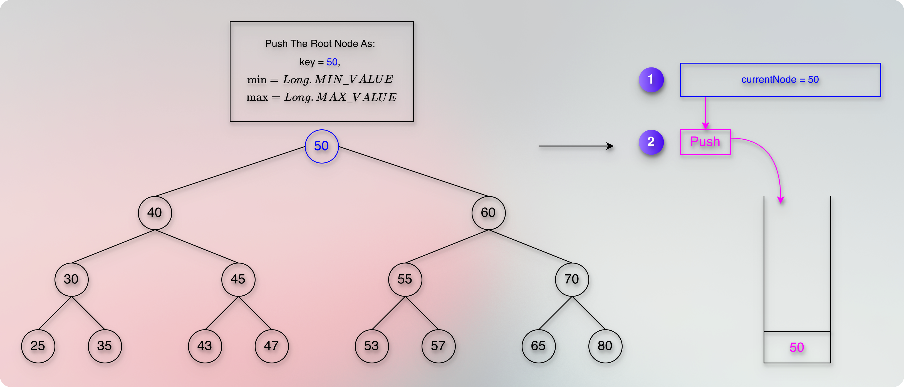
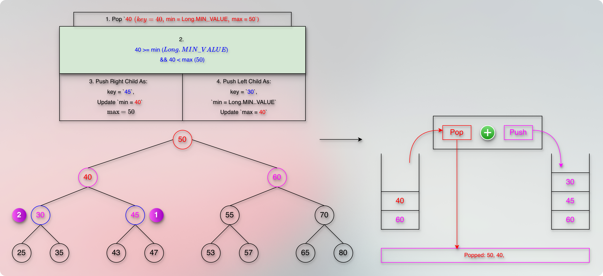
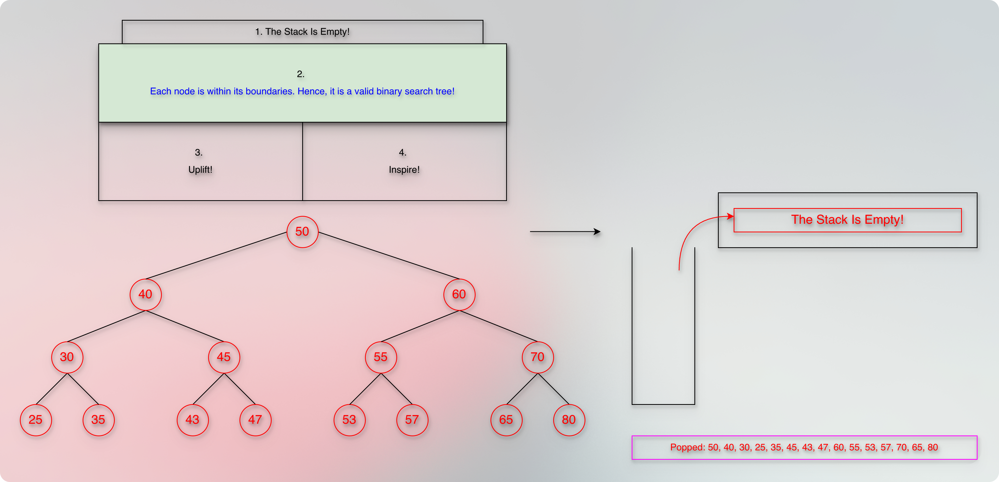

# Check if the given binary tree is a valid binary search tree

<!-- TOC -->
* [Check if the given binary tree is a valid binary search tree](#check-if-the-given-binary-tree-is-a-valid-binary-search-tree)
  * [Problem](#problem)
    * [Solution: Thought Process](#solution-thought-process)
    * [Illustration](#illustration)
    * [Time Complexity](#time-complexity)
    * [Space Complexity](#space-complexity)
    * [Code](#code)
<!-- TOC -->

> left subtree < parent <= right subtree 

## Problem

### Solution: Thought Process

* We use the given rule to create boundaries for each node.
* We push a node along with its boundaries.
* When we pop, we compare the node key with its boundaries.
* We can follow any traversal order to cover the entire tree.
* Here, we will follow the `Pre-Order` traversal.

### Illustration

### Time Complexity

### Space Complexity

### Code