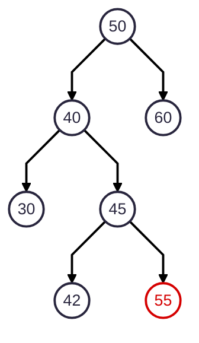
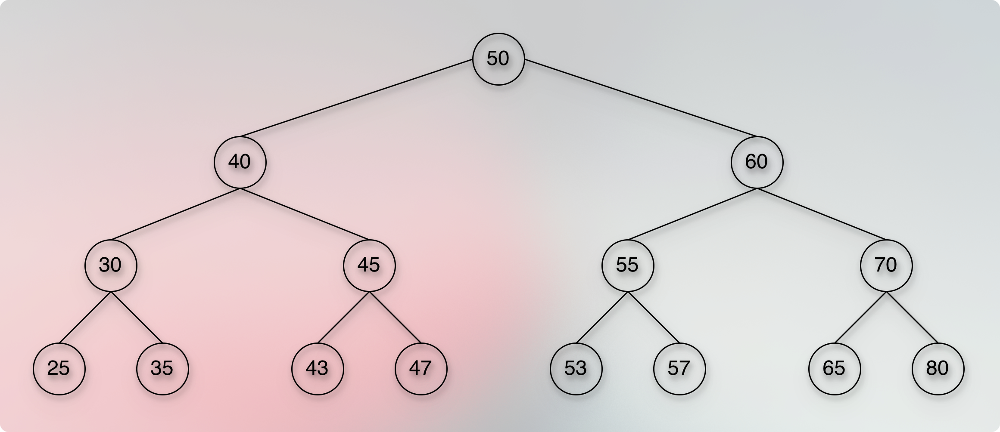

# Check if the given binary tree is a valid binary search tree

<!-- TOC -->
* [Check if the given binary tree is a valid binary search tree](#check-if-the-given-binary-tree-is-a-valid-binary-search-tree)
* [Problem](#problem)
  * [Is it a binary search tree? (Modified rules).](#is-it-a-binary-search-tree-modified-rules)
  * [Problem Introduction](#problem-introduction)
  * [Problem Description](#problem-description)
  * [Task](#task)
  * [Input Format](#input-format)
  * [Constraints](#constraints)
  * [Output Format](#output-format)
  * [Time Limit](#time-limit)
  * [Memory Limit](#memory-limit)
  * [Solution: Thought Process](#solution-thought-process)
    * [Summary](#summary)
    * [Pseudocode](#pseudocode)
    * [Beads](#beads)
  * [Time Complexity](#time-complexity)
  * [Space Complexity](#space-complexity)
  * [Questions](#questions)
    * [Can we follow any other way to cover the entire tree than the `Pre-Order` traversal? Will it make any difference? Does it work?](#can-we-follow-any-other-way-to-cover-the-entire-tree-than-the-pre-order-traversal-will-it-make-any-difference-does-it-work)
    * [What would `min < key <= max` mean?](#what-would-min--key--max-mean)
    * [What would `min < key < max` mean?](#what-would-min--key--max-mean-1)
    * [Why didn't we use the simple `in-order` traversal, where we can simply compare a parent and a child? Doesn't it work?](#why-didnt-we-use-the-simple-in-order-traversal-where-we-can-simply-compare-a-parent-and-a-child-doesnt-it-work)
  * [Relevant DSA Questions](#relevant-dsa-questions)
  * [ToDos](#todos)
  * [Next](#next)
<!-- TOC -->

> left subtree < parent <= right subtree 

# Problem

## Is it a binary search tree? (Modified rules).

## Problem Introduction

* In this problem you are going to solve the same problem as the previous one, but for a more general case, when binary search tree may contain equal keys.

## Problem Description

## Task

* You are given a binary tree with integers as its keys.
* You need to test whether it is a correct binary search tree.
* Note that there can be duplicate integers in the tree, and this is allowed.
* The definition of the binary search tree in such case is the following:
* For any node of the tree, if its key is 𝑥, then for any node in its left subtree its key must be strictly less than 𝑥, and for any node in its right subtree its key must be greater than or equal to 𝑥.
* In other words, smaller elements are to the left, bigger elements are to the right, and duplicates are always to the right.
* You need to check whether the given binary tree structure satisfies this condition.
* You are guaranteed that the input contains a valid binary tree.
* That is, it is a tree, and each node has at most two children.

## Input Format

* The first line contains the number of vertices 𝑛.
* The vertices of the tree are numbered from 0 to 𝑛 − 1.
* Vertex 0 is the root.
* The next 𝑛 lines contain information about vertices 0, 1, ..., 𝑛−1 in order.
* Each of these lines contains three integers 𝑘𝑒𝑦𝑖, 𝑙𝑒𝑓𝑡𝑖 and 𝑟𝑖𝑔ℎ𝑡𝑖.
* 𝑘𝑒𝑦𝑖 is the key of the 𝑖-th vertex, 𝑙𝑒𝑓𝑡𝑖 is the index of the left child of the 𝑖-th vertex, and 𝑟𝑖𝑔ℎ𝑡𝑖 is the index of the right child of the 𝑖-th vertex.
* If 𝑖 doesn’t have left or right child (or both), the corresponding 𝑙𝑒𝑓𝑡𝑖 or 𝑟𝑖𝑔ℎ𝑡𝑖 (or both) will be equal to −1.

## Constraints

* $0 ≤ 𝑛 ≤ 10^5$;
* $−2^{31} ≤ 𝑘𝑒𝑦𝑖 ≤ 2^{31} − 1$;
* $−1 ≤ 𝑙𝑒𝑓𝑡𝑖, 𝑟𝑖𝑔ℎ𝑡𝑖 ≤ 𝑛 − 1$.
* It is guaranteed that the input represents a valid binary tree.
* In particular, if 𝑙𝑒𝑓𝑡𝑖 != −1 and 𝑟𝑖𝑔ℎ𝑡𝑖 != −1, then 𝑙𝑒𝑓𝑡𝑖 != 𝑟𝑖𝑔ℎ𝑡𝑖.
* Also, a vertex cannot be a child of two different vertices.
* Also, each vertex is a descendant of the root vertex.
* Note that the minimum and the maximum possible values of the 32-bit integer type are allowed to be keys in the tree — beware of integer overflow!

## Output Format

* If the given binary tree is a correct binary search tree (see the definition in the problem description), output
* one word “CORRECT” (without quotes).
* Otherwise, output one word “INCORRECT” (without quotes).

## Time Limit

```markdown
| language   	| C 	| C++ 	| Java 	| Python 	| C# 	| Haskell 	| JavaScript 	| Ruby 	| Scala 	|
|------------	|---	|-----	|------	|--------	|----	|---------	|------------	|------	|-------	|
| time (sec) 	| 2 	| 2   	| 3    	| 10     	| 3  	| 4       	| 10         	| 10   	| 6     	|
```

## Memory Limit

* 512 MB

## Solution: Thought Process

* The data that we are going to read:

```kotlin

data class Node(val key: Long, val leftChildIndex: Int, val rightChildIndex: Int)
```

* So, we will read and store all the input data to the:

```kotlin

val nodes = Array<Node>(total) { Node(0, -1, -1) }

```

* We have a clear definition of what to check and how to validate:

> For any node of the tree, if its key is 𝑥, then for any
node in its left subtree its key must be strictly less than 𝑥, and for any node in its right subtree its key
must be greater than or equal to 𝑥. In other words, smaller elements are to the left, bigger elements
are to the right, and duplicates are always to the right. You need to check whether the given binary
tree structure satisfies this condition.

* Note that the immediate comparison alone and only does not work here.
* For example:



* In the given example above, the left subtree of `50` has deep down a node, `55` that is greater than `50`.
* The definition of a valid binary search tree in the problem says that **any node** in its left subtree must be strictly smaller.
* Hence, the given example is an invalid binary search tree.
* So, the naive approach where we might be tempted to compare only the immediate left child and right child fails here.
* And keeping the reference of each node for its entire left and right subtrees is also not an optimal way to solve this problem.
* This is the same reason we cannot use the previous solution: [Validate BinarySearchTree](../../../../../src/courses/uc/course02dataStructures/module05binarySearchTrees/015validBstBinarySearchTree.kt) either.
* For example:


* The simple `in-order` traversal and checking the sorted (ascending order) output fails here.
* Because the `in-order` output is: `30, 40, 42, 45, 50, 50, 60`.
* How do we decide the relationship between these two `50, 50`?
* How do we decide which one is a child and which one is a parent out of these two `50, 50`?
* How do we decide if the child is a left child or a right child?
* How do we get to know that one of these two `50, 50`, one is a left child and one is a parent, and hence, it is an invalid binary search tree?
  * Similarly, how do we compare and validate the case where a deep node from the right subtree can be equal to the ancestor, where the ancestor doesn't have to be an immediate parent.
  * The ancestor can be a grandparent or grand-grand-parent, and so on.
  * In the previous solution, we used a stack, and followed the `in-order` traversal.
  * Every time we pop a node, we compare it with the previous key and check that the recently popped key must be greater than the previous key.
  * And then, we update the previous key.
  * When we pop a node, we cannot know whether it is a left child or a right child or a deep right child to some older or oldest ancestor.
  * All we get is a sorted list in ascending order.
  * So, we only know about the previous key, but not the relation.
  * The simple `in-order` traversal gives an ascending sorted order output, and it works only if the binary search tree definition is strictly: `left < key < right` and no duplicate is allowed.
  * In this new problem, we need to compare the value of a key with its parent to ensure that the value is within the given boundaries. 
* However, there is a definite pattern in a valid binary search tree.
* For example:



* There is an interesting pattern here.
* We can see that each node has certain lower and upper boundaries.
* For example, in the above given image of a valid binary search tree, `40` is a left child of `50`.
* So, `40` must be smaller than `50`.
* It means that `40` gets upper boundary.
* However, the lower boundary for `40` is infinite.
* Now, if we start with the root node, the lower boundary of `50` is also infinite.
* It means that the left child of `50`, that is the node `40`, took (inherited) the lower boundary of the parent `50` and updated the upper boundary to the parent.
* Let us revise this pattern.
* `50` is the root node. 
* The root node has initial boundaries as: `Long.MIN_VALUE` and `Long.MAX_VALUE`.
* So, for the root node, both lower and upper boundaries are infinite.
> 50 (key = 50, min = Long.MIN_VALUE, max = Long.MAX_VALUE)
* Now, the left child of `50` is `40`.
* And the lower boundary of `40` is the same as the lower boundary of its parent, that is `Long.MIN_VALUE`.
* But the upper boundary of `40` equals to the parent key.
* So, the upper boundary of `40` is `50`.
> 40 (key = 40, min = Long.MIN_VALUE, max = 50)
* It means that for a left child:
> parent.min <= leftChild.key < parent.key
* To validate our assumption, we can continue going left side and check if this pattern continues.
* The left child of `40` must be strictly smaller than `40`.
* So, the upper bound (max) of `40.leftChild` is `40`.
* And the left child of `40` inherits the lower bound from the parent.
* Now, the left child of `40` is `30`.
* And `Long.MIN_VALUE <= 30 < 40`.
> 30 (key = 30, min = Long.MIN_VALUE, max = 40)
* So, the pattern continued.
* Now, let us check the right subtree.
* We can start with any node.
* We start with the root node.
> 50 (key = 50, min = Long.MIN_VALUE, max = Long.MAX_VALUE)
* Now, the right child of `50` must be greater than or equal to `50`.
* In other words, the right child of `50` must be at least `50`.
* That is the lower bound.
* The right child of `50` is `60`.
* The lower bound (min) of `60` is `50`.
* And it inherits the upper bound (max) from the parent.
> 60 (key = 60, min = 50, max = Long.MAX_VALUE)
* So, for a right child, the boundary becomes:
> parent.key <= rightChild.Key < parent.max
* To validate our assumption, we can continue going right side and check if the pattern continues.
* The right child of `60` must be equal to or greater than `60`.
* In other words, `60.rightChild` must be at least `60`.
* That is the lower boundary (min).
* And it inherits the upper boundary (max) from the parent.
* Now, the right child of `60` is `70`.
> 70 (key = 70, min = 60, max = Long.MAX_VALUE)
* The pattern continued.
* We can test this pattern for any nested node.
* For example, the leaf node `43` is a left child of `45`.
* So, the upper boundary (max) of `43` is `45`.
* And it inherits the lower boundary from the parent, `45`.
* We get the lower boundary if the node is a right child.
* `45` is a right child of `40`.
* So, the lower boundary (min, equal to or greater than) of `45` is `40`.
* `43` is a left child of `45`.
* Hence, it inherits the lower boundary from `45`.
* So, `43` must be at least (min, equal to or greater than) `40`. 
> 40 <= 43 < 45
* This is indeed, a valid equation, even for a deep (leaf) node.
* It means that each node has a specific lower and upper boundaries. 
* And we can pass these boundaries to a child depending upon the position (left or right) of the child.
* The interesting and impressive benefit here is that we don't have to keep record of each node.
* Because we can attach and pass these boundaries from a parent node to a child node and once we are done with that, we no longer need to hold the parent.
* We just continue doing this until we find an invalid node (that breaks the boundaries) or cover the entire tree.
> 1. For a left child, the parent.key becomes the max boundary, and it inherits the min boundary from the parent.  
> 2. For a right child, the parent.key becomes the min boundary, and it inherits the max boundary from the parent.  
> 3. For a valid node: `min <= key < max`
> 4. The `min <= key` part indicates that the `key` is a right child of the `min`, where `min` is the `parent.key`.
> 5. The `key < max` part indicates that the `key` is a left child of the `max`, where `max` is the `parent.key`.
> 6. If any one of these conditions fails, the node (The `key` part in the equation) is an invalid node and hence, it is an invalid binary search tree. 
* We use the given rule to create boundaries for each node.
* We push a node along with its boundaries.
* When we pop, we compare the node key with its boundaries.
* We can follow any traversal order to cover the entire tree.
* Here, we will follow the `Pre-Order` traversal.
* For example, suppose we have the below tree to validate.


* We start with the root node.


> Push 50 (key = 50, min = Long.MIN_VALUE, max = Long.MAX_VALUE)
* Initially, `min = Long.MIN_VALUE` and `max = Long.MAX_VALUE`.
* So, the root node value can be anything between these values.
* We push the root node with these boundaries.
* After pushing the root node, we immediately perform the pop operation.
---
> **Pop 50 (key = 50, min = Long.MIN_VALUE, max = Long.MAX_VALUE)**
* The pop operation gives us `key = 50, min = Long.MIN_VALUE, max = Long.MAX_VALUE`.
* We check if the `key = 50` is within its attached boundaries.
* `min = Long.MIN_VALUE`, and `50 >= min`.
* `max = Long.MAX_VALUE`, and `50 < max`.
* The condition is met. 
* So, the node (50) is a valid node and we can proceed further.
* Now, we want to follow the `Pre-Order` traversal to cover the tree.
* So, we first push the right child, and then the left child.
* Now, when we push the right child, we attach the associative boundaries with it.


* For example, the current boundaries we have from `50` is:
> `min = Long.MIN_VALUE`, and `max = Long.MAX_VALUE`.
---
> Push `50.rightChild` = 60 (key = 60, min = 50, max = Long.MAX_VALUE)
* Now, the right child of `50` must be greater than or equal to `50`.
* The right child of `50` must be at least (minimum) `50`.
* The lower bound of `50.rightChild` is `50`.
* So, we update the `min` when we push the right child of `50`.
* When we push `50.rightChild = 60`, we attach the following boundaries with it:
* `min = 50`, `max = Long.MAX_VALUE`.
* Now, whenever we pop `50.rightChild = 60`, we will compare its value against these boundaries.
* It must satisfy: `min <= 50.rightChild(=60) < Long.MAX_VALUE`.
---
> Push `50.leftChild` = 40 (key = 40, min = Long.MIN_VALUE, max = 50)
* After the right child, we push the left child.
* So, the next node we are going to push is `50.leftChild = 40`.
* It is the left child of `50`.
* So, it must be smaller than `50`.
* It means that we know the upper bound (max) of `50.leftChild = 40`.
* So, we update the `max` when we push the left child of `50`.
* When we push `50.leftChild`, we attach the following boundaries with it:
* `min = Long.MIN_VALUE`, `max = 50`.
---
* After pushing the right child followed by the left child, we perform the pop operation.


---
> **Pop 40 (key = 40, min = Long.MIN_VALUE, max = 50)**
* When we pop, we get `40` along with its attached boundaries.
* We use the attached boundaries to validate `40`.
* `min = Long.MIN_VALUE`, and `40 >= min`.
* `max = 50`, and `40 < max`.
* So, the condition `min <= key < max` is met.
* Hence, the node `40` is a valid node.
* After the pop operation, we perform the push operations.
---
> Push `40.rightChild` = 45 (key = 45, min = 40, max = 50)
* First, we push the right child of the popped node, `40`.
* The right child of `40` must be greater than or equal to `40`.
* The right child of `40` must be at least (min) `40`.
* The lower bound of `40.rightChild` is `40`.
* So, we update the `min` boundary to `40`.
* When we push `40.rightChild`, we attach the following boundaries with it.
* `min = 40, max = 50`
* After pushing the right child, we push the left child of the popped node.
---
> Push `40.leftChild` = 30 (key = 30, min = Long.MIN_VALUE, max = 40)
* We push the left child of `40`.
* The left child of `40` must be smaller than `40`.
* The upper bound (max) of `40.leftChild` is `40`.
* So, we update the `max` boundary to `40`.
* When we push `40.leftChild`, we attach the following boundaries with it.
* `min = Long.MIN_VALUE, max = 40`
* After pushing the left child, we perform the pop operation.
---
> **Pop 30 (key = 30, min = Long.MIN_VALUE, max = 40)**


* When we pop, we get `30`.
* We check it against its attached boundaries.
* `min = Long.MIN_VALUE`, and `30 >= min`.
* `max = 40`, and `30 < max`.
* The condition met.
* Hence, the node `30` is a valid node.
* After the pop operation, we perform the push operations.
---
> Push `30.rightChild` = 35 (key = 35, min = 30, max = 40)
* First, we push the right child of the popped node, `30`.
* The right child of `30` must be greater than or equal to `30`.
* The right child of `30` must be at least (min) `30`.
* The lower bound (min) of `30.rightChild` is `30`.
* So, we update the `min` to `30`.
* When we push `30.rightChild`, we attach the following boundaries with it:
* `min = 30, max = 40`
* After pushing the right child, we push the left child of the popped node.
---
> Push `30.leftChild` = 25 (key = 25, min = Long.MIN_VALUE, max = 30)
* We push the left child of `30`.
* The left child of `30` must be smaller than `30`.
* The upper bound (max) of `30.leftChild` is `30`.
* So, we update the `max` boundary to `30`.
* When we push `30.leftChild`, we attach the following boundaries with it:
* `min = Long.MIN_VALUE, max = 30`
* After pushing the left child, we perform the pop operation.
---
> **Pop 25 (key = 25, min = Long.MIN_VALUE, max = 30)**


* When we pop, we get `25`.
* We check it against its attached boundaries.
* `min = Long.MIN_VALUE`, and `25 >= min`.
* `max = 30`, and `25 < max`.
* The condition met.
* Hence, the node `25` is a valid node.
* After the pop operation, we perform the push operations.
---
> Push `25.rightChild` = No Right Child To Push!
* After pushing the right child, we push the left child of the popped node.
> Push `25.leftChild` = No Left Child To Push!
* After pushing the left child, we perform the pop operation.
---
> **Pop 35 (key = 35, min = 30, max = 40)**


* When we pop, we get `35`.
* We check it against its attached boundaries.
* `min = 30`, and `35 >= min`.
* `max = 40`, and `35 < max`.
* The condition met.
* Hence, the node `35` is a valid node.
* After the pop operation, we perform the push operations.
---
> Push `35.rightChild` = No Right Child To Push!
* After pushing the right child, we push the left child of the popped node.
> Push `35.leftChild` = No Left Child To Push!
* After pushing the left child, we perform the pop operation.
---
> **Pop 45 (key = 45, min = 40, max = 50)**


* When we pop, we get `45`.
* We check it against its attached boundaries.
* `min = 40`, and `45 >= min`.
* `max = 50`, and `45 < max`.
* The condition met.
* Hence, the node `45` is a valid node.
* After the pop operation, we perform the push operations.
---
> Push `45.rightChild` = 47 (key = 47, min = 45, max = 50)
* First, we push the right child of the popped node, `45`.
* The right child of `45` must be greater than or equal to `45`.
* The right child of `45` must be at least (min) `45`.
* The lower bound (min) of `45.rightChild` is `45`.
* So, we update the `min` to `45`.
* When we push `45.rightChild`, we attach the following boundaries with it:
* `min = 45, max = 50`.
* After pushing the right child, we push the left child of the popped node.
---
> Push `45.leftChild` = 43 (key = 43, min = 40, max = 45)
* We push the left child of `45`.
* The left child of `45` must be smaller than `45`.
* The upper bound (max) of `45.leftChild` is `45`.
* So, we update the `max` boundary to `45`.
* When we push `45.leftChild`, we attach the following boundaries with it:
* `min = 40, max = 45`
* After pushing the left child, we perform the pop operation.
---
> **Pop 43 (key = 43, min = 40, max = 45)**


* When we pop, we get `43`.
* We check it against its attached boundaries.
* `min = 40`, and `43 >= min`.
* `max = 45`, and `43 < max`.
* The condition met.
* Hence, the node `43` is a valid node.
* After the pop operation, we perform the push operations.
---
> Push `43.rightChild` = No Right Child To Push!
* After pushing the right child, we push the left child of the popped node.
> Push `43.leftChild` = No Left Child To Push!
* After pushing the left child, we perform the pop operation.
---
> **Pop 47 (key = 47, min = 45, max = 50)**


* When we pop, we get `47`.
* We check it against its attached boundaries.
* `min = 45`, and `47 >= min`.
* `max = 50`, and `47 < max`.
* The condition met.
* Hence, the node `47` is a valid node.
* After the pop operation, we perform the push operations.
---
> Push `47.rightChild` = No Right Child To Push!
* After pushing the right child, we push the left child of the popped node.
> Push `47.leftChild` = No Left Child To Push!
* After pushing the left child, we perform the pop operation.
---
> **Pop 60 (key = 60, min = 50, max = Long.MAX_VALUE)**


* When we pop, we get `60`.
* We check it against its attached boundaries.
* `min = 50`, and `60 >= 50`.
* `max = Long.MAX_VALUE`, and `60 < max`.
* The condition met.
* Hence, the node `60` is a valid node.
* After the pop operation, we perform the push operations.
---
> Push `60.rightChild` = 70 (key = 70, min = 60, max = Long.MAX_VALUE)
* First, we push the right child of the popped node, `60`.
* The right child must be greater than or equal to the popped node, `60`.
* The right child must be at least (min) `60`.
* The lower bound (min) of the `60.rightChild` is `60`.
* So, we update the `min` to `60`.
* When we push `60.rightChild`, we attach the following boundaries with it:
* `min = 60, max = Long.MAX_VALUE`.
* After pushing the right child, we push the left child of the popped node.
---
> Push `60.leftChild` = 55 (key = 55, min = 50, max = 60)
* We push the left child of `60`.
* The left child of `60` must be smaller than `60`.
* The upper bound (max) of `60.leftChild` is `60`.
* So, we update the `max` to `60`.
* When we push `60.leftChild`, we attach the following boundaries with it:
* `min = 50, max = 60`.
* After pushing the left child, we perform the pop operation.
---
> **Pop 55 (key = 55, min = 50, max = 60)**


* When we pop, we get `55`.
* We check it against its attached boundaries.
* `min = 50`, and `55 >= min`.
* `max = 60`, and `55 < max`.
* The condition met.
* Hence, the node `55` is a valid node.
* After the pop operation, we perform the push operations.
---
> Push `55.rightChild` = 57 (key = 57, min = 55, max = 60)
* First, we push the right child of the popped node, `55`.
* The right child must be greater than or equal to the popped node, `55`.
* The right child must be at least (min) `55`.
* The lower bound (min) of `55.rightChild` is `55`.
* So, we update the `min` to `55`.
* When we push `55.rightChild`, we attach the following boundaries with it:
* `min = 55, max = 60`.
* After pushing the right child, we push the left child of the popped node.
---
> Push `55.leftChild` = 53 (key = 53, min = 50, max = 55)
* We push the left child of the popped node, `55`.
* The left child must be smaller than `55`.
* The upper bound (max) of the `55.leftChild` is `55`.
* So, we update the `max` to `55`.
* When we push `55.leftChild`, we attach the following boundaries with it:
* `min = 50, max = 55`.
* After pushing the left child, we perform the pop operation.
---
> **Pop 53 (key = 53, min = 50, max = 55)**


* When we pop, we get `53`.
* We check it against its attached boundaries.
* `min = 50`, and `53 >= min`.
* `max = 55`, and `53 < max`.
* The condition met.
* Hence, the popped node `53` is a valid node.
* After the pop operation, we perform the push operations.
---
> Push `53.rightChild` = No Right Child To Push!
* After pushing the right child of the popped node, we push the left child of the popped node.
> Push `53.leftChild` = No Left Child To Push!
* After pushing the left child, we perform the pop operation.
---
> **Pop 57 (key = 57, min = 55, max = 60)**


* When we pop, we get `57`.
* We check it against its attached boundaries.
* `min = 55`, and `57 >= min`.
* `max = 60`, and `57 < max`.
* The condition met.
* Hence, the popped node, `57` is a valid node.
* After the pop operation, we perform the push operations.
---
> Push `57.rightChild` = No Right Child To Push!
* After pushing the right child, we push the left child of the popped node.
> Push `57.leftChild` = No Left Child To Push!
* After pushing the left child, we perform the pop operation.
---
> **Pop 70 (key = 70, min = 60, max = Long.MAX_VALUE)**


* When we pop, we get `70`.
* We check it against its attached boundaries.
* `min = 60`, and `70 >= min`.
* `max = Long.MAX_VALUE`, and `70 < max`.
* The condition met.
* Hence, the popped node, `70` is a valid node.
* After the pop operation, we perform the push operations.
---
> Push `70.rightChild` = 80 (key = 80, min = 70, max = Long.MAX_VALUE)
* First, we push the right child of the popped node, `70`.
* The right child must be greater than or equal to the popped node, `70`.
* The right child must be at least (min) `70`.
* The lower bound (min) of `70.rightChild` is `70`.
* So, we update the `min` to `70`.
* When we push `70.rightChild`, we attach the following boundaries with it:
* `min = 70, max = Long.MAX_VALUE`
* After pushing the right child of the popped node, we push the left child of the popped node.
---
> Push `70.leftChild` = 65 (key = 65, min = 60, max = 70)
* We push the left child of the popped node, `70`.
* The left child must be smaller than the popped node, `70`.
* The upper bound (max) of the `70.leftChild` is `70`.
* So, we update the `max` to `70`.
* When we push the `70.leftChild`, we attach the following boundaries with it:
* `min = 60, max = 70`.
* After pushing the left child, we perform the pop operation.
---
> **Pop 65 (key = 65, min = 60, max = 70)** 


* When we pop, we get `65`.
* We check it against its attached boundaries.
* `min = 60`, and `65 >= min`.
* `max = 70`, and `65 < max`.
* The condition met.
* Hence, the popped node, `65` is a valid node.
* After the pop operation, we perform the push operations.
---
> Push `65.rightChild` = No Right Child To Push!
* After pushing the right child, we push the left child of the popped node.
> Push `65.leftChild` = No Left Child To Push!
* After pushing the left child, we perform the pop operation.
---
> **Pop 80 (key = 80, min = 70, max = Long.MAX_VALUE)**


* When we pop, we get `80`.
* We check it against its attached boundaries.
* `min = 70`, and `80 >= min`.
* `max = Long.MAX_VALUE`, and `80 < max`.
* The condition met.
* Hence, the popped node, `80` is a valid node.
* After the pop operation, we perform the push operations.
---
> Push `80.rightChild` = No Right Child To Push!
* After pushing the right child, we push the left child of the popped node.
> Push `80.leftChild` = No Left Child To Push!
* After pushing the left child, we perform the pop operation. 
---
> Pop: The Stack Is Empty!


* We have covered (traveled) the entire tree.
* And we found that each node is a valid node.

### Summary

* We check each node until we find an invalid node.
* If we find an invalid node at any point, we declare the tree as an invalid binary search tree.
* If we do not find any invalid node, and we cover (travel) the entire tree, we declare the tree as a valid binary search tree.
* To cover each node, we follow one of the BST traversal orders.
* We follow the `Pre-Order` traversal.
* Note that the algorithm (the core logic) has nothing strictly tied up with a particular order. It is just a preference or convention out of many other ways to cover the entire tree.
* We start with the root and initial boundaries.
* The initial boundaries are: `min = Long.MIN_VALUE, max = Long.MAX_VALUE`.
* We push the root node along with the boundaries.
1. Pop and validate the node using the attached boundaries.
2. If the node is invalid, abort, return, and declare the tree as an invalid binary search tree.
3. If the valid popped node has a right child, we push it (the right child).
4. For a right child, the `parent.key` becomes the `min`, and the right child inherits the `max` from the parent. This is intuitive because as we go right, the `min` might increase.
5. After the right child, if the valid popped node has a left child, we push it (the left child).
6. For a left child, the `parent.key` becomes the `max`, and it inherits the `min` from the parent. This is intuitive because as we go left, the `max` decreases.
7. Repeat steps 1 to 6 until the stack becomes empty.
8. If the stack is empty (we covered the entire tree and found no invalid node), return and declare the tree as a valid binary search tree.

### Pseudocode

```kotlin

data class Node(val key: Long, val leftChildIndex: Int, val rightChildIndex: Int)

data class NodeWithBoundaries(val index: Int, val min: Long, val max: Long)

fun isValidBst(nodes: Array<Node>): Boolean {
  if (nodes.isEmpty()) return true
  val stack = ArrayDeque<NodeWithBoundaries>()
  val nodeWithBoundaries = NodeWithBoundaries(currentIndex, Long.MIN_VALUE, Long.MAX_VALUE)
  while (stack.isNotEmpty()) {
    val nodeState = stack.pop()
    val originalNode = nodes[nodeState.index]
    val key = originalNode.key
    val min = nodeState.min
    val max = nodeState.max
    if (key < min || key >= max) {
      return false
    }
    if (originalNode.rightChildIndex != -1) {
      stack.push(
        NodeWithBoundaries(originalNode.rightChildIndex, key, max)
      )
    }
    if (originalNode.leftChildIndex != -1) {
        stack.push(
            NodeWithBoundaries(originalNode.leftChildIndex, min, key)
        )
    }
  }
  return true
}

```

### Beads

* For a valid binary search tree, each node is naturally constrained by certain boundaries. 
* We attach boundaries for each node so that we don't have to check whether the node is a left, or a right child, and what is the value of its parent, etc.
* To attach the boundaries to a node, we need the parent node and the child node. Once we attach the boundaries to the child node, we can move on. We don't need to hold and keep the reference of the parent. The process continues.
* As the process continues, the boundaries for each node keeps changing as per the definition of the binary search tree.
* If it is a right child, we know that it must be greater than or equal to the parent. That is, we know the minimum value, the lower bound of the right child.
* Similarly, if it is a left child, we know that it must be smaller than the parent. That is, the maximum value, the upper bound of the left child.
* We push a node along with its boundaries so that whenever we pop the node, we can validate it using its attached boundaries.
* Did you understand this condition: `min <= key < max`?
* The `min <= key` part indicates that the `key` is a right child, and the `min` is the `parent.key`. Essentially, it translates into: "The right child must be greater than or equal to the parent."
* The `key < max` part indicates that the `key` is a left child, and the `max` is the `parent.key`. It translates into: "The left child must be strictly smaller than the parent."
* 

## Time Complexity

* We visit each node once.
* So, the time complexity is `O(n)`.

## Space Complexity

* We use a stack and the maximum size of the stack would be `O(h)`, where `h = Tree Height`.
* So, in the worst case (A skewed binary tree), `O(h) = O(n)`.
* And in the best case (A perfectly balanced binary tree), `O(h) = O(log n)`.

## Questions

### Can we follow any other way to cover the entire tree than the `Pre-Order` traversal? Will it make any difference? Does it work?

* Yes. We can follow any approach to cover the entire tree.
* The approach to cover the tree is not important here.
* The important part is that we validate a node properly.
* The `Pre-Order` is a `fail-fast` approach compared to `in-order` or `post-order`.
* Because, in the `pre-order`, we don't have to wait to validate the node that we visit.
* For example, if we use `in-order`, we have to go deep down to cover the left leaf child first. 


* For the given image, we have to validate `25` first before `40`.
* This process forces us to delay the validation of all the other nodes we visited (came across) while reaching the last left leaf child, `25`.
* Because the first `pop` operation happens only after we cover the last left leaf child in the `in-order` traversal.
* Other nodes like `50`, `40`, `30`, etc. have to wait for the validation.
* So, a particular approach might make a `constant` difference in the time complexity, but it works as long as the validation logic is correct (right).

### What would `min < key <= max` mean?

* The `min < key` part indicates that the right node must be strictly greater than the parent node.
* The `key <= max` part indicates that the left node must be equal to or less than the parent node.

### What would `min < key < max` mean?

* It is the ideal binary search tree condition, where a duplicate key is not allowed.
* The `min < key` part says that the right child must be strictly greater than the parent node.
* The `key < max` part says that the left child must be strictly smaller (less) than the parent node.
* Again, no duplicate keys are allowed.

### Why didn't we use the simple `in-order` traversal, where we can simply compare a parent and a child? Doesn't it work?

* Comparing an immediate parent and immediate child is not enough, because we have to confirm the entire subtree.
* We need to ensure that the `Any node of the entire left subtree < parent.key <= Any node of the entire right subtree`.
* The immediate parent and immediate child do not cover and check deep nodes of a subtree.
* Hence, it can produce a wrong result.
* For example:


* Here, `50` is a right child of `45`. 
* The validation check between the immediate parent `45` and the immediate child `50` concludes that `50` is a valid node.
* However, the deep (leaf) node `50` is a part of the left subtree of the root node `50`.
* And according to the problem definition, any node of the left subtree must be strictly smaller (less) than the parent node.
* Hence, this is an invalid binary search tree.
* However, the boundary approach still works, because it adjusts the boundaries for each node as we travel.
* We check the node against its attached boundaries.
* In this case, the deep leaf node, `50` will have `min = 45`, and `max = 50`.
* So, the valid condition `min <= key < max` fails here.
* And we correctly conclude it as an invalid binary search tree.

## Relevant DSA Questions

> Validation variants
* Validate a BST (no duplicates).
* Validate a BST (duplicates on the left side).
* Validate a BST (duplicates on the right side).
* Validate a BST using the Morris Traversal.
* Validate a BST using parent pointers.
* Validate a BST when only child pointers are known (No parent pointers).
* Validate a BST in streaming (progressive, step-by-step) input (add, remove, swap, split, join, etc.).

> BST Range/Constraint
* Count nodes in a given range. 
* Range sum of BST.
* Trim BST to a range.
* Validate a BST after a node is added or removed.

> BST Structural
* Lowest Common Ancestor (LCA) in BST.
* Kth smallest or largest element.
* Convert a sorted array to BST.
* Convert a BST to a sorted DLL.
* Recover a BST after swapping two nodes. 

> Other
* 

## ToDos

## Next