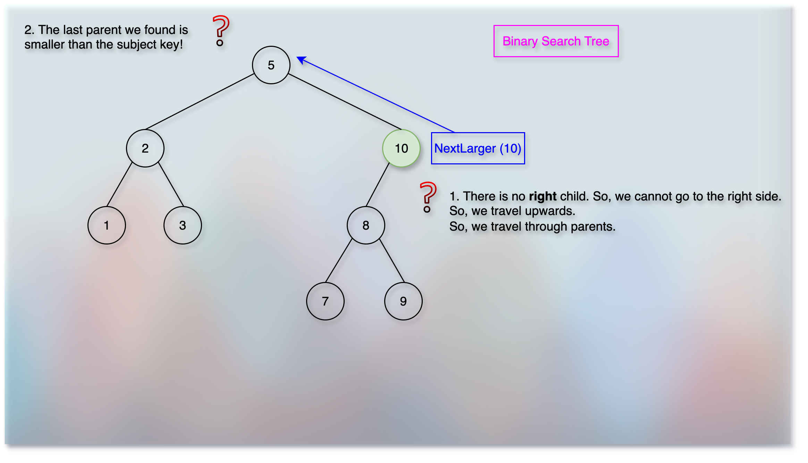

# Binary Search Trees (BSTs): Basic Operations

<!-- TOC -->
* [Binary Search Trees (BSTs): Basic Operations](#binary-search-trees-bsts-basic-operations)
  * [Prerequisites/References](#prerequisitesreferences)
  * [Find (Search)](#find-search)
  * [Next (Adjacent Element, Next Largest)](#next-adjacent-element-next-largest)
  * [Range Search](#range-search)
  * [Insert](#insert)
  * [Delete](#delete)
  * [Next](#next)
<!-- TOC -->

## Prerequisites/References


* [Trees](../module01BasicDataStructures/section03trees/trees.md)
* [Basic Data Structure Questions](../module01BasicDataStructures/questionsOnBasicDataStructures.md)
* [Priority Queues](../module03priorityQueuesHeapsDisjointSets/section01priorityQueuesIntroduction/priorityQueues.md)
* [Binary Heap Trees](../module03priorityQueuesHeapsDisjointSets/section02priorityQueuesUsingHeaps/topic02BinaryHeapTrees/binaryHeapTrees.md)
* [Complete Binary Tree](../module03priorityQueuesHeapsDisjointSets/section02priorityQueuesUsingHeaps/topic03CompleteBinaryTrees/completeBinaryTrees.md)
* [Heap Sort](../module03priorityQueuesHeapsDisjointSets/section03HeapSort/heapSort.md)
* [Binary Search Trees](05binarySearchTrees.md)

## Find (Search)

* Find and return the node that has the given key value.
* 


* If the key we want to find is equal to the root key, we return the root.
* Otherwise, we start with the root node. 
* So, `currentNode = rootNode`.
* And then we will start our searching journey using iteration.

**Code Translation**

```kotlin
if (rootNode.key == key) return rootNode
var currentNode = rootNode
```

* We will stop our searching: 
  * As soon as we find a node that has the given key.
  * Or when we fall off the tree! (We finish the tree, but can't find the key!)
  
**Code Translation** 

```kotlin

// Keep searching as long as we haven't fallen off the tree
// That is to say: Keep searching as long as the "currentNode != null"
while (currentNode != null) {
    
}
```

**Inside the `while` loop: Looking for the key**

* If `key == currentNode.key`, we return the `currentNode`.
* Otherwise, if the `key > currentNode.key`, we need to go to the right side (direction) of the current node.
  * But only if the `currentNode` has a right child! 
* If the `key < currentNode.key`, we need to go left side of the current node.
  * But only if the `currentNode` has a left child!
* If we can't find the given key, the last station (node) is the closest one where the key would come.

**Code Translation**

```kotlin

when {
    key == currentNode.key -> return currentNode
    key > currentNode.key -> currentNode = currentNode.right
    key < currentNode.key -> currentNode = currentNode.left
}
```

**What if we reach the end of the tree?**

* When the `currentNode.right` or `currentNode.left` gives a `null` value, we finished (fallen off) the tree. 
* So, the `while` condition `currentNode != null` becomes false, and we exit the loop.
* Hence, we get a `null` value for the `currentNode` after the `while` loop.  

**Pseudocode**

```kotlin

fun find(key: Int, rootNode: Node?): Node? {
    if (rootNode == null) return null
    if (rootNode.key == key) {
        return rootNode
    }
    var currentNode = rootNode
    while (currentNode != null) {
        when {
            key == currentNode.key -> return currentNode
            key < currentNode.key -> currentNode == currentNode.left
            key > currentNode.key -> currentNode == currentNode.right
        }
    }
    // The `while` loop finished. We fallen off the tree. The `currentNode` is `null`.
    return currentNode
}

```

## Next (Adjacent Element, Next Largest)

* We want to find the **next largest** key than the given node.
* Now, there are two possibilities:
  * Either the subject node has a right subtree.
  * The subject does not have a right subtree.
* If the subject has a right subtree:
  * We go to the right side of the subject once.
  * And then we keep going to the left side until we hit the end.


**We go to the right side once and then to the left side. But what if there is no left subtree?**

* In that case, the right side node is the **next largest** node.


**Code Translation**

```kotlin

var currentNode = subjectNode
if (subjectNode.right != null) {
    // Go to the right direction once
    currentNode = subjectNode.right
    // Then go to the left most node
    while (currentNode?.left != null) {
        currentNode = currentNode.left
    }
    // This left most node is the next largest node
    return currentNode
}

```


* If the subject does not have a right subtree:
  * We travel upwards via parents until we find the next larger node.


**When will we find the next larger parent?**

* As long as the current node is not null and it is a right child of the parent, the parent cannot be the next larger node.
* Only once we find that the current node is a left child of the parent, the `parent` is the next larger node.

```kotlin
var currentNode = subjectNode
if (subjectNode.right == null) {
    var parentNode = currentNode.parent
    // Keep climbing upside
    while (parentNode != null && currentNode == parentNode.right) {
        currentNode = parentNode
        parentNode = parentNode.parent
    }
    // When the `while` loop exits:
    // Either the `parentNode` is `null`. So, we couldn't find the next larger node.
    // Or `currentNode == parentNode.left` that makes the `parentNode` the next larger node.
    return parentNode
}
```

* Now, when we travel upwards via parents, we may or may not find the next larger node.



* Suppose we want to find `nextLarger(N)`.
* If we reach the root and do not find any larger key than `N`, then:
  * Return the best output: Error, null, the subject node `N` itself, the last node we reached (might be a misleading, wrong, confusing choice), etc.
  * Here, we return `null` that indicates there is no next larger node.
  * It means that the subject node itself is the largest node!

```kotlin

fun nextLarger(node: Node?): Node? {
    if (node == null) return null
    return if (node.right != null) {
        nextLargerLeftDescendant(node.right)
    } else {
        nextLargerParent(node)
    }
}

fun nextLargerLeftDescendant(node: Node?): Node? {
    if (node == null) return null
    var currentNode = node
    while (currentNode.left != null) {
        currentNode = currentNode.left
    }
    return currentNode
}

fun nextLargerParent(node: Node?): Node? {
    if (node == null) return null
    var currentNode = node
    var parentNode = currentNode.parent
    while (parentNode != null && currentNode == parentNode.right) {
        currentNode = parentNode
        parentNode = parentNode.parent
    }
    return parentNode
}

```

## Range Search


* Suppose the tree is:
```kotlin

val tree = [1, 4, 6, 7, 8, 10, 11, 13, 17, 18, 20, 25, 30, 35, 40, 50]
```
* Suppose, we have got `rangeSearch(5, 19)`.
* Now, if we denote the ranges as: `5 = x` and `19 = y`.
* We want to add nodes whose key values are between `x` and `y` inclusive.
* Then, we can keep looking for the next larger node until the node value becomes equal to or greater than `y`.
* The `nextLarger` approach must start with one `find` call to stand on the `x` node.
* And from there, we can keep looking for the `nextLarger` node.
* The `find` operation takes `O(Tree Height)` = $O(\;log (n)\;)$ time.
* The problem with this `nextLarger` approach is that we may re-visit (re-travel) nodes and paths along the way.
* For example, in the given image, the `nextLarger` travels `7 --> 13 --> 10 --> 8` to find `nextLarger(7)`.
* Then, from `8`, the same person travels and touches the nodes `8 --> 10`. 
* So, `10` is re-touched, (re-visited, re-travelled).
* From `10`, the person travels to `11`.
* And from `11`, the person travels as: `11 --> 10 --> 13`.
* See, all these two nodes, `10` and `13` are re-touched (re-visited, re-travelled) again.
* We can do better than that.
* The idea is: We do `Pruned In-Order Traversal`.
* `Prune` means: To trim (cut) away dead or overgrown branches from trees to improve their growth or shape.
* So, while following `L-P-R` traversal, if at any point, the node is out of range, we discard the subtree.
* In case of the `nextLarger` approach, we had a single normal human being.
* In case of the `Pruned In-Order Traversal,` we hire a mutant.
* The mutant has a super-power of creating multiple self-cloning (recursion).
* But the mutant is also lazy!
* The mutant does not visit more than 1 node!
* Instead of visiting each node by himself, the mutant creates clones and follows `In-Order: L-P-R`.
* Now, the mutant is so lazy (or smart) that before creating clones, he checks: Do I need to?
* For example, the mutant at node `4` does not create any `left-side clone` as he finds everything is small down there.
* Similarly, the mutant at node `30` does not create any `right-side clone` as he finds everything is large down there.
* The mutant that creates a clone, becomes the boss mutant.
* If there is a left-side, the boss mutant creates a left-side clone and sends them to the left-side.
* Once the left-side clone finishes the travelling, they call the boss mutant (returns the result) and disappears.
* Yes, once the mutant calls the boss (returns the result), he disappears (Garbage collected). 
* Then, the boss mutant processes the occupied node (does his job of comparison for the `rangeSearch`).
* And then the boss mutant creates a right-side clone.
* Once the right-side clone finishes the job, they call the boss mutant (returns the result) and disappears.
* And then the boss mutant calls his boss mutant, and disappears.
* Now, the mutant doesn't even need to `find` the lower-end boundary of the range.
* The mutant starts with the root, `7`. 
* And for our example, after `7`, it will be the `right-side clone` who will visit `13`.
* `13` creates a `left-side clone` (recursion) that visits `10`.
* `10` creates a `left-side clone` (recursion) that visits `8`.
* `8` does not create any clone, finishes the job, and calls (returns the result) to the boss mutant `10`.
* `10` processes the occupied node and creates a `right-side clone` (recursion) that visits `11`.
* `11` does not create any clone, finishes the job, and calls (returns the result) to `10`.
* `10` calls (returns the result) to `13`.
* Each mutant only visits a single node and sends clones for other nodes.
* Clones send results to the boss mutant.
* So, we don't revisit (re-travel, re-touch) a single node twice!
* But yes, we pay the price of: Clones (recursion stack).

**Code Translation**

```kotlin

fun rangeSearch(xLeftLimit: Int, yRightLimit: Int): List<Int> {
    val results = mutableListOf<Int>()
    fun rangeSearchHelper(node: Node?, xLeftLimit: Int, yRightLimit: Int) {
        if (node == null) return
        // The `Left` part of `Left-Parent-Right`.
        // Don't worry. We follow `L-P-R`.
        // So, even though we know that `node.key > xLeftLimit`, we will process it after finishing the `L` part.
        // Before proceeding the left part, check if the left subtree is within the range.
        if (node.key > xLeftLimit) {
            rangeSearchHelper(node.left, xLeftLimit, yRightLimit)
        }
        // The `P` part of `L-Parent-R`.
        if (node.key >= xLeftLimit && node.key <= yRightLimit) {
            results.add(node.key)
        }
        // Before proceeding the right subtree, check if the right subtree is within the range.
        if (node.key < yRightLimit) {
            rangeSearchHelper(node.right, xLeftLimit, yRightLimit)
        }
    }
    // Handle edge cases
    if (xLeftLimit > yRightLimit) {
        return results
    }
    return rangeSearchHelper(rootNode, xLeftLimit, yRightLimit)
}
```

## Insert


* Suppose, we want to insert a node with key `4`.
* We want to insert a new node.
* So, we need to create a new node.

**Code Translation**

```kotlin
val newNode = Node(key = 4)
```

**Initial base conditions**

* If the `rootNode` is `null`, the `newNode` becomes the `rootNode` and we are done.

**Code Translation**

```kotlin

if (rootNode == null) {
    rootNode = newNode
    return
}
```

**What if the `rootNode` is not `null`?**

* In that case, we need to find the correct `parent` under which the `newNode` should fit.

**What happens to the existing `child` of the `parent` under which the `newNode` would fit?**

* This is the magic of the binary search tree!
* The correct spot (position, location) will always be `null` for the `newNode` in a valid binary search tree.
* The `newNode` that we insert always ends up being a `leaf` node.

**How do we insert the `newNode`?**

* We follow the [find](#find-search) approach to travel the tree.
* When the `currentNode` becomes `null` (when we exit the `while` loop), we fit the `newNode` right there.
* But we cannot fit (float!) the `newNode` in the air! 
* We need a `parentNode` under which we can attach the `newNode`.
* And the `parentNode` is the node right before the `currentNode` became `null`. 
* It means that we need to keep track of the `parentNode` as well along with the `currentNode`.
* Because `currentNode` tells the spot where we fit the `newNode` and the `parentNode` holds the `newNode`.
* Now, as we can see in the [find](#find-search), inside the `while` loop, the `currentNode` is not `null`.
* So, we can assign the `parentNode` inside the `while` loop.

**Code Translation**

```kotlin
val newNode = Node(key = 4)
var currentNode = rootNode
var parentNode = currentNode
while (currentNode != null) {
    parentNode = currentNode
    when {
        newNode.key == currentNode.key -> return
        newNode.key > currentNode.key -> currentNode = currentNode.right
        newNode.key < currentNode.key -> currentNode = currentNode.left
    }
}
newNode.parent = parentNode
if (newNode.key > parentNode.key) {
    parentNode.right = newNode
} else {
    parentNode.left = newNode
}
```

* So, the full pseudocode is as below:

```kotlin

fun insert(key: Int, rootNode: Node?) {
    val newNode = Node(key)
    if (rootNode == null) {
        return newNode
    }
    var currentNode = rootNode
    var parentNode = currentNode
    while (currentNode != null) {
        parentNode = currentNode
        when {
            key == currentNode.key -> return
            key < currentNode.key -> currentNode = currentNode.left
            key > currentNode.key -> currentNode = currentNode.right
        }
    }
    newNode.parent = parentNode
    if (key < parentNode.key) {
        parentNode.left = newNode
    } else {
        parentNode.right = newNode
    }
}
```

## Delete


* Suppose, we want to delete `13`.
* Then, we would first replace `13` with its `nextLarger` node.
* And then, the next larger node takes the place of `13`.
* And if the next larger node has any right child, then it will take the vacant place of its parent - as its parent has moved to take place of `13`.
* ToDo: 
* What if the node we want to delete does not have any right child? 


```kotlin

fun delete(node: Node) {
    val deletingNode = find(node, rootNode)
    val nextLargerNode = nextLarger(node)
    val rightChild = nextLargerNode.right
    
}

```

## Next