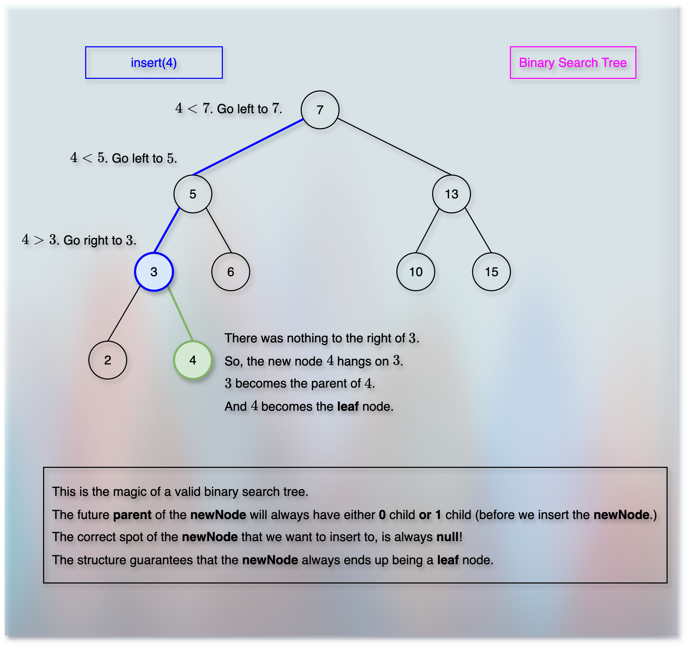

# Binary Search Trees (BSTs): Basic Operations

<!-- TOC -->
* [Binary Search Trees (BSTs): Basic Operations](#binary-search-trees-bsts-basic-operations)
  * [Prerequisites/References](#prerequisitesreferences)
  * [Find (Search)](#find-search)
  * [Next (Adjacent Element, Next Largest)](#next-adjacent-element-next-largest)
  * [Range Search](#range-search)
  * [Insert](#insert)
  * [Delete](#delete)
  * [Next](#next)
<!-- TOC -->

## Prerequisites/References


* [Trees](../module01BasicDataStructures/section03trees/trees.md)
* [Basic Data Structure Questions](../module01BasicDataStructures/questionsOnBasicDataStructures.md)
* [Priority Queues](../module03priorityQueuesHeapsDisjointSets/section01priorityQueuesIntroduction/priorityQueues.md)
* [Binary Heap Trees](../module03priorityQueuesHeapsDisjointSets/section02priorityQueuesUsingHeaps/topic02BinaryHeapTrees/binaryHeapTrees.md)
* [Complete Binary Tree](../module03priorityQueuesHeapsDisjointSets/section02priorityQueuesUsingHeaps/topic03CompleteBinaryTrees/completeBinaryTrees.md)
* [Heap Sort](../module03priorityQueuesHeapsDisjointSets/section03HeapSort/heapSort.md)
* [Binary Search Trees](05binarySearchTrees.md)

## Find (Search)


* We start with the root node. 
* So, `currentNode = rootNode`.
* If the key we want to find is equal to the root key, we return the root.
* Otherwise, if the `key > currentNode.key`, we need to go to the right side (direction) of the current node.
  * But only if the `currentNode` has a right child! 
* If the `key < currentNode.key`, we need to go left side of the current node.
  * But only if the `currentNode` has a left child!
* If we can't find the given key, the last station (node) is the closest one where the key would come.

```kotlin

fun find(key: Int, rootNode: Node): Node? {
    if (rootNode == null) return null
    if (rootNode.key == key) {
        return rootNode
    }
    var currentNode = rootNode
    return if (key > currentNode.key) {
        if (currentNode.right != null) {
            find(key, currentNode.right)
        } else {
            currentNode
        }
    } else if (key < currentNode.key) {
        if (currentNode.left != null) {
            find(key, currentNode.left)
        } else {
            currentNode
        }
    }
}

```

## Next (Adjacent Element, Next Largest)


* Suppose we want to find `nextLarger(N)`.
* If we have a right child of `N`, then:
  * Go to the right side once.
  * And then keep going to the left side until we hit the end.
* If `N` does not have a right child, then:
  * Keep going upwards through parents until we find the larger key than `N`.
* If we reach the root and do not find any larger key than `N`, then:
  * Return the best output: Error, null, the subject node `N` itself, the last node we reached (might be a misleading, wrong, confusing choice), etc.

```kotlin

fun nextLarger(node: Node?): Node? {
    if (node == null) return null
    return if (node.right != null) {
        nextLargerLeftDescendant(node.right)
    } else {
        nextLargerParent(node)
    }
}

fun nextLargerLeftDescendant(node: Node?): Node? {
    if (node == null) return null
    var currentNode = node
    while (currentNode.left != null) {
        currentNode = currentNode.left
    }
    return currentNode
}

fun nextLargerParent(node: Node?): Node? {
    if (node == null) return null
    var currentNode = node
    while (currentNode.parent != null) {
        currentNode = currentNode.parent
        if (currentNode.key > node.key) {
            return currentNode
        }
    }
    return currentNode
}

```

## Range Search


* Suppose, we have got `rangeSearch(5, 12)`.
* Now, if we denote the ranges as: `5 = x` and `12 = y`.
* Then, we would keep looking for the next larger node until the node value becomes equal to or greater than `y`.
* Note that we want to add nodes whose key values are greater than `x`, but less than `y`.

```kotlin

fun rangeSearch(xLeftLimit: Node, yRightLimit: Node) {
    var node = nextLarger(xLeftLimit)
    val results = mutableListOf<Node>()
    while (node != null && node.key < yRightLimit.key) {
        results.add(node)
        node = nextLarger(node)
    }
}
```

## Insert



* Reference: [Find Operation](#find-search)
* Suppose, we want to insert a node with key `3`.
* The [Find](#find-search) operation may or may not find a node with key `3`.
* But it gives us the nearest position where the node with key `3` should fit.

```kotlin

fun insert(key: Int, rootNode: Node?): Node {
    val newNode = Node(key)
    if (rootNode == null) {
        return newNode
    }
    val node = find(key, rootNode)
    if (node.key < key) {
        node.right = newNode
    } else {
        node.left = newNode
    }
    return newNode
}
```

## Delete


* Suppose, we want to delete `13`.
* Then, we would first replace `13` with its `nextLarger` node.
* And then, the next larger node takes the place of `13`.
* And if the next larger node has any right child, then it will take the vacant place of its parent - as its parent has moved to take place of `13`.
* ToDo: 
* What if the node we want to delete does not have any right child? 


```kotlin

fun delete(node: Node) {
    val deletingNode = find(node, rootNode)
    val nextLargerNode = nextLarger(node)
    val rightChild = nextLargerNode.right
    
}

```

## Next