# Balancing A Binary Search Tree (BST)

<!-- TOC -->
* [Balancing A Binary Search Tree (BST)](#balancing-a-binary-search-tree-bst)
  * [Prerequisites/References](#prerequisitesreferences)
  * [Objectives](#objectives)
  * [Caution](#caution)
  * [Understanding the basic runtime of a binary search tree operation](#understanding-the-basic-runtime-of-a-binary-search-tree-operation)
  * [The depth problem](#the-depth-problem)
  * [How does the re-balancing solve the depth problem?](#how-does-the-re-balancing-solve-the-depth-problem)
  * [What can create an unbalanced tree?](#what-can-create-an-unbalanced-tree)
  * [How do we keep the binary search tree balanced?](#how-do-we-keep-the-binary-search-tree-balanced)
  * [Rotation of a binary search tree](#rotation-of-a-binary-search-tree)
  * [Balancing Thought Process](#balancing-thought-process)
  * [Height of a node](#height-of-a-node)
  * [A balanced binary search tree](#a-balanced-binary-search-tree)
  * [A node structure for balance](#a-node-structure-for-balance)
  * [AVL Claim: AVL Properties](#avl-claim-avl-properties)
  * [AVL Introduction Summary: TL;DR](#avl-introduction-summary-tldr)
  * [How do we find (calculate) which side is more weighted?](#how-do-we-find-calculate-which-side-is-more-weighted)
  * [AVL-Tree Basic Left Rotation Idea](#avl-tree-basic-left-rotation-idea)
    * [Code Consideration: Thought Process](#code-consideration-thought-process)
    * [Pseudocode: Basic Left Rotation (Cause: RR)](#pseudocode-basic-left-rotation-cause-rr)
  * [AVL-Tree Basic Right Rotation Idea: (LL-Cause)](#avl-tree-basic-right-rotation-idea-ll-cause)
  * [AVL-Tree Basic Left-Right Rotation Idea](#avl-tree-basic-left-right-rotation-idea)
    * [Pseudocode of Left-Right Rotation](#pseudocode-of-left-right-rotation)
  * [AVL-Tree Basic Right-Left Rotation Idea](#avl-tree-basic-right-left-rotation-idea)
  * [On which node do we perform the rotation when multiple nodes are imbalanced?](#on-which-node-do-we-perform-the-rotation-when-multiple-nodes-are-imbalanced)
    * [Insert example](#insert-example)
  * [How to distinguish between the right rotation and the LR-Rotation?](#how-to-distinguish-between-the-right-rotation-and-the-lr-rotation)
  * [Final pseudocode for the right rotation](#final-pseudocode-for-the-right-rotation)
  * [Final pseudocode for the LR-Rotation](#final-pseudocode-for-the-lr-rotation)
  * [How to distinguish between the left rotation and the RL-Rotation?](#how-to-distinguish-between-the-left-rotation-and-the-rl-rotation-)
  * [Final pseudocode for the left rotation](#final-pseudocode-for-the-left-rotation)
  * [Final pseudocode for the RL-Rotation](#final-pseudocode-for-the-rl-rotation)
  * [Rotation summary](#rotation-summary)
  * [Conclusion](#conclusion)
  * [TL;DR](#tldr)
  * [What is the difference between a binary heap tree and a binary search tree?](#what-is-the-difference-between-a-binary-heap-tree-and-a-binary-search-tree)
  * [ToDo](#todo)
  * [Next](#next)
<!-- TOC -->

## Prerequisites/References

* [Trees](../module01BasicDataStructures/section03trees/010trees.md)
* [Basic Data Structure Questions](../module01BasicDataStructures/questionsOnBasicDataStructures.md)
* [Priority Queues](../module03priorityQueuesHeapsDisjointSets/section01priorityQueuesIntroduction/priorityQueues.md)
* [Binary Heap Trees](../module03priorityQueuesHeapsDisjointSets/section02priorityQueuesUsingHeaps/topic02BinaryHeapTrees/binaryHeapTrees.md)
* [Complete Binary Tree](../module03priorityQueuesHeapsDisjointSets/section02priorityQueuesUsingHeaps/topic03CompleteBinaryTrees/completeBinaryTrees.md)
* [Heap Sort](../module03priorityQueuesHeapsDisjointSets/section03HeapSort/heapSort.md)
* [Binary Search Trees](05binarySearchTrees.md)
* [Binary Search Trees: Basic Operations](10binarySearchTreesBSTsBasicOperations.md)
* [Binary Tree Implementation](../../../../../src/courses/uc/course02dataStructures/module05binarySearchTrees/010binarySearchTree.kt)
* [AVL Visualization](https://www.cs.usfca.edu/~galles/visualization/AVLtree.html)
* [Abdul Bari Sir: AVL Tree](https://youtu.be/jDM6_TnYIqE?si=ozgBIYnV79pJw8Nc)

## Objectives

* Understand the basic runtime of a binary search tree operation.
* Understand the motivation behind the binary search tree balancing.
* Implement rotation.

## Caution

> [!WARNING]
> Before moving forward to understand the problem and rotations, ensure that...

* You understand: [Binary Search Tree BST Basic Operations](10binarySearchTreesBSTsBasicOperations.md).
* If you skip that part, it might become difficult to connect the dots.
* So, ensure that you understand:
* [Binary Search Tree BST Basic Operations](10binarySearchTreesBSTsBasicOperations.md).

## Understanding the basic runtime of a binary search tree operation

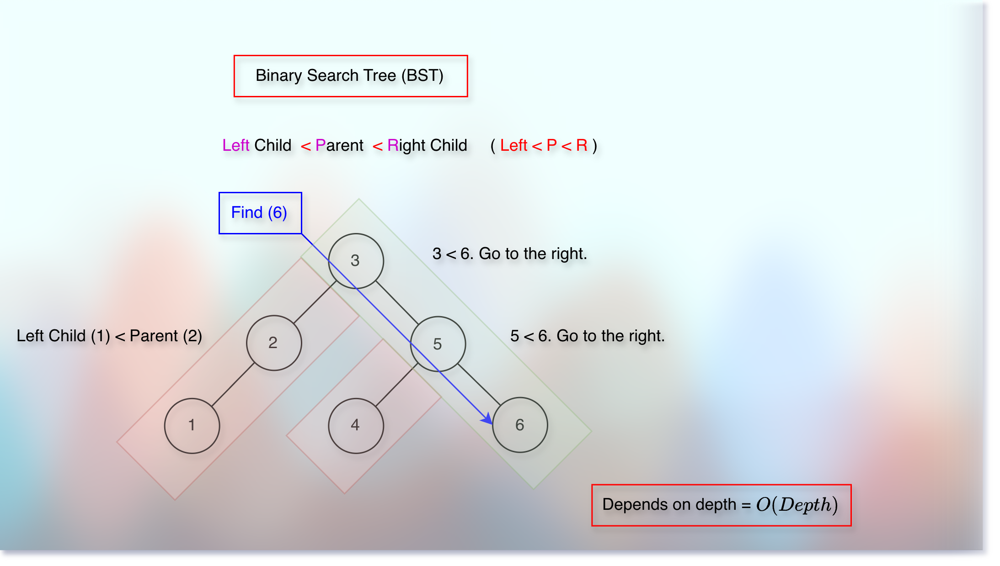

* The `find` operation depends on the `depth` of the tree.
* If a node has a higher depth, then we take more time.
* For example, while trying to find `6`.
* Similarly, if the node has a lower depth, we take less time.
* For example, `3`.
* If you remember, we have associated the well (a deep hole) analogy with `depth` in [Trees](../module01BasicDataStructures/section03trees/010trees.md).
* So, it is like a node that we want to find is in a well.
* It is looking upside waiting for someone to descend into the well.

## The depth problem

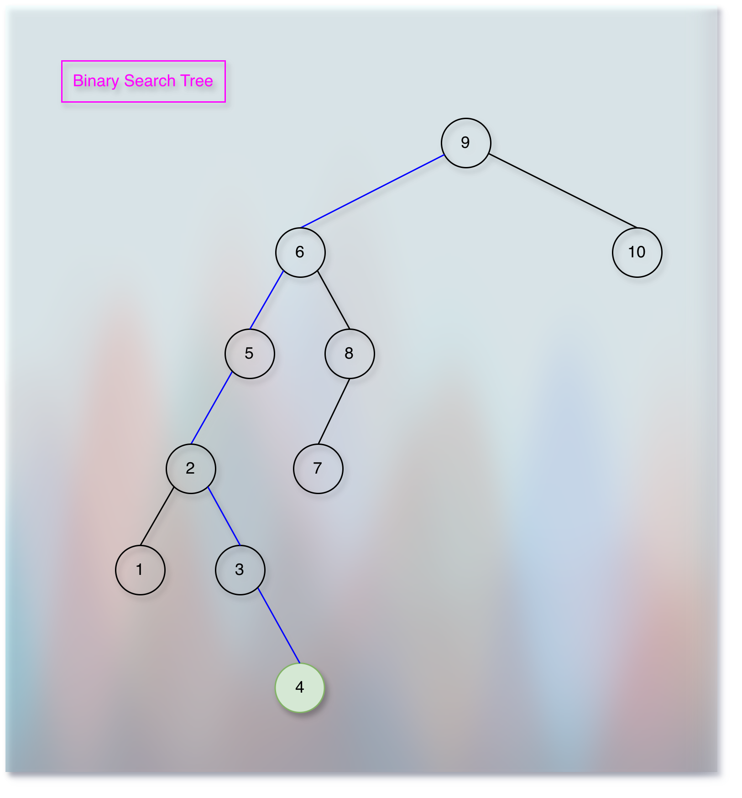

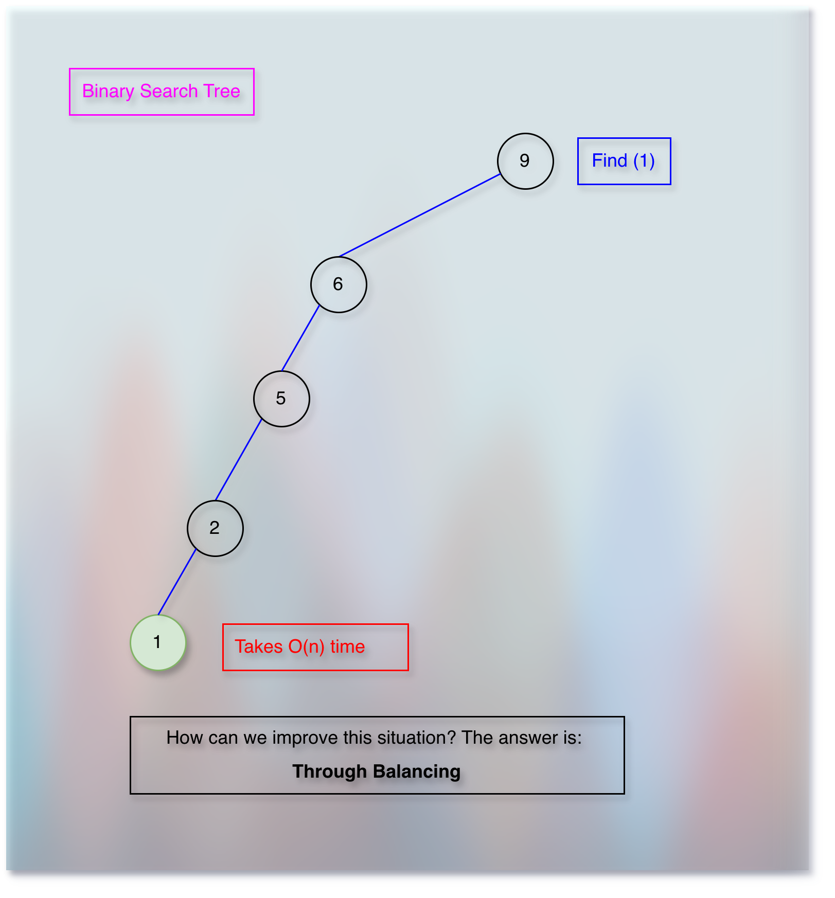

* If a binary search tree is not balanced, we might take `O(n)` time for the `find` operation. 

## How does the re-balancing solve the depth problem?

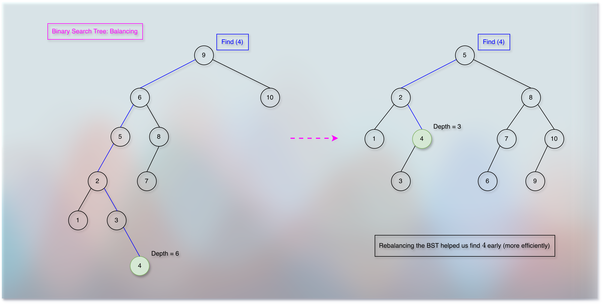

* Re-balancing reduces the depth and keeps the `in-order (LPR)` sorted.
* Hence, the `find` operation becomes faster (efficient).
* The key observation here is that the efficiency depends on the height of the tree.
* And the height of a tree depends on the height of subtrees.
* So, if we maintain the height of subtrees, we can maintain the height of the tree.
* If the distribution (structure) of the subtrees is unbalanced, then the tree becomes taller, unbalanced, and inefficient.
* So, if we control and maintain the distribution (structure) of the subtree, we can control the efficiency of the tree.
* To control and maintain the distribution (structure) of a subtree, we need a way to define, and measure it.
* We already know that "height" is the defining property.
* And the measurement scale here is in terms of "balance."
* "Balance" is associated with the "height" only.
* So, "maintaining the balance" means "maintaining the height".
* And, a tree can be highly "unbalanced," "balanced," or somewhere in the middle.
* It means that the tree can be "taller," "shorter," or somewhere in the middle.
* Also, we need to ensure that the efforts of maintaining the balance should not defeat the core purpose.
* The core purpose is to make various operations, such as `find(search)` (that depends on the tree height) more efficient.

## What can create an unbalanced tree?

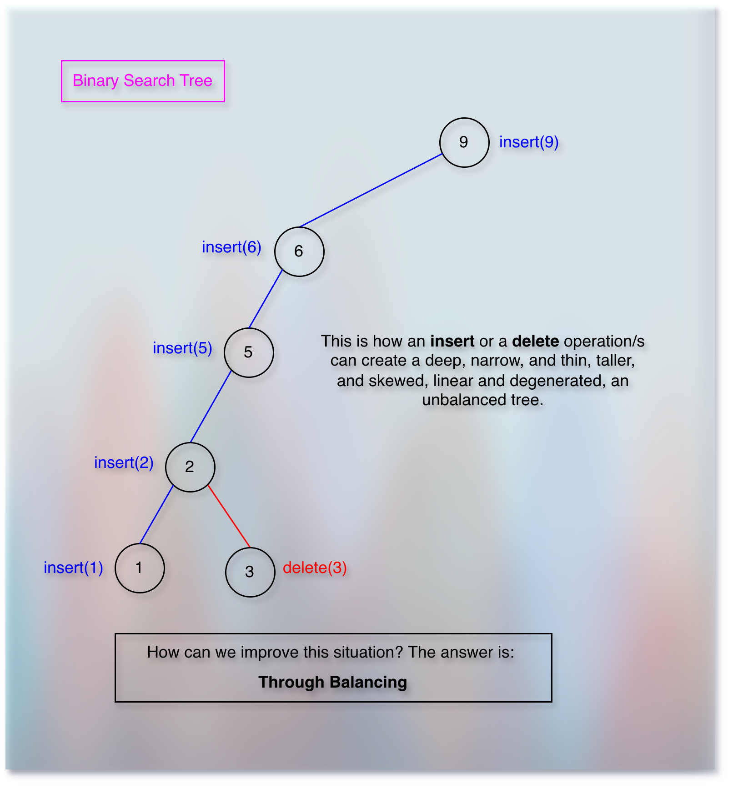

* Insert and delete operations.

## How do we keep the binary search tree balanced?

* Using the rotation technique.

## Rotation of a binary search tree

* It is possible to change the structure of a binary search tree without violating the rules (invariants) that define the binary search tree.
* For example, as shown in the image below: 

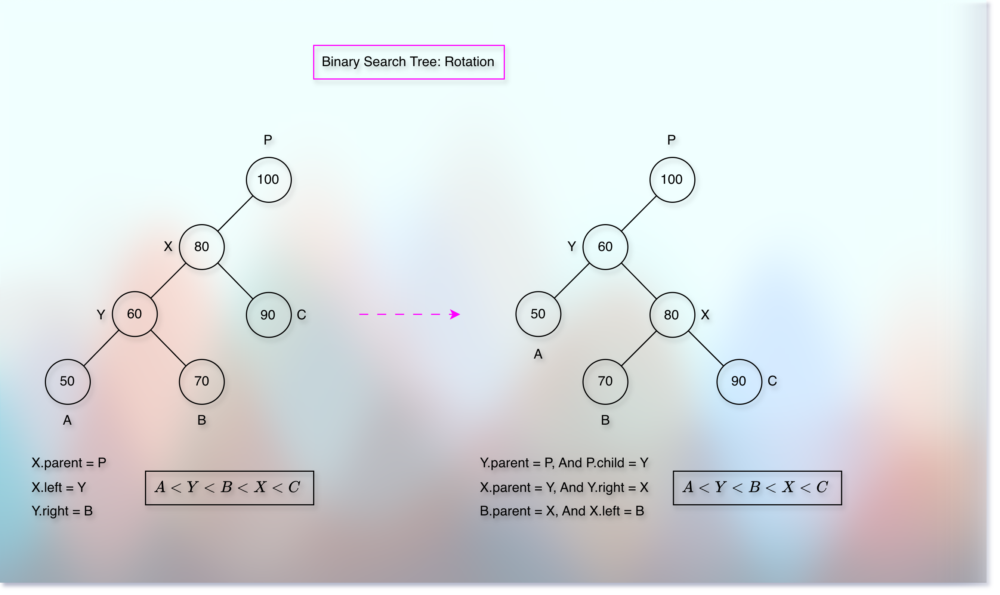

## Balancing Thought Process

* To maintain the balance of a binary search tree, we need to define, measure, and keep track of the "balance".
* We use the term "height" to define, measure, and keep track of the "balance."

## Height of a node

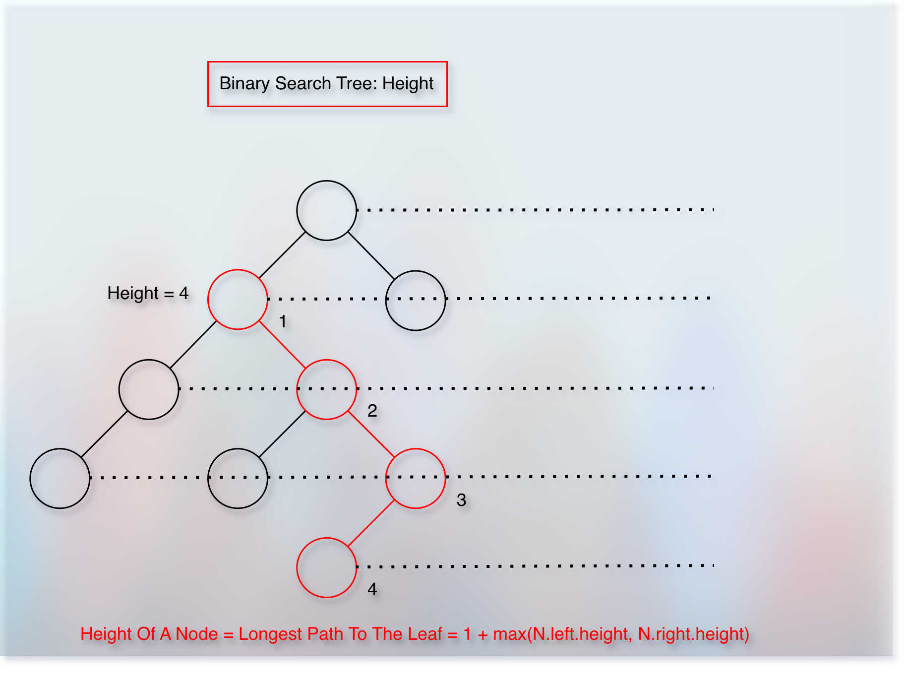

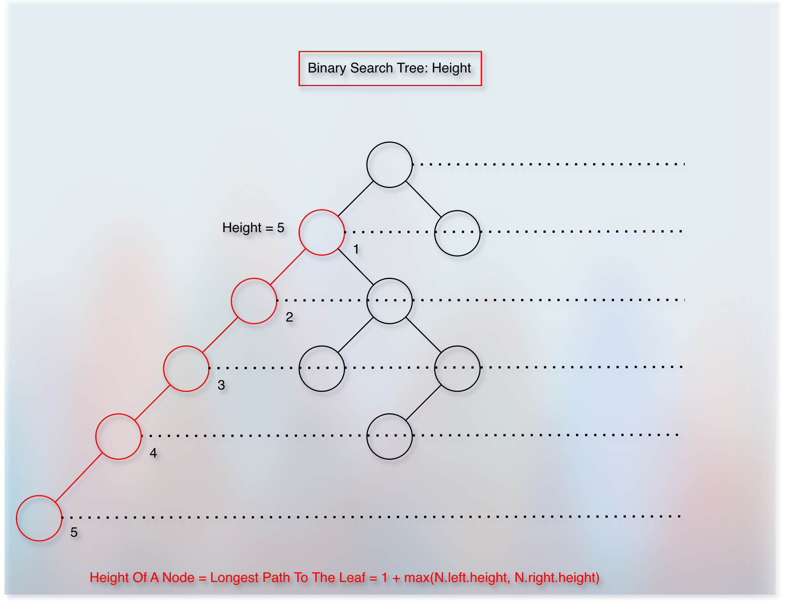

* The longest path from the node to the leaf

```kotlin

val heightOfNode = 1 + maxOf(Node.left.height, Node.right.height) 

```

* So, the node of the tree will look something like below:

```kotlin

class Node(var key: Int, var left: Node? = null, var right: Node? = null) {
    val height: Int
      get() = 1 + maxOf(left?.height ?: 0, right?.height ?: 0)
}

```

## A balanced binary search tree

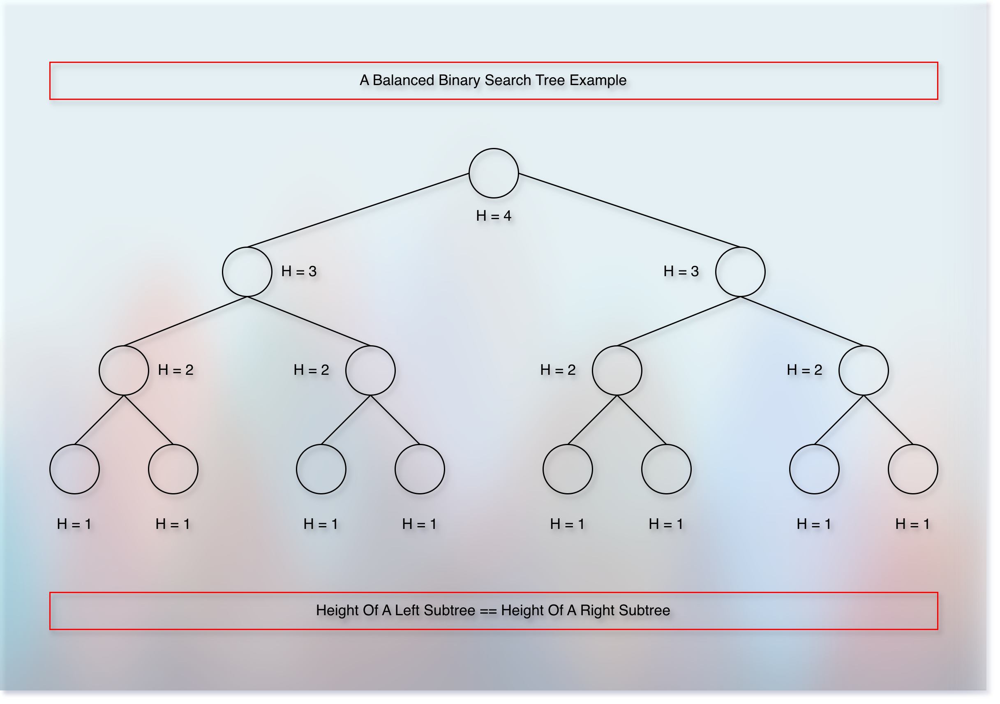

* If the height of a left subtree is equal to the height of a right subtree, we call it a perfectly balanced tree.
* It means that, we need to add another field, "height" to the node structure.
* So that we can measure and keep track of the "balance".
* And when a tree is balanced:


$$
N.left.height == N.right.height
$$
$$
N.left.height - N.right.height = 0
$$

* However, maintaining a perfectly balanced binary search tree after every `insert` and `delete` operation might take `O(n)` time.
* The objective of maintaining the "balance" is to maintain the "height".
* If we maintain the "height" at most `O(log n)`, then we can perform various operations, such as `find(search)` efficiently.
* But if maintaining the perfect balance itself takes `O(n)` time, then it is not helpful.
* So, we take some flexibility here.
* In an AVL tree, we maintain the below property: 

$$
| N.left.height - N.right.height | <= 1
$$

* It is known as the "controlled balance."
* And the analysis of such an AVL-Tree, satisfies the below formula:

$$
N(h) = 1 + N(h - 1) + N(h - 2)
$$

* Here, `N(h)` means "minimum number of nodes for an AVL-Tree of height `h`."
* The formula connects (associates) the "minimum number of nodes" with the "height".
* And we will see that using the "rotation" technique, we can maintain this "flexible balance" (also known as: "controlled balance," "enough balance," "perfectly imperfect balance," etc.) in just `O(1)` time!
* It means that we don't spend more time in maintaining the balance, and we can still maintain the tree height at most `O(log n)`.
* Now, to maintain the "balance," we need to maintain the "height".
* And to maintain the "height," we need to track it.
* To track "height," we introduce a new field (property) to the "node".

## A node structure for balance

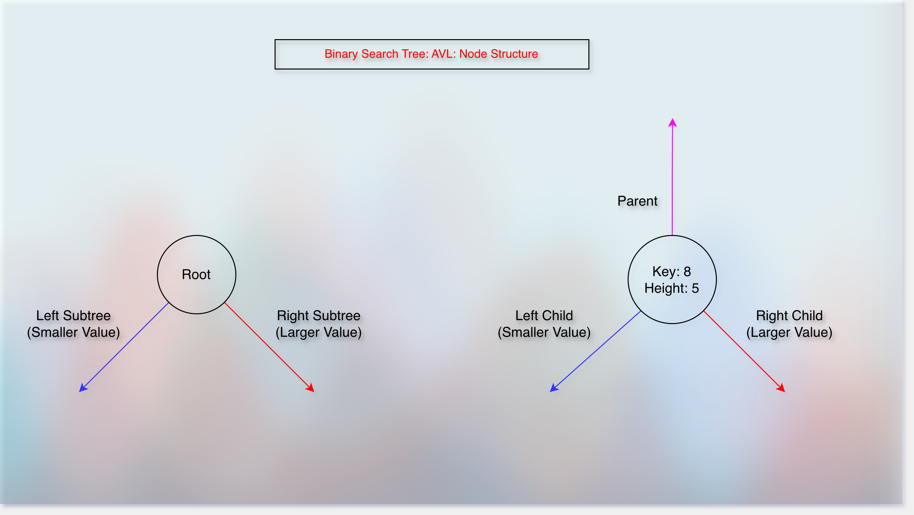


* So, the node of the tree and the code to check whether the node is balanced, will look something like below:

```kotlin

class Node(var key: Int, var left: Node? = null, var right: Node? = null) {
    val height: Int
      get() = 1 + maxOf(left?.height ?: 0, right?.height ?: 0)
  
    val isBalanced: Boolean
        get() = abs((left?.height ?: 0) - (right?.height ?: 0)) <= 1
}

```

## AVL Claim: AVL Properties

* We claim that the height of a balanced binary tree (AVL) is at most almost $O(log\ n)$.
* Now, height is made up with nodes.
* So, it is possible to get an idea about the total number of nodes based upon the height of the tree.
* And we can add (consider) the "balance" property into this relationship.
* So, we are trying to figure out the relationship between the height and the total number of nodes in a tree when the tree is balanced.
* So, we start with the minimum nodes.
* We want to figure out the minimum nodes for a binary tree of height `h`.
* As per the AVL property, the difference between the height of two children should be less than or equal to 1.
* We can have such an AVL tree as shown in the below image:

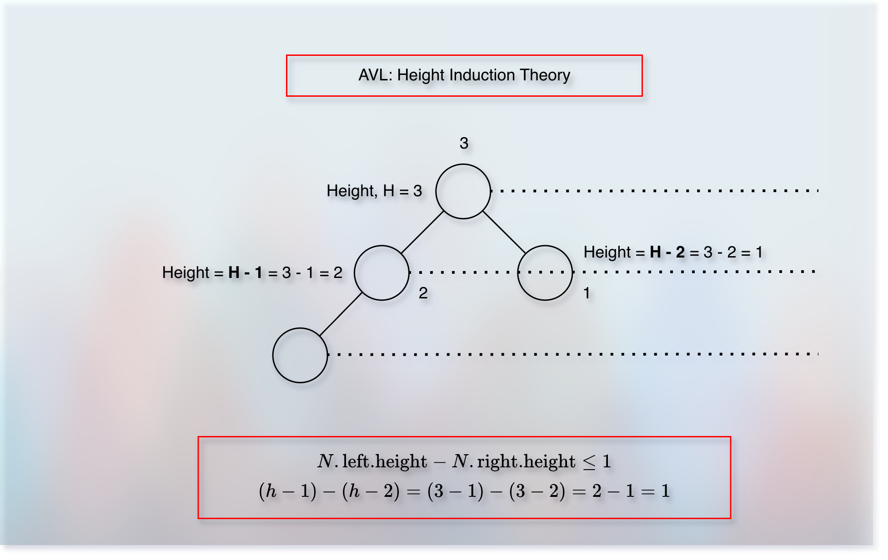

* Now, the subtree of height `h - 1` must have at least `N(h - 1)` nodes under the AVL-Tree constraint (properties).
* Let us denote it as `N(h - 1)` that says the minimum nodes in an AVL-Tree of height `h - 1`.
* And the subtree of height `h - 2` must have at least `N(h - 2)` nodes.
* So, `N(h - 2)` says the minimum nodes in an AVL-Tree of height `h - 2`.
* Now, if we add `+1(the root node)` to `N(h - 1) + N(h - 2)`, we get the minimum nodes in an AVL-Tree of height `h` (Refer the above [image](../../../../../assets/images/dataStructures/uc/module05binarySearchTreesBST/200heightAndNodesRelation.png) to get the idea).
* So, it is:

$$
N(h) = 1 + N(h - 1) + N(h - 2)
$$

* It indicates a recursive formula!
* And it is similar to a Fibonacci formula!
* For a Fibonacci number $F_h$, we can say:

$$
F_h = F_{h - 1} + F_{h - 2}
$$

* The value of a Fibonacci number, $F_h$ is a summation of the previous (last) Fibonacci number, $F_{h - 1}$ and the second previous (the second last) Fibonacci number, $F_{h - 2}$.
* And since $N(h)$ represents "minimum number of nodes for an AVL-Tree of height `h`," we can say:

$$
N(h) >= F_h
$$

* If we represent this "minimum number of nodes" as `n`, then it is:

$$
n >= F_h
$$

* Also:

$$
F_h >= 2^{\frac{h}{2}}
$$

* So, it becomes:

$$
n >= 2^{\frac{h}{2}}
$$

* Taking $log_2$ both the sides:

$$
log_2(n) >= log_2(2^{\frac{h}{2}})
$$

$$
log_2(n) >= \frac{h}{2}
$$

* Multiplying both the sides by 2:

$$
2\;log_2(n) >= h
$$

$$
h <= 2\;log_2(n)
$$

* We just proved that the maximum height of an AVL-Tree is $2\;log_2(n)$.
* $log_2(n)$ indicates a perfect balanced binary tree, but we take some flexibility in an AVL-Tree.
* Due to this flexibility, it can become twice as tall as a perfectly balanced binary tree.
* `2` is the price we pay to rebalance the tree in `O(1)`.
* It means that, we don't spend too much time in rebalancing, and `find(search)` operation is still efficient.
* Asymptotically, it is `O(log n)`.

## AVL Introduction Summary: TL;DR

* A binary search tree (BST) becomes inefficient as we perform the insert or delete operations.
* Insert or delete operations can skew the BST and make it taller and thin. 
* As a result, various operations such as `find(search)` become inefficient.
* The efficiency depends on the tree height.
* Tree height depends on the height of the subtrees.
* If we can control the height of the subtrees, we can maintain the height and efficiency of the tree.
* However, the efforts of controlling the height of the subtrees should not defeat the core purpose.
* The core purpose is to perform various operations such as `find(search)` efficiently.
* It turned out that, if we can control $| N.left.height - N.right.height | <= 1$, we get a nice enough balance (controlled balance).
* It is known as the "Adelson-Velsky and Landis (AVL)" property. 
* The minimum number of nodes for an AVL-Tree of height, `h` is:

$$
N(h) = 1 + N(h - 1) + N(h - 2)
$$

* We can relate it with a Fibonacci number, $F_h$.

$$
F_h >= 2^{\frac{h}{2}}
$$

$$
n >= 2^{\frac{h}{2}}
$$

$$
2\;log_2(n) >= h
$$

$$
h <= 2\;log_2(n)
$$

* It means that the maximum height of an AVL-Tree is $2\;log_2(n)$. 
* Next, we will see how to maintain the AVL-Tree property through the "rotation" technique.

## How do we find (calculate) which side is more weighted?

* We use the "height" property of a node to measure and fix the balance.
* The formula (AVL-Tree Property) is:

$$
\text{Balance Factor} = \text{Height Of A Left-Subtree} - \text{Height Of A Right-Subtree}
$$

* Now, if the tree is right-sided, the value of the `right height` will be more than the `left height`.
* So, the result will be `negative`.
* When this negative value is less than `-1`, we cay say that the tree is unbalanced by the right side.
* For example:
* Suppose that the `left.height` is `1` and the `right.height` is `3`.
* So, the balance factor will be:
* `left.height - right.height` = `1 - 3` = `-2` and it is less than `-1`.
* If it is less than `-1`, we can say that the tree is heavy on the right side.
* To make the tree balanced, we need to pull a few nodes to the left side.
* That will be the `left rotation`.
* 
---
* Similarly, if `left.height - right.height > 1`, we can say that the tree is heavy at the left-side.
* For example:
* Suppose that the `left.height` is `3` and `right.height` is `1`.
* Then, the balance factor will be:
* `left.height - right.height` = `3 - 1` = `2`, which is more than `1`.
* This tree is heavy on the left side.
* To make the tree balanced, we need to pull a few nodes to the right side.
* That will be the `right rotation`.
* 
---

* To keep the tree balanced, we want to ensure that:

$$
| \text{Balance Factor} | <= 1
$$

## AVL-Tree Basic Left Rotation Idea

* A tree can become unbalanced after an insert or a delete operation.
* Each node of the tree has the `height` and the `balance` properties.
* Assume that we are performing the `insert` operation.
* Following the binary search tree invariant, we perform the typical binary search.
* We find the right position (spot) to `insert` this new node.
* A particular node will get a new child.
* We increase the height of the node that has got this new child.
* Assume that this new insertion has made the tree right-sided.
* It means that the `balance` property of one or more nodes is `< - 1`.
* When we have an excessive right-subtree, we perform the left-rotation.
* It is also known as "RR-Rotation (Right of right rotation)".
* Because it happens when the right of right node causes the imbalance.
* So, the name "RRR" is based upon the root cause of the rotation.
* And to fix that, we perform the "Left Rotation."

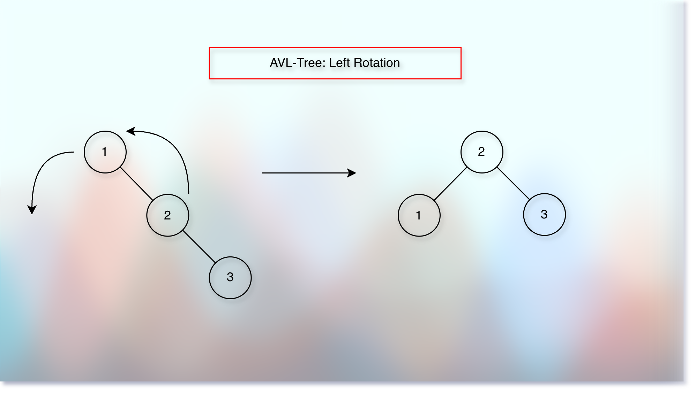

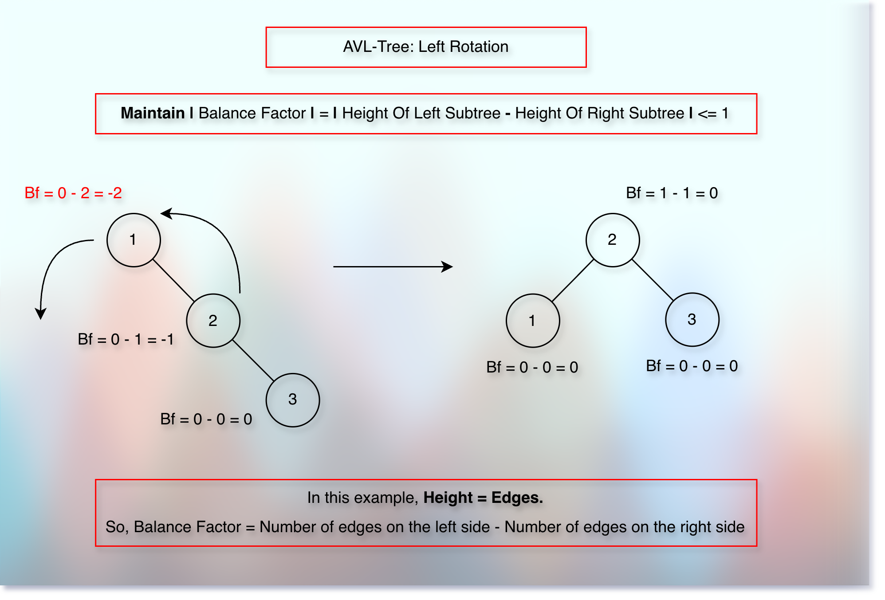

### Code Consideration: Thought Process

* Identify the cause and decide the rotation. 
  * For example, if (bf < -1), then it is a right-sided tree.
  * It means we need to perform either left rotation or RL-rotation.
  * Similarly, if (bf > 1), then it is a left-sided tree.
  * So, we need to perform either right rotation or LR-rotation.
  * LL-Cause leads right rotation, RR-Cause leads left rotation, LR-Cause leads LR-Rotation, and RL-Cause leads RL-Rotation. 
  * Decide the rotation based on the cause and effect.
* Visualize the image, recall the rotation, and affected nodes.
* Start with the unbalanced node and the upcoming (new, future) parent.
  * For example, in the left rotation, the right child of the unbalanced node becomes the new parent.
  * And if the new parent has a left child, we may need to store it in a temporary variable as the unbalanced node will become its new parent.
  * It will become the right child of the unbalanced node.
  * Think about this for the rotation that we perform.
* Think about the affected nodes.
* Consider four properties: Parent, left, right, and height (including the relevant edge cases).
  * Consider the edge cases. 
  * For example, the upcoming (new, future) parent might not have all the children.
* Take required references before the rotation. 
  * For example, children of the upcoming (new, future) parent.
* Apply the changes to perform the rotation. 
  * For example, shifting the unbalanced node by changing the properties (pointers).
* Update the properties of the affected nodes after the rotation.
* Update the height of all the affected nodes at the end - after we are done with all the position shifting.

### Pseudocode: Basic Left Rotation (Cause: RR)

* This is not a final code that covers all the cases.
* This is just a piece of code based on the recent explanation about the basic left rotation.
* We will slowly and gradually cover the final code with all the cases, including the edge cases.
* Think about these properties: Parent, left child, right child, and height of a node.
* Whenever we rotate the tree, we need to take care of these properties of the affected node.
* And we need to understand which nodes get affected by a particular rotation.

```kotlin
val bf = balanceFactor(unbalancedNode)
// This is the condition for the left-rotation (and also for the RL-Rotation. We will improve it.)
if (bf < -1) {
    // Start with the unbalanced node.
    // Unbalanced node: Parent, left, right, and height.
    // Left child of the unbalanced node remains as it is.
    // Right child of the unbalanced node becomes the new parent.
    val newParent = unbalancedNode.right
    // Update the parent of the unbalanced node to point to the new parent.
    // We will handle the case of a dense AVL-Tree shortly.
    unbalancedNode.parent = newParent
    // The unbalanced node becomes the left child of the new parent
    newParent.left = unbalancedNode
    // Update the height of affected nodes from children to parent order
    updateHeight(unbalancedNode)
    updateHeight(newParent)
}
```

* We can understand this with an analogy of a pulley.

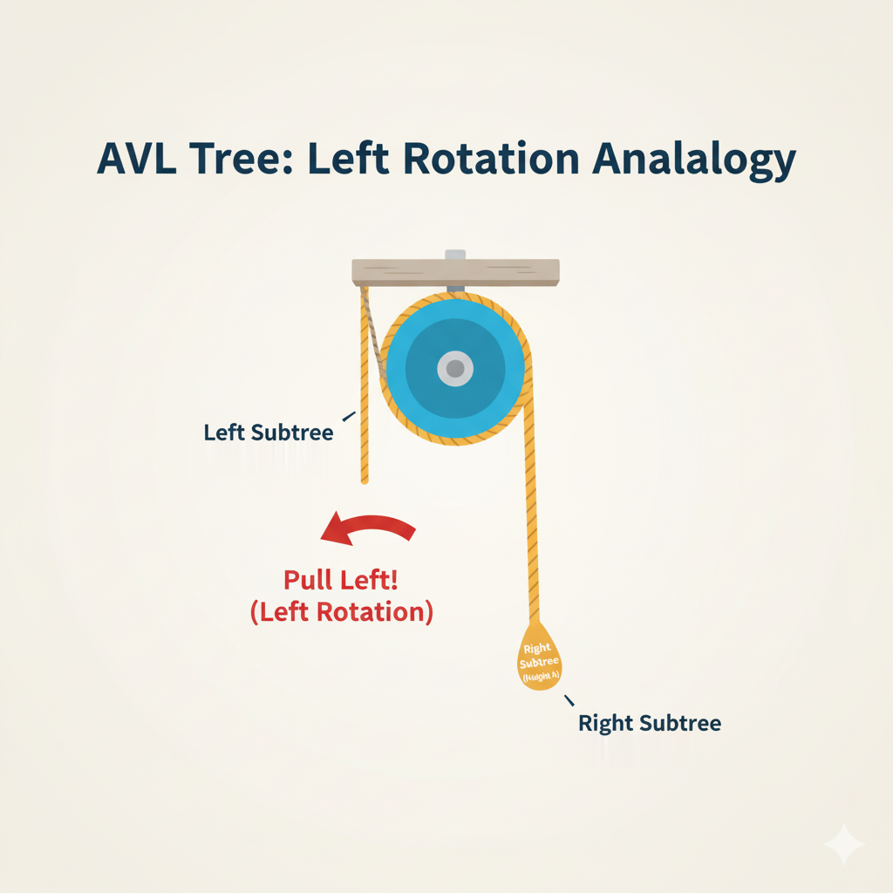

* When the right-side is more weighted, we pull the left-side to maintain the balance.

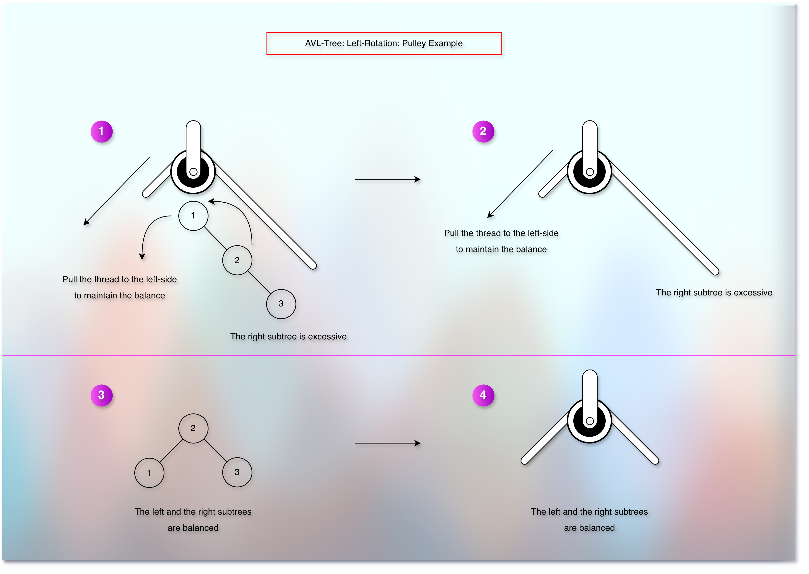

* Now, we can take an example of a dense tree.

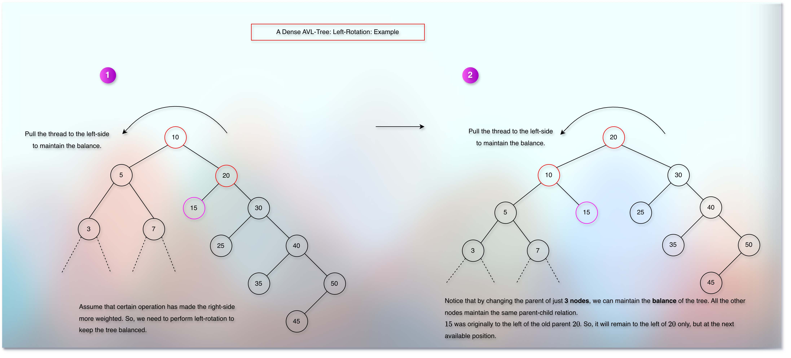

* We can see that no matter how dense the tree is, we need to change only a few nodes to re-balance the entire tree.

```kotlin

val bf = balanceFactor(unbalancedNode)
// This is the condition for the left rotation (and also for the RL-Rotation. We will improve it.)
if (bf < -1) {
    // Start with the unbalanced node.
    // Left child of the unbalanced node remains as it is.
    // Right child of the unbalanced node becomes the new parent
    val newParent = unbalancedNode.right
    // Update the parent of the unbalanced node - The new parent node becomes the parent
    unbalancedNode.parent = newParent
    // Take the reference of the left child of the new parent as we will have to update its parent
    val oldLeftOfNewParent = newParent.left
    // Right child of the new parent remains as it is.
    // Update the left side of the new parent - The unbalanced node becomes the left child
    newParent.left = unbalancedNode
    // Update the right child of the unbalanced node - The old left child of the new parent
    unbalancedNode.right = oldLeftOfNewParent
    oldLeftOfNewParent.parent = unbalancedNode
    // Update the height from children to parent order
    updateHeight(oldLeftOfNewParent)
    updateHeight(unbalancedNode)
    updateHeight(newParent)
}

```

* We can understand this with the pulley example also.

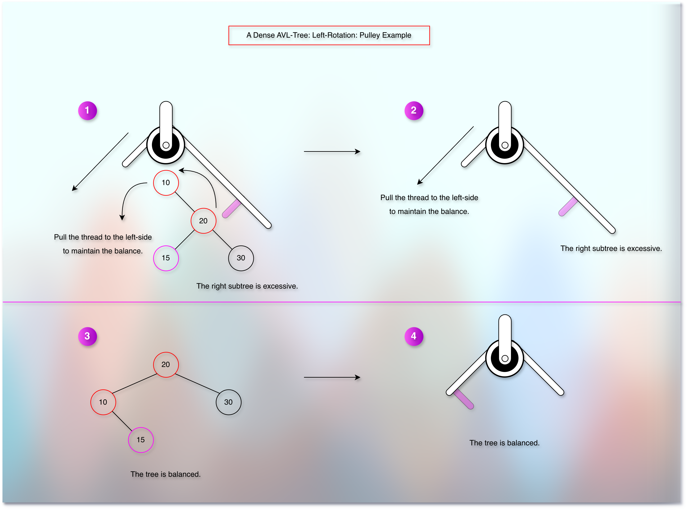

* When we rotate a grandparent to the left side, the left grandchild goes with them and becomes their right grandchild.

## AVL-Tree Basic Right Rotation Idea: (LL-Cause)

* When we have an excessive left-subtree, we perform the right-rotation.
* We also call it "LL-Rotation."
* Because it happens when the left of the left node causes the imbalance.
* So, remember that the name "LLR" is based upon the root cause of the imbalance.
* And to fix it, we perform "Right Rotation."

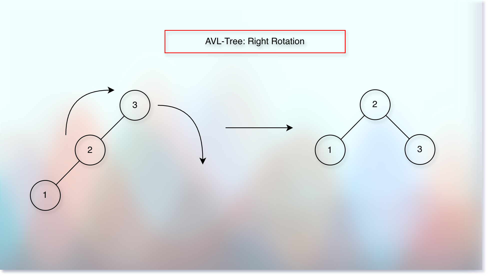

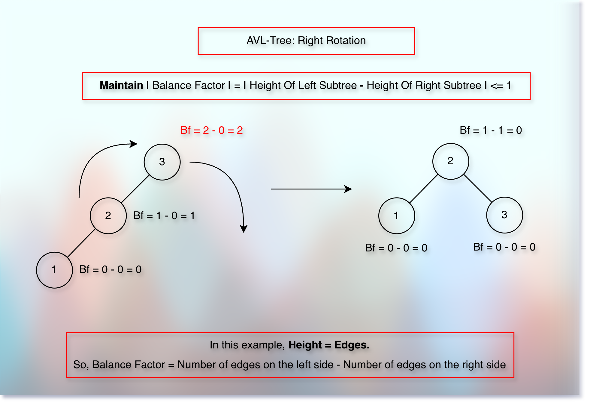

```kotlin
val bf = balanceFactor(unbalancedNode)
// This is the condition for the right rotation (and also for LR-Rotation. We will improve.)
if (bf > 1) {
    // The left child of the unbalanced node becomes the new parent
    val newParent = unbalancedNode.left
    // The unbalanced node goes to the right side of the new parent
    newParent.right = unbalancedNode
    // The "newParent" becomes the parent node of the unbalanced node 
    unbalancedNode.parent = newParent
    // Update the height from children to parent order 
    updateHeight(unbalancedNode)
    updateHeight(newParent)
    // We will shortly see an example of a dense tree, where the new parent might have children.
}
```

* We can understand this with an analogy of a pulley.

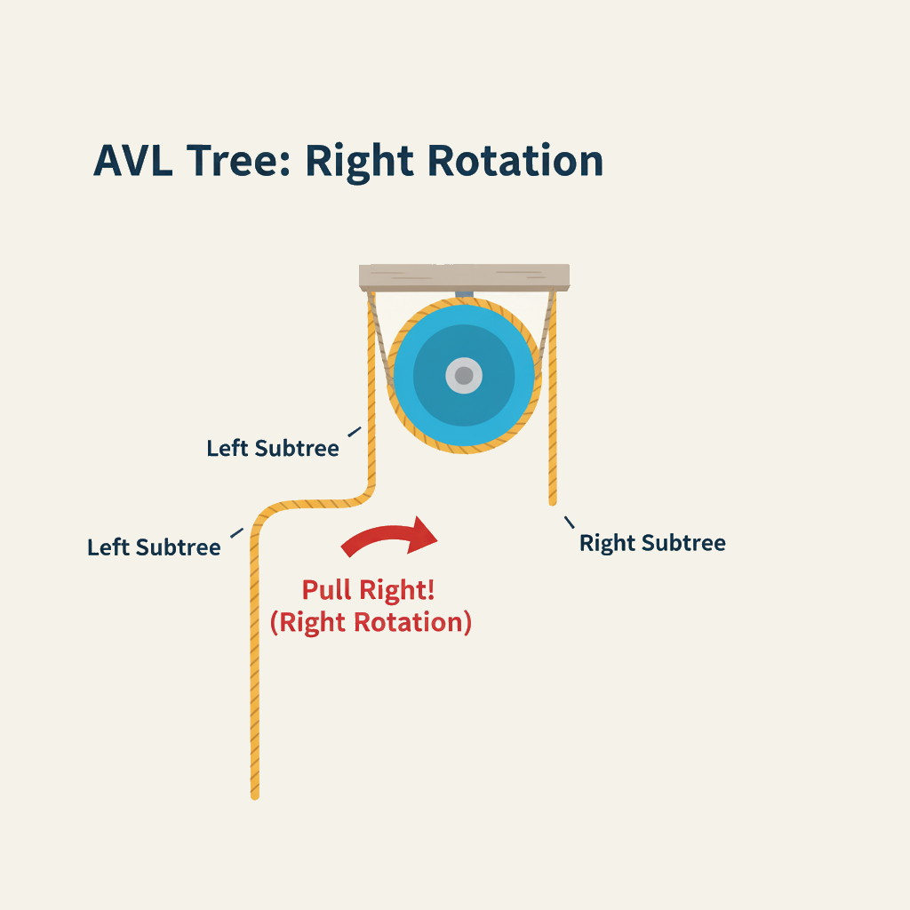

* When the left-side is more weighted, we pull the right-side to maintain the balance.

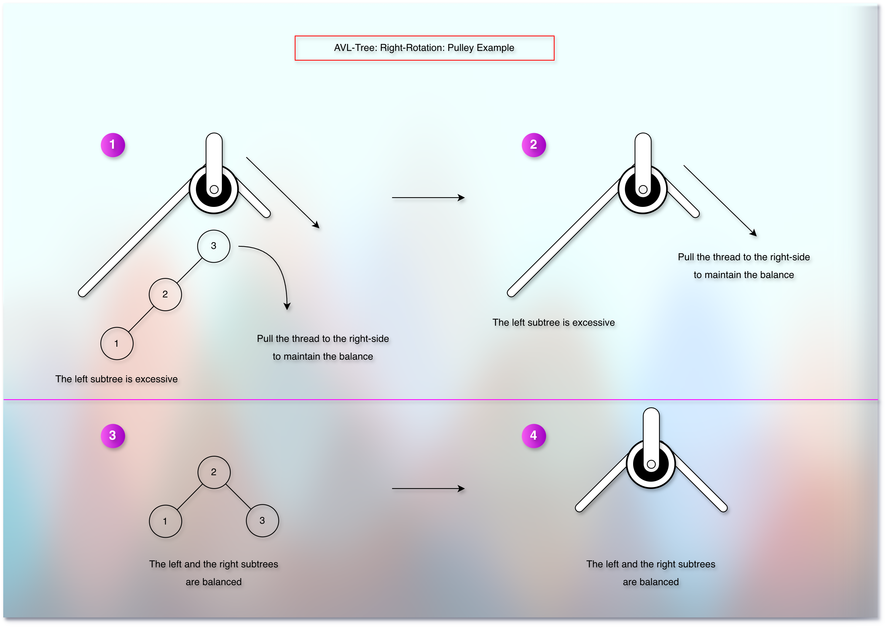

* Now, we can take an example of a dense tree.

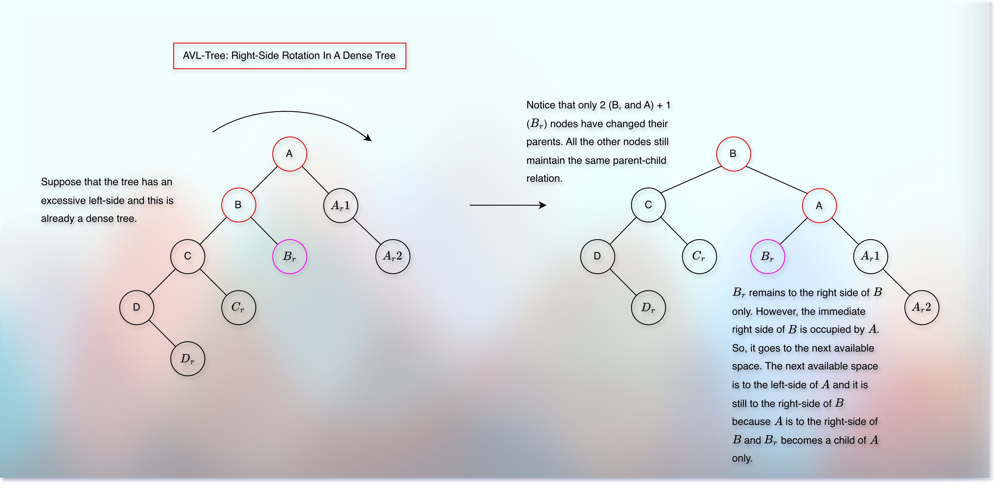

```kotlin

val bf = balanceFactor(unbalancedNode)
// This is the condition for the right rotation (and also for the LR-Rotation). We will improve it.
if (bf > 1) {
    // The left child of the unbalanced node becomes the new parent.
    val newParent = unbalancedNode.left
    // The right child of the new parent node gets affected - if any.
    val oldRightOfNewParent = newParent.right
    // The unbalanced node becomes the right child of the new parent.
    newParent.right = unbalancedNode
    // Update the parent of the unbalanced node.
    unbalancedNode.parent = newParent
    // The old right child of the new parent (if any) becomes the left child of the unbalanced node.
    unbalancedNode.left = oldRightOfNewParent
    oldRightOfNewParent.parent = unbalancedNode
    // Update the height from children to parent order
    updateHeight(oldRightOfNewParent)
    updateHeight(unbalancedNode)
    updateHeight(newParent)
}

```

* Again, we can visualize and understand it better with the pulley analogy. 

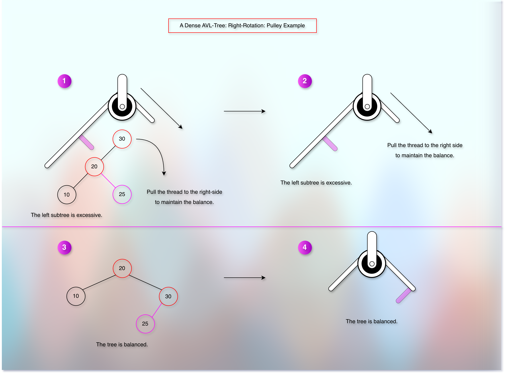

* If we rotate the grandparent to the right side, the right grandchild goes with them and becomes their left child.

## AVL-Tree Basic Left-Right Rotation Idea

* Sometimes, we need to perform multiple rotations to balance the tree.
* The below image shows a left-rotation followed by the right-rotation. 

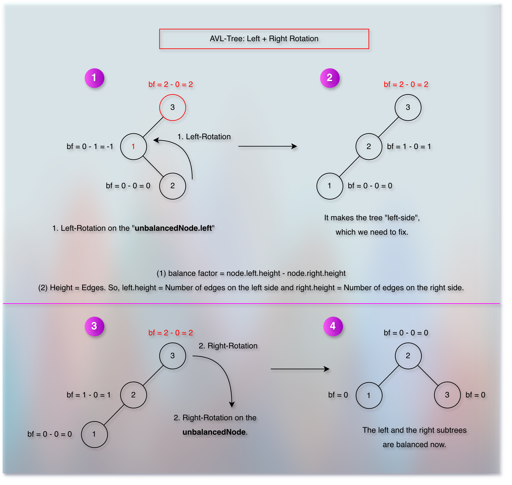

* First, we perform the left rotation on the "**unbalancedNode.left**".
* It establishes a different "left" child to the "**unbalancedNode**".
* And then, we perform the right rotation on the "**unbalancedNode**".

---

* If we ever get a question about the original old parent of the unbalanced node, this is the right place to learn it.


* We might get a question that focuses on the old parent of the unbalanced node.
* How do we take care of the old parent of the unbalanced node? 
* How do we update its child?
* Why don't we have any parent pointer?  
* Because when we rotate the unbalanced node, the old parent of it gets the new child that was originally the grandchild. 
* In the code, we change the parent of the unbalanced node, but not the child of the unbalanced node's old parent.
* Does the old parent of the unbalanced node point to the unbalanced node even after the rotation?
* The answer is:
* We don't walk, we shift (move) the ground!
* We don't change the parent pointers, the child takes the place!
* Imagine that your left hand is on top of your right hand.
* The left hand is steady, but we rotate the right hand.
* The unbalanced node's old parent gets the new child as we rotate the unbalanced node.
* For example, in the given image, we first rotate `1` to the left side.
* Before we rotate `1`, `1` is the left child of `3`.
* If we ask `3.left`, we get `1`.
* As we rotate `1` to the left side, the old parent of `1`, which was `3`, gets the new child `2`.
* We did not need the parent pointer.
* The old parent of `1`, that is `3`, gets the new child (that was originally its grandchild) `2`.
* We don't have a parent pointer.
* But now if we ask `3.left`, we get `2`.
* That's how rotating the unbalanced node also updates its old parent.
* So, after the rotation, the unbalanced node is no more the child of its old parent.
* The old parent of the unbalanced node points to a different node.
* The old grandchild takes the place of the unbalanced node.
* Hence, the old parent of the unbalanced node now points to this new node who was once a grandchild, but now a child.
---

* We can do the Left-Right Rotation in two steps also, as shown in the image below.

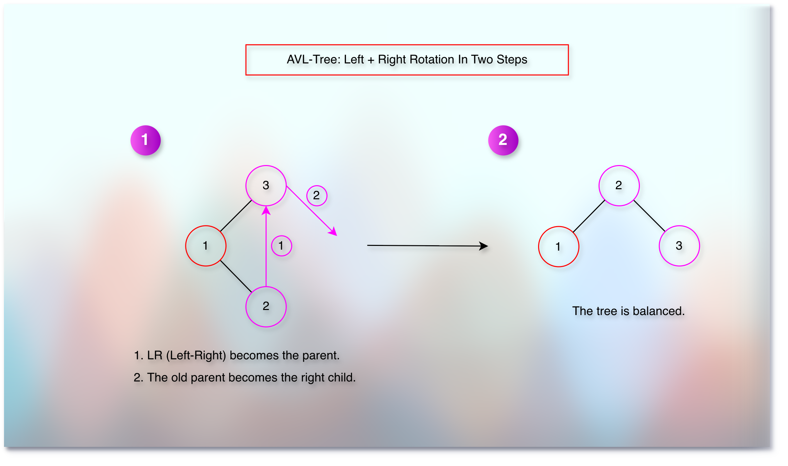

* Now, we can take an example of a dense tree, as shown in the image below.

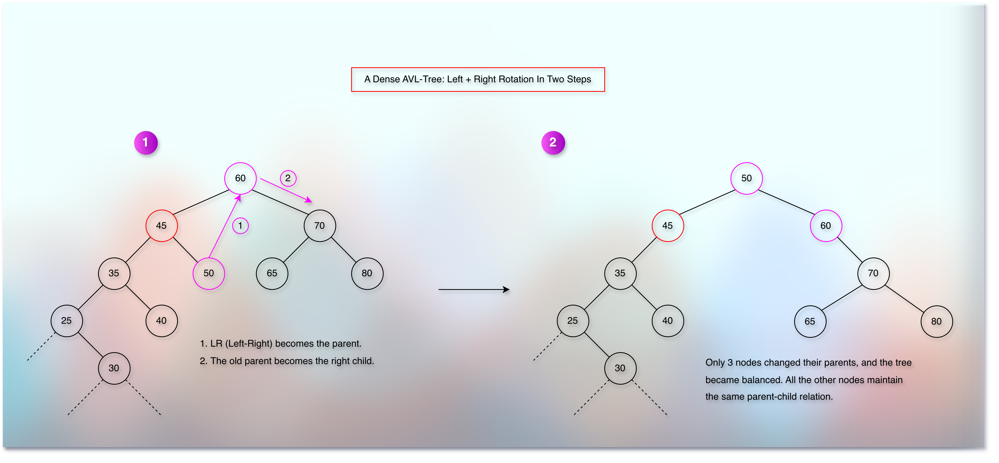


### Pseudocode of Left-Right Rotation

* Left rotation on the `unbalancedNode.left`.
  * The left rotation should also update the height of the affected nodes.
* And the right rotation on the `unbalancedNode` itself.
  * The right rotation would also update the height of the affected nodes.

```kotlin

val bf = balanceFactor(unbalancedNode)
// We will see how to distinguish b/w right-rotation and LR-rotation soon.
if (bf > 1) {
    // Start with the unbalancedNode.left and perform the left rotation on it
    val leftOfUnbalanced = unbalancedNode.left
    // The rotate operation should also update the height of the relevant (affected) nodes.
    rotateLeft(leftOfUnbalanced)
    rotateRight(unbalancedNode)
}
```

## AVL-Tree Basic Right-Left Rotation Idea

* Similarly, the below image shows a right-rotation followed by the left-rotation.

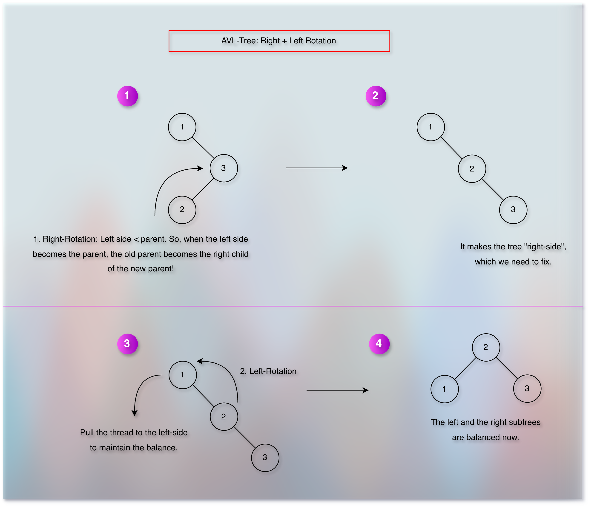

* First, we perform the right rotation on the "**unbalancedNode.right**".
* It establishes a different right child to the "**unbalancedNode**".
* Then, we perform the left rotation on the "**unbalancedNode**".
* Right-Left Rotation in two steps, as shown in the image below:

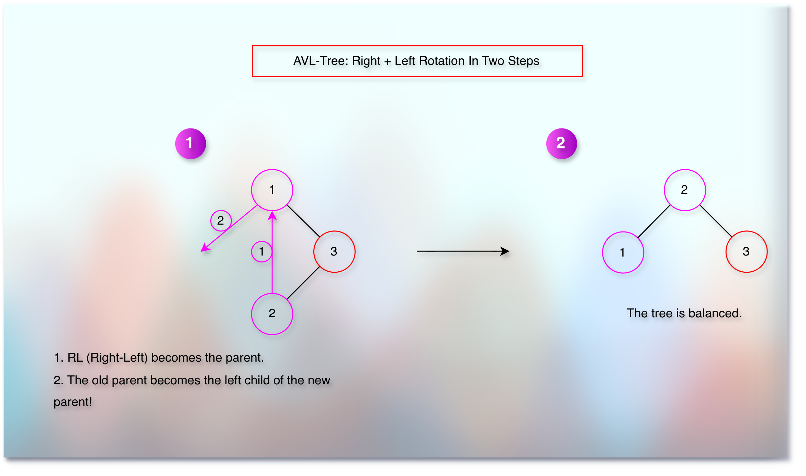

* An example of a dense tree, as shown in the image below:

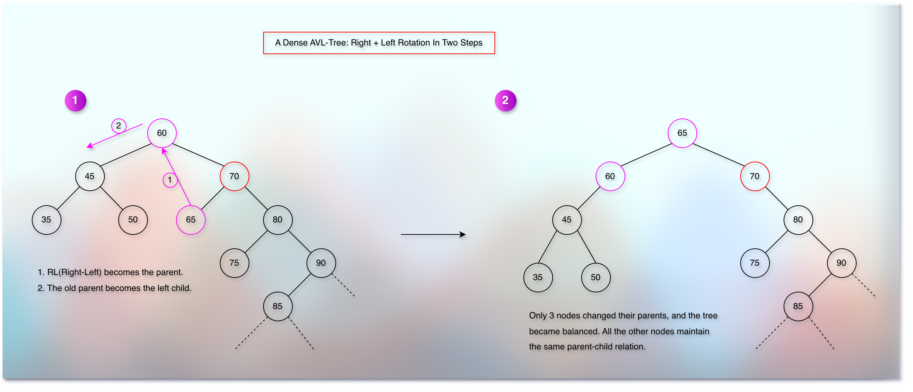


```kotlin

val bf = balanceFactor(unbalancedNode)
if (bf < -1) {
    rotateRight(unbalancedNode.right)
    rotateLeft(unbalancedNode)
}

```

## On which node do we perform the rotation when multiple nodes are imbalanced?

**When, how, and on which node do we perform a rotation?**

* The first unbalanced ancestor node becomes the subject.
* And the type of rotation depends on the relative position between the node that causes the imbalance and the subject node (the first unbalanced ancestor node).
* For example:

### Insert example

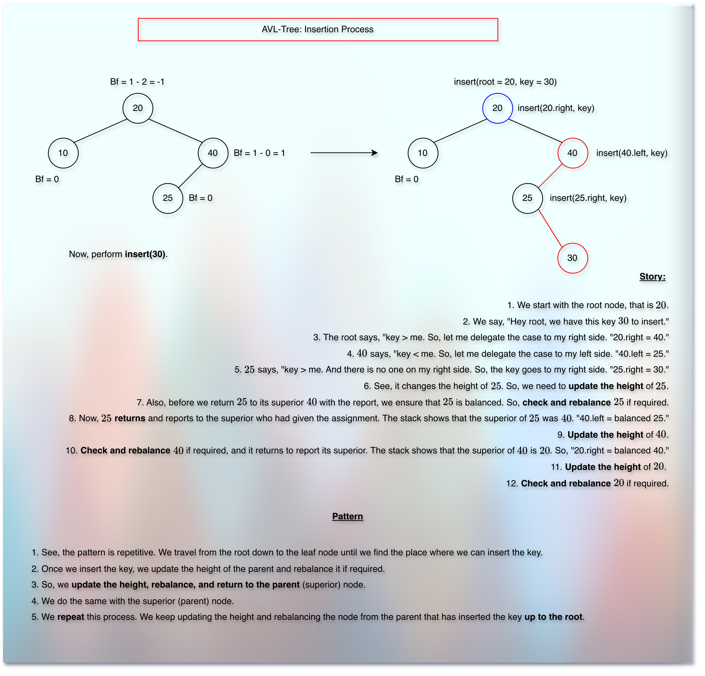

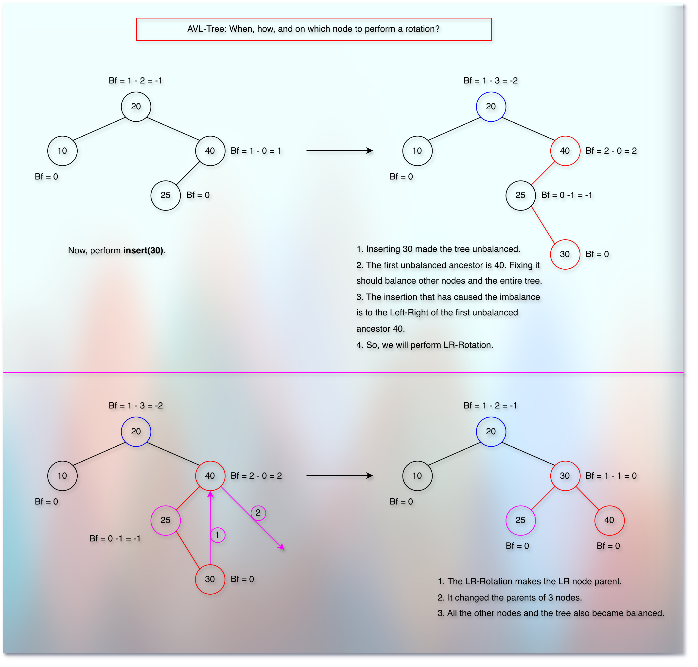

* Now, if we insert 22:

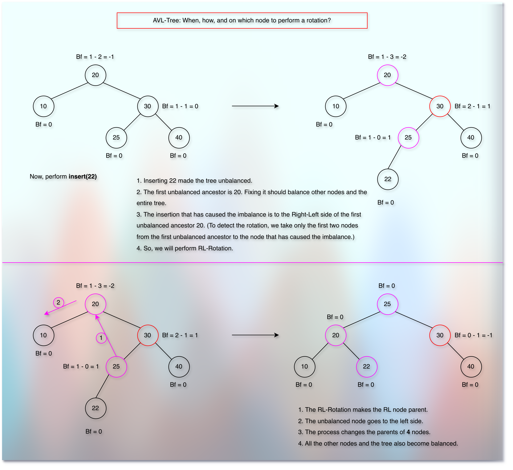

* Inserting `22` made the node `20` unbalanced.
* `20` is the first and only unbalanced ancestor node.
* The direction of first two nodes from the first unbalanced ancestor node, `20` towards the node that has caused imbalance is `RL`.
* Yes, we take only the first two nodes and it doesn't have to reach the node that has caused the imbalance.
* So, we perform the `RL-Rotation.`
* The root-cause node, `22` becomes the parent, and the old-parent, `20` goes to the left side.
* The process changes the parent of `4` nodes.

---

**Why do we take only the first two nodes to detect and decide the rotation?**

* Because, the direction of the first two nodes from the first unbalanced ancestor to the root-cause node is enough to decide the rotation and balance the tree.
* For example, if we had inserted `27` instead of `22`:

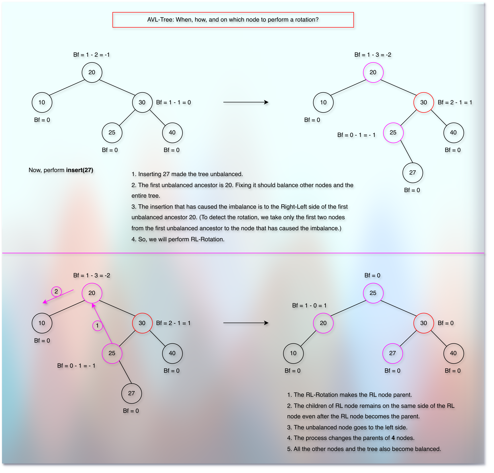

---

* Now, insert `50` (after inserting `22`):

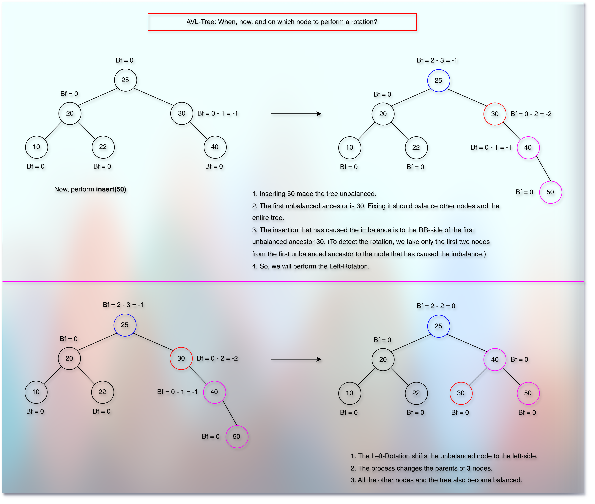

## How to distinguish between the right rotation and the LR-Rotation?

**When do we perform the right rotation?**

* When we have a left-sided tree.
* So, when `balanceFactor(unbalancedNode) > 1` for the unbalanced node.
* So, the balance factor of the unbalanced node belongs to the `positive` family.
* For example:


* For the left-sided tree, we also check the left child of the unbalanced node.
* If it is a pure (straight) left-sided tree, then the left child of the unbalanced node must have `balanceFactor(unbalancedNode.left) >= 0`.
* So, the left child of the unbalanced node also belongs to the `positive` family, or at least the neutral (zero) family.
* However, if `balanceFactor(unbalancedNode.left) < 0`, then it is zigzag and it is LR-Rotation.
* So, when the balance factor of the unbalanced node belongs to the positive family, but the balance factor linked to the left child of the unbalanced node belongs to the negative family, it is LR-Rotation.  
* For example:


**How to remember?**

* Be it the right rotation or the LR-rotation, it always starts with:

```kotlin
// The common condition for the right rotation and LR-Rotation
if (bf > 1) {
    
}
```

* Now, if it is a pure, straight left-sided tree, then the left child of the unbalanced node cannot be right-sided.
* So, in a pure unbalanced left-sided AVL-tree, `balanceFactor(unbalancedNode.left) >= 0`.
* In a pure, straight left-sided unbalanced AVL-Tree, both the `unbalancedNode` and `unbalancedNode.left` belong to the same `positive` family.
* But if `balanceFactor(unbalancedNode.left) < 0`, it means that the unbalanced node itself is left-sided, but the left child of the unbalanced node is right-sided.
* So, in the `RL-Cause`, the balance factor of the `unbalancedNode` belongs to the `positive` family, but the balance factor of its left child belongs to the `negative` family!
* So, the condition for the pure and straight unbalanced left-sided AVL-tree is:

```kotlin

if (balanceFactor(unbalancedNode) > 1 && balanceFactor(unbalancedNode.left) >= 0) {
    // This is a pure, straight unbalanced left-sided AVL-tree
}
```

* And the condition for the LR-Cause is:

```kotlin

if (balanceFactor(unbalancedNode) > 1 && balanceFactor(unbalancedNode.left) < 0) {
    // This is LR-Caused imbalance
}
```

## Final pseudocode for the right rotation

```kotlin

val bf = balanceFactor(node)
if (bf > 1 && balanceFactor(node.left) >= 0) {
    val oldLeftOfUnbalancedNode = node.left
    val rightChildIfAnyOfNewParent = oldLeftOfUnbalancedNode.right
    node.parent = oldLeftOfUnbalancedNode
    oldLeftOfUnbalancedNode.right = node
    node.left = rightChildIfAnyOfNewParent
    rightChildIfAnyOfNewParent.parent = node
    // Update the height from children to parent order
    updateHeight(rightChildIfAnyOfNewParent)
    updateHeight(node)
    updateHeight(oldLeftOfUnbalancedNode)
}

```

## Final pseudocode for the LR-Rotation

```kotlin

val bf = balanceFactor(node)
if (bf > 1 && balanceFactor(node.left) < 0) {
    rotateLeft(node.left)
    rotateRight(node)
}
```

## How to distinguish between the left rotation and the RL-Rotation? 

**When do we perform the left rotation?**

* When the BST is right-sided.
* It means when `balanceFactor(unbalancedNode) < -1`.
* We can remember it in this way: The balance factor of the unbalanced node belongs to the negative family for the **left rotation**.
* For the right-sided tree, we also check the right child of the unbalanced node.
* If the balance factor of the right child of the unbalanced node also belongs to the negative family or to the neutral family (zero), it is only the **single left rotation**.
* For example:


* However, when the unbalanced node belongs to the negative family, but the right child of the unbalanced node belongs to the positive family, it is the case of the double rotation: RL-Rotation.
* For example:


## Final pseudocode for the left rotation

```kotlin

val bf = balanceFactor(node)
if (bf < -1 && balanceFactor(node.right) <= 0) {
    // This is the case of a single left rotation
    val rightOfUnbalancedNode = node.right
    val leftOfNewParentIfAny = rightOfUnbalancedNode.left
    node.parent = rightOfUnbalancedNode
    rightOfUnbalancedNode.left = node
    node.right = leftOfNewParentIfAny
    leftOfNewParentIfAny.parent = node
    // Update the height from children to parent order.
    updateHeight(rightOfUnbalancedNode)
    updateHeight(node)
    updateHeight(leftOfNewParentIfAny)
}

```

## Final pseudocode for the RL-Rotation

```kotlin

val bf = balanceFactor(node)
if (bf < -1 && balanceFactor(node.right > 0)) {
    // This is the case of the double rotation: RL-Rotation
    rotateRight(node.right)
    rotateLeft(node)
}

```

## Rotation summary

* if `bf > 1`, it means the tree is left-sided. 
* So, we perform either right rotation or the LR-rotation.
  * How to remember? At the end, we do the right rotation only in `LR`.
  * For the left-sided tree, we check the left child.
  * If both the unbalanced node and the left child belong to the same family, it is the case of the single rotation: Right rotation.
  * Otherwise, it is the case of the double rotation: LR-Rotation.
* If `bf < -1`, it means that the tree is right-sided.
* So, we perform either the left rotation or the RL-rotation.
  * How to remember? At the end, we do the left rotation only in `RL`.
  * For the right-sided tree, we check the right child.
  * If both the unbalanced node and the right child belong to the same family, it is the case of the single rotation: Left rotation.
  * Otherwise, it is the case of the double rotation: RL-Rotation.
* `LR-Rotation`: (1) Left rotation on the `unbalancedNode.left` and then (2) Right rotation on the `unbalancedNode`.
* `RL-Rotation`: (1) Right rotation on the `unbalancedNode.right` and then (2) Left rotation on the `unbalancedNode`.

## Conclusion

* The first unbalanced ancestor node becomes the anchor of the rotation.
* To find the first unbalanced ancestor node, we travel upwards via parents of the root-cause node that has caused the imbalance.
* To decide the rotation, we check only the first two nodes from the first unbalanced ancestor to the node that has caused the imbalance. 
* The rotation changes maximum 4 nodes.
* The area of changes includes: Child-Parent relation and the balance factor (height).
* The rebalance must happen immediately after the moment of imbalance.
* We must not accumulate the imbalance weight (score). Otherwise, it becomes chaos.

## TL;DR

* A binary search tree can become a degenerated, linear, tall, thin, and unbalanced tree.
* To keep it balanced, we perform rotations.
* The following are the main four rotations that we need to remember:

**Right Rotation**

* The phrase "Right Rotation" should bring one of the below or both the images to our mind:
 
* 

* OR
 
* 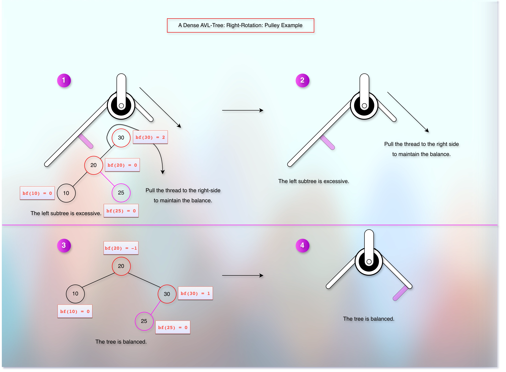
 
* When a grandparent moves to the right side, the right grandchild moves with them.
* When we rotate the grandparent to the right side, the old right grandchild becomes their new left child.

**Left-Right Rotation**

* The phrase "Left-Right Rotation" or "LR Rotation" should bring one of the below or both the images to our mind:

* 
 
* OR
 
* 

**How to remember?**

* Remember this pair: **Right rotation Vs. Left-Right rotation**
* The pair that starts with "Right" ends with "Right".
* To distinguish, check the opposite, which is "Left".
* For the right rotation, `main.bf > 1`.
* If `left.bf >= 0`, then it is the pure (single) right rotation.
* See the common relational comparator in the case of the pure (single) rotation.
* Otherwise, if `left.bf < 0`, it is LR rotation.
* LR rotation means the cause is: "Right Of Left".
  * Read it from right to left.
  * So, LR becomes: Right Of Left.
  * Draw it.
* In the LR rotation, first we perform the left rotation on the left child.
* Then we perform the right rotation on the main unbalanced node.
* Remember it like this:
  * Left-Right Rotation.
  * "Left" comes first.
  * So, Rotate "Left" on the "Left" side!
  * Then, rotate the main unbalanced node on the "Right" side!

```markdown

+--------------------------------------------------------+
|                                                        |
|                                                        |
|               (1) Right rotation (bf > 1)              |
|                    |                 |                 |
|                    |                 |                 |
|                    |         left.bf >= 0              |
|   left.bf >= 0     +------+                            |
|              <-------+    |                            |
|                      |    |                            |
+----------------------+----+----------------------------+
|                      |    |                            |
|                      |    v                            |
|               (2)  Left-Right rotation                 |
|                      ^                                 |
|                      |       left.bf < 0               |
|                      |                                 |
|                      |                                 |
|                                                        |
|                      Check left to distinguish         |
|                                                        |
|                      left.bf < 0                       |
|                                                        |
|               First, rotate left on the left side      |
|                                                        |
|        Then the unbalanced node on the right side      |
|                                                        |
+--------------------------------------------------------+

```

---

**Left Rotation**

* The phrase "Left Rotation" should bring one of the below or both the images to our mind:

* 
 
* OR
 
* 

* When we rotate the grandparent to the left side, the old left grandchild becomes their new right child.

**Right-Left Rotation**

* The phrase "Right-Left Rotation" or "RL Rotation" should bring one of the below or both the images to our mind:
* 
* 
* 
* OR
* 
* 

**How to remember?**

* Remember this pair: **Left rotation Vs. Right-Left rotation**
* The pair that starts with "Left" ends with "Left".
* To distinguish, check the opposite, which is "Right".
* For the left rotation, `main.bf < -1`.
* If `right.bf <= 0`, then it is the pure (single) left rotation.
* See the common relational comparator in the case of the pure (single) rotation.
* Otherwise, if `right.bf > 0`, it is RL rotation.
* RL rotation is caused by: "Left Of Right"
  * Read it from right to left.
  * So, RL becomes "Left Of Right".
  * Draw it.
* In the RL rotation, first we perform the right rotation on the right child.
* Then we perform the left rotation on the main unbalanced node.
* We can remember it like this:
  * Right-Left Rotation.
  * "Right" comes first.
  * So, we first rotate "Right" on the "Right" side.
  * Then, we rotate the main unbalanced node on the "Left" side.

```markdown

+--------------------------------------------------------+
|                                                        |
|                                                        |
|               (1) Left rotation (bf < -1)              |
|                    |                |                  |
|                    |                |                  |
|                    |       right.bf <= 0               |
|  right.bf <= 0     +------+                            |
|              <-------+    |                            |
|                      |    |                            |
+----------------------+----+----------------------------+
|                      |    |                            |
|                      |    v                            |
|               (2)  Right-Left rotation                 |
|                      ^                                 |
|                      |       right.bf > 0              |
|                      |                                 |
|                      |                                 |
|                                                        |
|                      Check right to distinguish        |
|                                                        |
|                      right.bf > 0                      |
|                                                        |
|             First, rotate right on the right side      |
|                                                        |
|         Then the unbalanced node on the left side      |
|                                                        |
+--------------------------------------------------------+

```

---

* Every time we insert or delete a node, we check the height and the balance of the parent node.
* If `bf < -1`, we perform either the left rotation or the RL-rotation.
  * If `bf < -1` and `right.bf <= 0`, then left rotation.
  * If `bf < - 1` but `right.bf > 0`, then LR rotation.
* If `bf > 1`, we perform either the right rotation or the LR-rotation.
  * If `bf > 1` and `left.bf >= 0`, it is the right rotation.
  * If `bf > 1` but `left.bf < 0`, it is LR rotation.
* We perform rotation primarily on the unbalanced node.
* But in the case of RL rotation, first we rotate the right child of the unbalanced node to the right side.
* Then we rotate the unbalanced node to the left side.
* Similarly, in LR rotation, first we rotate the left child of the unbalanced node to the left side.
* Then we rotate the unbalanced node to the right side.

**How do we find (distinguish) whether it is a left rotation or RL-rotation?**

* When do we perform the left rotation on an unbalanced node?
* When the balance factor of the unbalanced node is `< -1`.
* If it is a pure (single) left-rotation, then the balance factor of the right child will also be `< = 0`.
* Otherwise, it is a RL rotation.
* In RL rotation, first we rotate the right child in the right direction.
* And then we rotate the unbalanced node in the left direction.

**How do we find (distinguish) whether it is a right rotation or LR-rotation?**

* When do we perform the right rotation?
* When the balance factor of the unbalanced node is `bf > 1`.
* If it is a pure right-rotation, then the balance factor of the left child will also be `>= 0`.
* Otherwise, it is LR rotation.
* In LR rotation, we first rotate the left child in the left direction.
* And then we rotate the unbalanced node towards the right direction.

## What is the difference between a binary heap tree and a binary search tree?

* The binary heap tree is not a sorted tree.
* The binary search tree is sorted for `In-Order(Left-Parent-Right)` traversal.
* For almost every other operation, we need to consider two variations of a binary search tree: (1) A balanced binary search tree (2) A skewed binary search tree.
* `Insert` is `O(log n)` in a heap.
* In a heap, we perform the `swiftUp` operation to maintain the properties.
* It takes `O(log n)` time (Tree height).
* In a binary search tree, we start from the root and find the right place.
* If it is a balanced binary search tree, it takes `O(log n)`.
* Otherwise, a skewed `BST` can take `O(n)` time.
* `Search` is tricky. 
* `Search` for a balanced binary search tree (and not a skewed `BST`) is `O(log n)`. 
* Otherwise, it can be `O(n)` for a skewed `BST`.
* `searchMax` (`findMax`) is `O(1)` for a `maxHeap`.
* `searchMin` (`findMin`) is `O(1)` for a `minHeap`.
* `Search`, it can be `O(n)` for a heap. Because, we know that the `parent` is `greater` than children in the `maxHeap`, and `smaller` than children in the `minHeap`, but we don't know in which direction to go after the parent. 
* `Delete` is also tricky.
* `Delete`: If it is a balanced binary search tree (and not a skewed `BST`), then it is `O(log n)`. Otherwise, it can be `O(n)` for a skewed `BST` as we have to travel through each node.
* `Delete` can make the `BST` unbalanced. 
* We need to perform a rotation operation to rebalance the tree, which takes `O(1)` time.
* For a heap, it can be `O(n)` as we can't know in which direction to go after the parent. Hence, we might have to visit each node.
* In a heap, we may take `O(n)` time to find the node that we want to delete. 
* Then we increase the priority, which follows the `swiftUp` process and it takes `O(log n)` time. 
* And then, we extract it by swapping it with the leaf node, which follows the `swiftDown` process and it takes `O(log n)` time.
* So overall, for the `delete` operation, a `heap` takes `O(n) + O(log n) + O(log n)` time, where the dominant term is `O(n)`.
* `ExtractMax` is `O(1)` in the `maxHeap` tree.
* For a balanced binary search tree, it is `O(log n)`. Otherwise, it can be `O(n)` for a skewed binary search tree. 
* Similarly, `extractMin` is `O(1)` in the `minHeap` tree, `O(log n)` for a balanced binary search tree, and `O(n)` for a skewed binary search tree.

## ToDo

* Under each rotation theory → Pseudocode
  * Add step-by-step progress along with those 4 properties: Parent, left, right, and height.
* When and how do we recalculate the balance factor? Do we have to recalculate the balance factor of each node after each insert or delete operation? How does that work? 
* Why does the height update order matter?
* Maybe we can have a separate file for the insert and delete operations as this file has become too long.
  * I am unsure if it is better to have relevant (associated) concepts at one place. 
  * For example: Both the `insert` and `delete` operations also use `updateHeight`, `balanceFactor`, and `rotations`.
  * But this file focuses mainly on the `rotation` part.
  * If we use a separate file for the `insert` and `delete` operations, it will be step-by-step (the next step) progress.
  * I am convinced to have a separate file for the `insert` and `delete` operations.
* Actual implementation
* Relevant problems
  //ToDo: Follow The Standard Improvement Process.

## Next

* [AVLTree: Insert Operation](20avlTreeInsertOperation.md)
* [AVLTree: Delete Operation](25avlTreeDeleteOperation.md)
* [AVLTree: Implementation](../../../../../src/courses/uc/course02dataStructures/module05binarySearchTrees/030avlTreeImplementation.kt)
* [AVLTree: Merge Operation](30avlTreeMergeOperation.md)
* [AVLTree: Split Operation](40avlTreeSplitOperation.md)
* [AVLTree: Kth Small Key](50avlTreeFindKthSmallKey.md)
* [Flip (Replace) Using An AvlTree](60flipReplaceWithAvlTree.md)
* [Splay Trees](70splayTrees.md)
* [Red-Black Trees](80redBlackTrees.md)