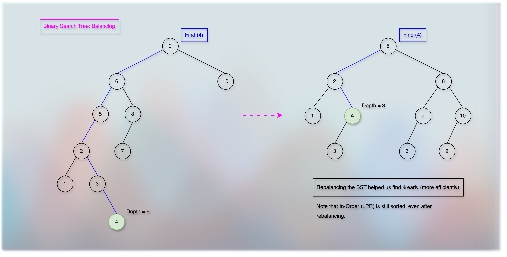
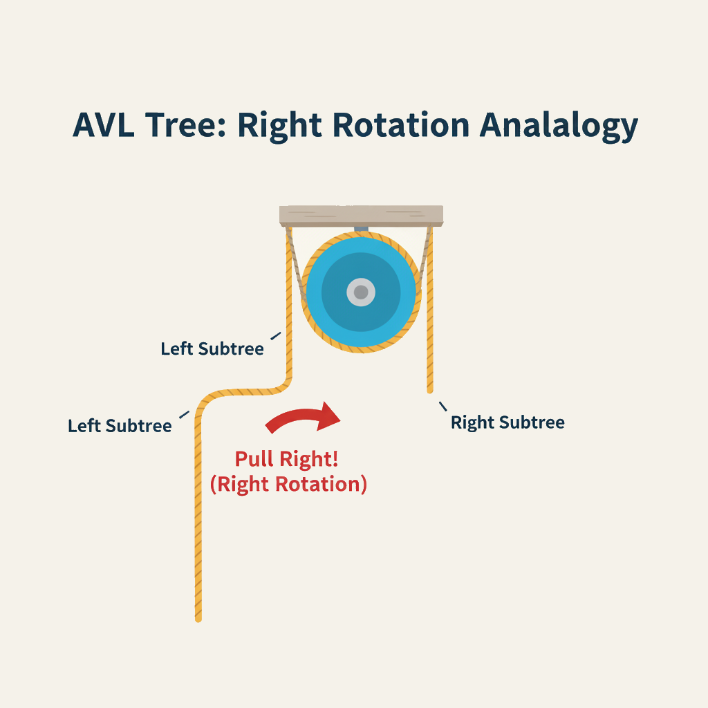
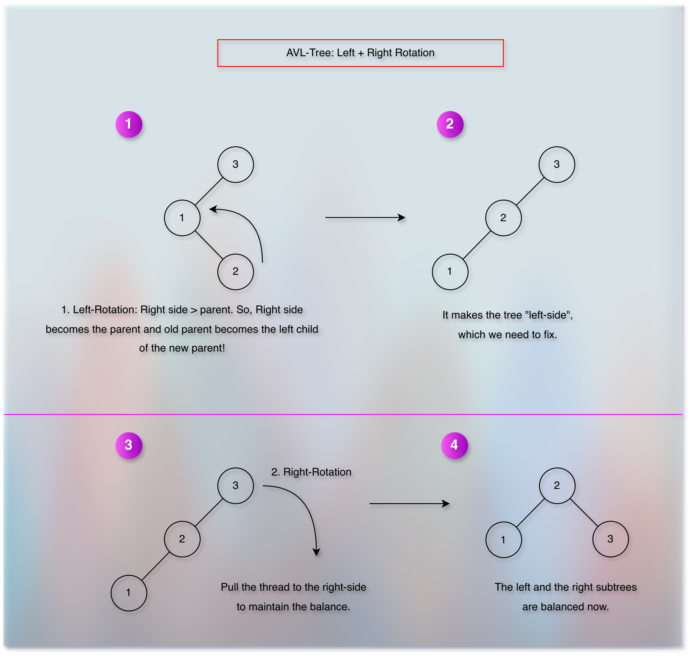

# Balancing A Binary Search Tree (BST)

<!-- TOC -->
* [Balancing A Binary Search Tree (BST)](#balancing-a-binary-search-tree-bst)
  * [Prerequisites/References](#prerequisitesreferences)
  * [Objectives](#objectives)
  * [Understanding the basic runtime of a binary search tree operation](#understanding-the-basic-runtime-of-a-binary-search-tree-operation)
  * [The depth problem](#the-depth-problem)
  * [How does the re-balancing solve the depth problem?](#how-does-the-re-balancing-solve-the-depth-problem)
  * [What can create an unbalanced tree?](#what-can-create-an-unbalanced-tree)
  * [How do we keep the binary search tree balanced?](#how-do-we-keep-the-binary-search-tree-balanced)
  * [Rotation of a binary search tree](#rotation-of-a-binary-search-tree)
  * [Balancing Thought Process](#balancing-thought-process)
  * [Height of a node](#height-of-a-node)
  * [A balanced binary search tree](#a-balanced-binary-search-tree)
  * [A node structure for balance](#a-node-structure-for-balance)
  * [AVL Claim: AVL Properties](#avl-claim-avl-properties)
  * [Summary: TL;DR](#summary-tldr)
  * [AVL-Tree Basic Left Rotation Idea](#avl-tree-basic-left-rotation-idea)
  * [AVL-Tree Basic Right Rotation Idea](#avl-tree-basic-right-rotation-idea)
  * [What is the difference between a binary heap tree and a binary search tree?](#what-is-the-difference-between-a-binary-heap-tree-and-a-binary-search-tree)
  * [Next](#next)
<!-- TOC -->

## Prerequisites/References

* [Trees](../module01BasicDataStructures/section03trees/trees.md)
* [Basic Data Structure Questions](../module01BasicDataStructures/questionsOnBasicDataStructures.md)
* [Priority Queues](../module03priorityQueuesHeapsDisjointSets/section01priorityQueuesIntroduction/priorityQueues.md)
* [Binary Heap Trees](../module03priorityQueuesHeapsDisjointSets/section02priorityQueuesUsingHeaps/topic02BinaryHeapTrees/binaryHeapTrees.md)
* [Complete Binary Tree](../module03priorityQueuesHeapsDisjointSets/section02priorityQueuesUsingHeaps/topic03CompleteBinaryTrees/completeBinaryTrees.md)
* [Heap Sort](../module03priorityQueuesHeapsDisjointSets/section03HeapSort/heapSort.md)
* [Binary Search Trees](05binarySearchTrees.md)
* [Binary Search Trees: Basic Operations](10binarySearchTreesBSTsBasicOperations.md)
* [AVL Visualization](https://www.cs.usfca.edu/~galles/visualization/AVLtree.html)
* [Abdul Bari Sir: AVL Tree](https://youtu.be/jDM6_TnYIqE?si=ozgBIYnV79pJw8Nc)

## Objectives

* Understand the basic runtime of a binary search tree operation.
* Understand the motivation behind the binary search tree balancing.
* Implement rotation.

## Understanding the basic runtime of a binary search tree operation


* The `find` operation depends on the `depth` of the tree.
* If a node has a higher depth, then we take more time.
* For example, while trying to find `6`.
* Similarly, if the node has a lower depth, we take less time.
* For example, `3`.
* If you remember, we have associated the well analogy with `depth` in [Trees](../module01BasicDataStructures/section03trees/trees.md).
* So, it is like a node that we want to find is in a well.
* It is looking upside waiting for someone to descend into the well.

## The depth problem


* If a binary search tree is not balanced, we might take `O(n)` time for the `find` operation. 

## How does the re-balancing solve the depth problem?



* Re-balancing reduces the depth and keeps the `in-order (LPR)` sorted.
* Hence, the `find` operation becomes faster (efficient).
* The key observation here is that the efficiency depends on the height of the tree.
* And the height of a tree depends on the height of subtrees.
* So, if we maintain the height of subtrees, we can maintain the height of the tree.
* If the distribution (structure) of the subtrees is unbalanced, then the tree becomes taller, unbalanced and inefficient.
* So, if we control and maintain the distribution (structure) of the subtree, we can control the efficiency of the tree.
* To control and maintain the distribution (structure) of a subtree, we need a way to define, and measure it.
* We already know that "height" is the defining property.
* And the measurement scale here is in terms of "balance."
* "Balance" is associated with the "height" only.
* So, "maintaining the balance" means "maintaining the height".
* And, a tree can be highly "unbalanced," "balanced," or somewhere in the middle.
* It means that the tree can be "taller," "shorter," or somewhere in the middle.
* Also, we need to ensure that the efforts of maintaining the balance should not defeat the core purpose.
* The core purpose is to make various operations, such as `find(search)` (that depends on the tree height) more efficient.

## What can create an unbalanced tree?


* Insert and delete operations.

## How do we keep the binary search tree balanced?

* Using the rotation technique.

## Rotation of a binary search tree

* It is possible to change the structure of a binary search tree without violating the rules that define the binary search tree.
* For example, as shown in the image below: 


## Balancing Thought Process

* To maintain the balance of a binary search tree, we need to define, measure, and keep track of the "balance".
* We use the term "height" to define, measure, and keep track of the "balance."

## Height of a node


* The longest path from the node to the leaf

```kotlin

val heightOfNode = 1 + maxOf(Node.left.height, Node.right.height) 

```

## A balanced binary search tree


* If the height of a left sub-tree is equal to the height of a right sub-tree, we call it a perfectly balanced tree.
* It means that, we need to add another field, "height" to the node structure.
* So that we can measure and keep track of the "balance".
* And when a tree is balanced:


$$
N.left.height == N.right.height
$$
$$
N.left.height - N.right.height = 0
$$

* However, maintaining a perfectly balanced binary search tree after every `insert` and `delete` operation might take `O(n)` time.
* The objective of maintaining the "balance" is to maintain the "height".
* If we maintain the "height" at most `O(log n)`, then we can perform various operations, such as `find(search)` efficiently.
* But if maintaining the perfect balance itself takes `O(n)` time, then it is not helpful.
* So, we take some flexibility here.
* In an AVL tree, we maintain the below property: 

$$
N.left.height - N.right.height <= 1
$$

* It is known as the "controlled balance."
* And the analysis of such an AVL-Tree, satisfies the below formula:

$$
N(h) = 1 + N(h - 1) + N(h - 2)
$$

* Here, `N(h)` means "minimum number of nodes for an AVL-Tree of height `h`."
* The formula connects (associates) the "minimum number of nodes" with the "height".
* And we will see that using the "rotation" technique, we can maintain this "flexible balance" (also known as: "enough balance," "perfectly imperfect balance," etc.) in just `O(1)` time!
* It means that we don't spend more time in maintaining the balance, and we can still maintain the tree height at most `O(log n)`.
* Now, to maintain the "balance," we need to maintain the "height".
* And to maintain the "height," we need to track it.
* To track "height," we introduce a new field (property) to the "node".

## A node structure for balance


## AVL Claim: AVL Properties

* We claim that the height of a balanced binary tree (AVL) is at most $O(log\ n)$.
* Now, height is made up with nodes.
* So, it is possible to get an idea about the total number of nodes based upon the height of the tree.
* And we can add (consider) the "balance" property into this relationship.
* So, we are trying to figure out the relationship between the height and the total number of nodes in a tree when the tree is balanced.
* So, we start with the minimum nodes.
* We want to figure out the minimum nodes for a binary tree of height `h`.
* As per the AVL property, the difference between the height of two children should be less than or equal to 1.
* We can have such an AVL tree as shown in the below image:


* Now, the subtree of height `h - 1` must have at least `h - 1` nodes.
* Let us denote it as `N(h - 1)` that says the minimum nodes in a tree of height `h - 1`.
* And the subtree of height `h - 2` must have at least `h - 2` nodes.
* So, `N(h - 2)` says the minimum nodes in a tree of height `h - 2`.
* Now, if we add `+1(the root node)` to `N(h - 1) + N(h - 2)`, we get the minimum nodes in a tree of height `h`.
* So, it is:

$$
N(h) = 1 + N(h - 1) + N(h - 2)
$$

* On the other hand, for a Fibonacci number $F_h$, we can say:

$$
F_h = F_{h - 1} + F_{h - 2}
$$

* The value of a Fibonacci number, $F_h$ is a summation of the previous (last) Fibonacci number, $F_{h - 1}$ and the second previous (second last) Fibonacci number, $F_{h - 2}$.
* And since $N(h)$ represents "minimum number of nodes for an AVL-Tree of height `h`," we can say:

$$
N(h) >= F_h
$$

* If we represent this "minimum number of nodes" as `n`, then it is:

$$
n >= F_h
$$

* Also:

$$
F_h >= 2^{\frac{h}{2}}
$$

* So, it becomes:

$$
n >= 2^{\frac{h}{2}}
$$

* Taking $log_2$ both the sides:

$$
log_2(n) >= log_2(2^{\frac{h}{2}})
$$

$$
log_2(n) >= \frac{h}{2}
$$

* Multiplying both the sides by 2:

$$
2log_2(n) >= h
$$

$$
h <= 2log_2(n)
$$

* Dropping the constant `2`,

$$
h <= log_2(n)
$$

* We just proved that the maximum height of an AVL-Tree is $log_2(n)$.

## Summary: TL;DR

* A binary search tree (BST) becomes inefficient as we perform the insert or delete operations.
* Insert or delete operations can skew the BST and make it taller and thin. 
* As a result, various operations such as `find(search)` become inefficient.
* The efficiency depends on the tree height.
* Tree height depends on the height of the subtrees.
* If we can control the height of the subtrees, we can maintain the height and efficiency of the tree.
* However, the efforts of controlling the height of the subtrees should not defeat the core purpose.
* The core purpose is to perform various operations such as `find(search)` efficiently.
* It turned out that, if we can control $N.left.height - N.right.height <= 1$, we get a nice enough balance.
* It is known as the "Adelson-Velsky and Landis (AVL)" property. 
* The minimum number of nodes for an AVL-Tree of height, `h` is:

$$
N(h) = 1 + N(h - 1) + N(h - 2)
$$

* We can relate it with a Fibonacci number, $F_h$.

$$
F_h >= 2^{\frac{h}{2}}
$$

$$
n >= 2^{\frac{h}{2}}
$$

$$
log_2(n) >= h
$$

$$
h <= log_2(n)
$$

* It means that the maximum height of an AVL-Tree is $log(n)$. 
* Next, we will see how to maintain the AVL-Tree property through the "rotation" technique.

## How do we find (calculate) which side is more weighted?

* We use the "height" property of a node to measure and fix the balance.
* The formula (AVL-Tree Property) is:

$$
| \text{Balance Factor} | = | \text{Height Of A Left-Subtree} - \text{Height Of A Right-Subtree} |
$$

* And we want to ensure that:

$$
| \text{Balance Factor} | <= 1
$$

## AVL-Tree Basic Left Rotation Idea

* When we have an excessive right-subtree, we perform the left-rotation.
* It is also known as "RR-Rotation (Right of right rotation)".
* Because it happens when the right of right node causes the imbalance.
* So, the name "RRR" is based upon the root cause of the rotation.
* And to fix that, we perform the "Left Rotation."


* We can understand this with an analogy of a pulley.


* When the right-side is more weighted, we pull the left-side to maintain the balance.


* Now, we can take an example of a dense tree.


* We can see that no matter how dense the tree is, we need to change the parents of only 3 nodes to balance the entire tree.
* We can understand this with the pulley example also.


## AVL-Tree Basic Right Rotation Idea

* When we have an excessive left-subtree, we perform the right-rotation.
* We also call it "LL-Rotation."
* Because it happens when the left of left node causes the imbalance.
* So, remember that the name "LLR" is based upon the root cause of the imbalance.
* And to fix it, we perform "Right Rotation."


* We can understand this with an analogy of a pulley.



* When the left-side is more weighted, we pull the right-side to maintain the balance.


* Now, we can take an example of a dense tree.


* Again, we can visualize and understand it better with the pulley analogy. 


## AVL-Tree Basic Left-Right Rotation Idea

* Sometimes, we need to perform multiple rotations to balance the tree.
* The below image shows a left-rotation followed by the right-rotation. 



* We can do the Left-Right Rotation in two steps also, as shown in the image below.


* Now, we can take an example of a dense tree, as shown in the image below.


## AVL-Tree Basic Right-Left Rotation Idea

* Similarly, the below image shows a right-rotation followed by the left-rotation.


* Right-Left Rotation in two steps, as shown in the image below:


* An example of a dense tree, as shown in the image below:


## On which node do we perform the rotation when multiple nodes are imbalanced?

**When, how, and on which node do we perform a rotation?**

* The first unbalanced ancestor node becomes the subject.
* And the type of rotation depends on the relative position between the node that causes the imbalance and the subject node (the first unbalanced ancestor node).
* For example:


//ToDo: Follow The Standard Improvement Process.

## What is the difference between a binary heap tree and a binary search tree?

## Next