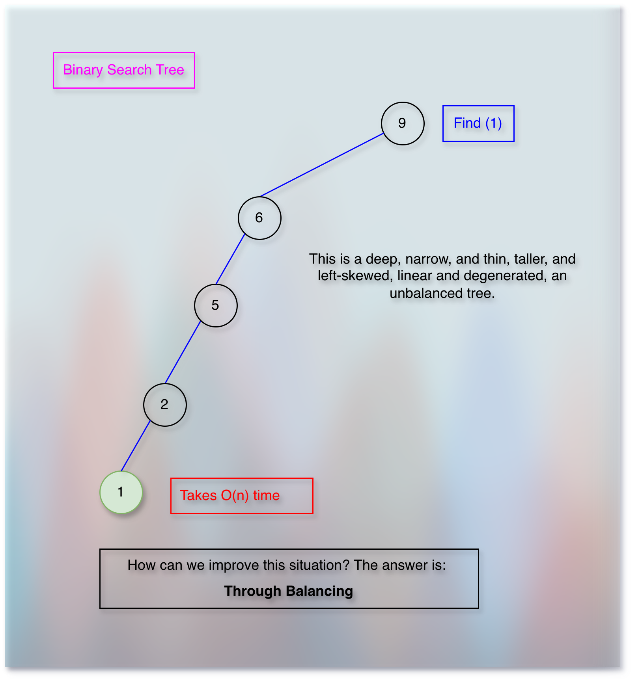

# Balancing A Binary Search Tree (BST)

<!-- TOC -->
* [Balancing A Binary Search Tree (BST)](#balancing-a-binary-search-tree-bst)
  * [Prerequisites/References](#prerequisitesreferences)
  * [Objectives](#objectives)
  * [Understanding the basic runtime of a binary search tree operation](#understanding-the-basic-runtime-of-a-binary-search-tree-operation)
  * [What is the difference between a binary heap tree and a binary search tree?](#what-is-the-difference-between-a-binary-heap-tree-and-a-binary-search-tree)
  * [Next](#next)
<!-- TOC -->

## Prerequisites/References

* [Trees](../module01BasicDataStructures/section03trees/trees.md)
* [Basic Data Structure Questions](../module01BasicDataStructures/questionsOnBasicDataStructures.md)
* [Priority Queues](../module03priorityQueuesHeapsDisjointSets/section01priorityQueuesIntroduction/priorityQueues.md)
* [Binary Heap Trees](../module03priorityQueuesHeapsDisjointSets/section02priorityQueuesUsingHeaps/topic02BinaryHeapTrees/binaryHeapTrees.md)
* [Complete Binary Tree](../module03priorityQueuesHeapsDisjointSets/section02priorityQueuesUsingHeaps/topic03CompleteBinaryTrees/completeBinaryTrees.md)
* [Heap Sort](../module03priorityQueuesHeapsDisjointSets/section03HeapSort/heapSort.md)
* [Binary Search Trees](05binarySearchTrees.md)
* [Binary Search Trees: Basic Operations](10binarySearchTreesBSTsBasicOperations.md)

## Objectives

* Understand the basic runtime of a binary search tree operation.
* Understand the motivation behind the binary search tree balancing.
* Implement rotation.

## Understanding the basic runtime of a binary search tree operation

* The `find` operation depends on the `depth` of the tree.
* If a node has a higher depth, then we take more time.
* For example, while trying to find `6`.
* Similarly, if the node has a lower depth, we take less time.
* For example, `3`.
* If you remember, we have associated the well analogy with `depth` in [Trees](../module01BasicDataStructures/section03trees/trees.md).
* So, it is like a node that we want to find is in a well.
* It is looking upside waiting for someone to descend into the well.

## The depth problem

* If a binary search tree is not balanced, we take `O(n)` time for the `find` operation. 

## How does the re-balancing solve the depth problem?

* Re-balancing reduces the depth.
* Hence, the `find` operation becomes faster (efficient).

## What is the difference between a binary heap tree and a binary search tree?

## Next