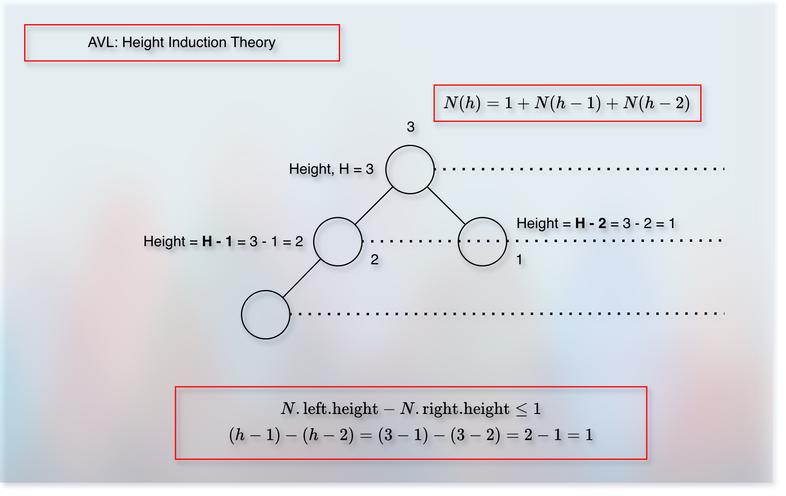

# Balancing A Binary Search Tree (BST)

<!-- TOC -->
* [Balancing A Binary Search Tree (BST)](#balancing-a-binary-search-tree-bst)
  * [Prerequisites/References](#prerequisitesreferences)
  * [Objectives](#objectives)
  * [Understanding the basic runtime of a binary search tree operation](#understanding-the-basic-runtime-of-a-binary-search-tree-operation)
  * [The depth problem](#the-depth-problem)
  * [How does the re-balancing solve the depth problem?](#how-does-the-re-balancing-solve-the-depth-problem)
  * [What can create an unbalanced tree?](#what-can-create-an-unbalanced-tree)
  * [How do we keep the binary search tree balanced?](#how-do-we-keep-the-binary-search-tree-balanced)
  * [Rotation of a binary search tree](#rotation-of-a-binary-search-tree)
  * [Balancing Thought Process](#balancing-thought-process)
  * [Height of a node](#height-of-a-node)
  * [A balanced binary search tree](#a-balanced-binary-search-tree)
  * [A node structure for balance](#a-node-structure-for-balance)
  * [AVL Claim: AVL Properties](#avl-claim-avl-properties)
  * [What is the difference between a binary heap tree and a binary search tree?](#what-is-the-difference-between-a-binary-heap-tree-and-a-binary-search-tree)
  * [Next](#next)
<!-- TOC -->

## Prerequisites/References

* [Trees](../module01BasicDataStructures/section03trees/trees.md)
* [Basic Data Structure Questions](../module01BasicDataStructures/questionsOnBasicDataStructures.md)
* [Priority Queues](../module03priorityQueuesHeapsDisjointSets/section01priorityQueuesIntroduction/priorityQueues.md)
* [Binary Heap Trees](../module03priorityQueuesHeapsDisjointSets/section02priorityQueuesUsingHeaps/topic02BinaryHeapTrees/binaryHeapTrees.md)
* [Complete Binary Tree](../module03priorityQueuesHeapsDisjointSets/section02priorityQueuesUsingHeaps/topic03CompleteBinaryTrees/completeBinaryTrees.md)
* [Heap Sort](../module03priorityQueuesHeapsDisjointSets/section03HeapSort/heapSort.md)
* [Binary Search Trees](05binarySearchTrees.md)
* [Binary Search Trees: Basic Operations](10binarySearchTreesBSTsBasicOperations.md)
* [AVL Visualization](https://www.cs.usfca.edu/~galles/visualization/AVLtree.html)

## Objectives

* Understand the basic runtime of a binary search tree operation.
* Understand the motivation behind the binary search tree balancing.
* Implement rotation.

## Understanding the basic runtime of a binary search tree operation


* The `find` operation depends on the `depth` of the tree.
* If a node has a higher depth, then we take more time.
* For example, while trying to find `6`.
* Similarly, if the node has a lower depth, we take less time.
* For example, `3`.
* If you remember, we have associated the well analogy with `depth` in [Trees](../module01BasicDataStructures/section03trees/trees.md).
* So, it is like a node that we want to find is in a well.
* It is looking upside waiting for someone to descend into the well.

## The depth problem


* If a binary search tree is not balanced, we might take `O(n)` time for the `find` operation. 

## How does the re-balancing solve the depth problem?


* Re-balancing reduces the depth and keeps the `in-order (LPR)` sorted.
* Hence, the `find` operation becomes faster (efficient).

## What can create an unbalanced tree?


* Insert and delete operations.

## How do we keep the binary search tree balanced?

* Using the rotation technique.

## Rotation of a binary search tree

* It is possible to change the structure of a binary search tree without violating the rules that define the binary search tree.
* For example, as shown in the image below: 


## Balancing Thought Process

* To maintain the balance of a binary search tree, we need to define, measure, and keep track of the "balance".
* We use the term "height" to define, measure, and keep track of the "balance."

## Height of a node


* The longest path from the node to the leaf

```kotlin

val heightOfNode = 1 + maxOf(Node.left.height, Node.right.height) 

```

## A balanced binary search tree


* If the height of a left sub-tree is equal to the height of a right sub-tree, we call it a balanced tree.
* It means that, we need to add another field, "height" to the node structure.
* So that we can measure and keep track of the "balance".
* And when a tree is balanced:


$$
N.left.height == N.right.height
$$
$$
N.left.height - N.right.height = 0
$$

* However, maintaining a perfectly balanced binary search tree after every `insert` and `delete` operation might take `O(n)` time.
* The objective of maintaining the "balance" is to maintain the "height".
* If we maintain the "height" at most `O(log n)`, then we can perform various operations, such as `find(search)` efficiently.
* But if maintaining the perfect balance itself takes `O(n)` time, then it is not helpful.
* So, we take some flexibility here.
* In an AVL tree, we maintain the below property: 

$$
N.left.height - N.right.height <= 1
$$

* And we will see that using the "rotation" technique, we can maintain this "flexible balance" (also known as: "enough balance," "perfectly imperfect balance," etc.) in just `O(1)` time!
* It means that we don't spend more time in maintaining the balance, and we can still maintain the tree height at most `O(log n)`.
* Now, to maintain the "balance," we need to maintain the "height".
* And to maintain the "height," we need to track it.
* To track "height," we introduce a new field (property) to the "node".

## A node structure for balance


## AVL Claim: AVL Properties

* We claim that the height of a balanced binary tree (AVL) is at most $O(log\ n)$.
* Now, height is made up with nodes.
* So, it is possible to get an idea about the total number of nodes based upon the height of the tree.
* And we can add (consider) the "balance" property into this relationship.
* So, we are trying to figure out the relationship between the height and the total number of nodes in a tree when the tree is balanced.
* So, we start with the minimum nodes.
* We want to figure out the minimum nodes for a binary tree of height `h`.
* As per the AVL property, the difference between the height of two children should be less than or equal to 1.
* We can have such an AVL tree as shown in the below image:




## What is the difference between a binary heap tree and a binary search tree?

## Next