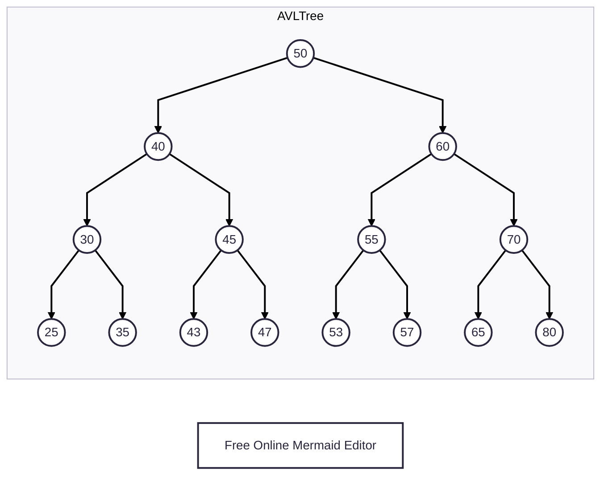

# Split An AvlTree into Two AvlTrees

<!-- TOC -->
* [Split An AvlTree into Two AvlTrees](#split-an-avltree-into-two-avltrees)
  * [Prerequisites](#prerequisites)
  * [The Problem Statement](#the-problem-statement)
  * [Thought Process: Brick by brick, Step by step:](#thought-process-brick-by-brick-step-by-step)
    * [Understanding the requirements and output](#understanding-the-requirements-and-output-)
    * [Return type](#return-type)
    * [Approach, idea](#approach-idea)
      * [Pattern](#pattern)
    * [Building the function](#building-the-function)
    * [Break and Merge (Break and build)](#break-and-merge-break-and-build)
    * [Justifying the property names of the `SplitResult`](#justifying-the-property-names-of-the-splitresult)
    * [Understanding the recursion part (Dry Run)](#understanding-the-recursion-part-dry-run)
  * [Next](#next)
<!-- TOC -->

## Prerequisites

* [Trees](../module01BasicDataStructures/section03trees/trees.md)
* [Basic Data Structure Questions](../module01BasicDataStructures/questionsOnBasicDataStructures.md)
* [Priority Queues](../module03priorityQueuesHeapsDisjointSets/section01priorityQueuesIntroduction/priorityQueues.md)
* [Binary Heap Trees](../module03priorityQueuesHeapsDisjointSets/section02priorityQueuesUsingHeaps/topic02BinaryHeapTrees/binaryHeapTrees.md)
* [Complete Binary Tree](../module03priorityQueuesHeapsDisjointSets/section02priorityQueuesUsingHeaps/topic03CompleteBinaryTrees/completeBinaryTrees.md)
* [Heap Sort](../module03priorityQueuesHeapsDisjointSets/section03HeapSort/heapSort.md)
* [Binary Search Trees](05binarySearchTrees.md)
* [Binary Search Trees: Basic Operations](10binarySearchTreesBSTsBasicOperations.md)
* [AVL Visualization](https://www.cs.usfca.edu/~galles/visualization/AVLtree.html)
* [Abdul Bari Sir: AVL Tree](https://youtu.be/jDM6_TnYIqE?si=ozgBIYnV79pJw8Nc)
* [AVL Insert](20avlTreeInsertOperation.md)
* [AVL Delete](25avlTreeDeleteOperation.md)
* [avlTreeImplementation.kt](../../../../../src/courses/uc/course02dataStructures/module05binarySearchTrees/010avlTreeImplementation.kt)

## The Problem Statement

* Split the given `AvlTree` from the node of key `x` in such a way that we get two `AVLTrees` where one `AvlTree` gets all the nodes that are less than or equal to `x`, and the other `AvlTree` gets all the nodes that are greater than `x`.

$$T_1 <= x$$
$$T_2 > x$$

## Thought Process: Brick by brick, Step by step:

### Understanding the requirements and output 

* We want to split the given `AvlTree` into two `AvlTrees`.
* So, our final output will be two `AvlTrees`.
* Now, we denote one `AvlTree` as $T_1$ and another as $T_2$.
* $T_1$ should be $T_1 <= x$.
* It means that all the nodes (keys) of $T_1$ must be at most `x`.
* We can call $T_1$ the small (light, left) tree. 
* When we say a small tree, the focus is on the key value of any node, and not on the overall height of the tree.
* Similarly, $T_2$ should be $T_2 > x$.
* It means that all the nodes (keys) must be greater than `x`.
* We can call $T_2$ the big (heavy, right) tree.
* When we say a big tree, the focus is on the key value of any node, and not on the overall height of the tree.

### Return type

* Two `AvlTrees` so that $T_1 <= x$, and $T_2 > x$.
* So, we can return a pair of `AvlTrees` or return an encapsulated `data class`.

### Approach, idea




* We want to know whether a particular node belongs to $T_1 <= x$, or $T2 > x$.
* So, we are doing some sort of segregation and classification here.
* To identify, segregate, and classify all the nodes, we need to travel.
* We start our traversal from the root of the given `AvlTree`.
* Now, there is an interesting magic (observation, characteristics) of an `AvlTree`.
* We don't have to visit all the nodes.
* We can classify a chunk of multiple nodes (a subtree) based on the current node.
* For example, suppose that we have the above given `AvlTree`.
* And suppose that the `target` is `60`.
* Now, we start our traversal from `50`.
* The current node: `50 <= target` belongs to $T_1$.
* At this point, we know that the entire left subtree of `50` also belongs to $T_1$.
* This is a certain part.
* So, we need to leverage this characteristic of the `AvlTree`.
* Maybe we can somehow avoid going further down the left side of `50`.
* And we can just travel towards the right side of `50`.
* Because the right child of `50` can still have a left subtree that might belong to $T_1$.
* But we are unsure about it.
* The right child of `50` may or may not have such a subtree.
* So, this is the uncertain part that we still need to travel.
* Not only because it is the uncertain part, but we need to classify a subtree or a node that belongs to $T_2$.
* So, to classify a subtree or a node for $T_2$, we travel towards the right side of `50`.
* Think of it in the following way:
* When `node.key <= target`, we immediately classify the entire `node.left` as $T_1$ without traveling there.
* Next, we need to classify the remaining uncertain side (`node.right`), about which we are unsure.
* So, when `node.key <= target`, we move towards the `node.right` side.
* Similarly, when we are at `70`, we are sure that the entire right side from `70` must belong to $T_2$.
* Because that is the characteristic of an `AvlTree`.
* So again, this is a certain part.
* And again, maybe we can somehow avoid going further down the right side of `70`.
* But we still need to travel to the left side of `70`.
* Because deep down the left side of `70` can have a subtree that might belong to $T_1$.
* But we are unsure about it.
* The left side of `70` may or may not have such a subtree or node.
* So, this is the uncertain part that we still need to travel.
* Again, we can think of it in the following way:
* When `node.key > target`, we immediately classify the entire `node.right` as $T_2$ without traveling there.
* Next, we need to classify the remaining uncertain side (`node.left`), about which we are unsure.
* So, when `node.key > target`, we travel towards the `node.left` side.

#### Pattern

* At any node, we classify it, and possibly also a particular side (subtree) of it, and then we decide in which direction to go further.
* This process of classification remains the same; only the input keeps changing.
* So, it suggests the recursion pattern.

```kotlin
fun split(node: AvlNode, target: AvlNode) {
    if (node.key <= target.key) {
        // We are sure that `node.left` also belongs to $T_1$. 
        // So, we travel towards the remaining uncertain side, which is `node.right`.
        // Note that at this point, this is just a traversal.
        // There is no way to store the classification information at the moment.
        // We will build the entire solution gradually, brick by brick, step by step.
        split(node.right)
    } else {
        // We are sure that `node.right` also belongs to $T_2$.
        // So, we travel towards the remaining uncertain side, which is `node.left`.
        // Note that at this point, this is just a traversal.
        // There is no way to store the classification information at the moment.
        // We will build the entire solution gradually, brick by brick, step by step.
        split(node.left)
    }
}
```

* At some point, we will hit a leaf node.
* And for a leaf node, left and right children (sides) are null.
* So, we need to consider that, maybe as our base case.

```kotlin
fun split(node: AvlNode, target: AvlNode) {
    if (node == null) return
    if (node.key <= target.key) {
        // We are sure that `node.left` also belongs to $T_1$. 
        // So, we travel towards the remaining uncertain side, which is `node.right`.
        // Note that at this point, this is just a traversal.
        // There is no way to store the classification information at the moment.
        // We will build the entire solution gradually, brick by brick, step by step.
        split(node.right)
    } else {
        // We are sure that `node.right` also belongs to $T_2$.
        // So, we travel towards the remaining uncertain side, which is `node.left`.
        // Note that at this point, this is just a traversal.
        // There is no way to store the classification information at the moment.
        // We will build the entire solution gradually, brick by brick, step by step.
        split(node.left)
    }
}
```

* Now, at some point, we will be at the leaf node.
* //ToDo: It feels like a few things (dots, links, explanation) are missing between these two (above and below) lines. It feels like a disconnection and a missing information. It doesn't feel like fluid and connected. Something is missing in between here.
* A tree is always built from the bottom.
* So, we need to build the tree from the bottom.
* And to build a tree, we need 3 data: The parent node, left subtree (a.k.a. left tree or left child), and the right subtree (a.k.a. right tree or right child).
* Now, when we reach the leaf node, we need to have the references of the parent node, so that we can merge them.
* And this merged tree will be a subtree for a particular parent node.
* And this process keeps going on.
* So that will be the reverse journey.
* First, we travel towards the bottom, and then we travel towards the top.
* As we travel towards the top, we merge and build the tree.
* Notice that the return type gives us a tree that we need to attach to the parent node.
* And every time we need to attach the tree to a particular node, we need to know whether the tree goes to the right side of the parent node or the left side of the parent node.
* Every time we merge a tree, we need to know whether the tree is a part of $T_1$ or $T_2$.
* The condition to decide whether a particular node is a part of $T_1$ or $T_2$ is simple.
* `if (node.key <= target)`, then it is the part of $T_1$.
* Else, it is part of $T_2$.

### Building the function


* We want to split the given `AvlTree` into two `AvlTrees`.
* So, let us call the function: `split`.
* And we want to split it from a particular node.
* Let us call this node `x`, `target`, or `limit` node.
* So, the `split` function expects this `target` node.
* And we want to return two `AvlTrees`.
* Let us encapsulate these two `AvlTrees` into a `data class` and call it `SplitResult`.
* This `SplitResult` data class might look like below:

```kotlin
// We will clarify and justify the names and order of the properties soon.
data class SplitResult(val t1LeftTree: AvlTree, val t2RightTree: AvlTree)

```

* The property name `t1LeftTree` conveys that all the nodes in this tree have values at most `target`.
* Similarly, the property name `t2RighTree` conveys that all the nodes of this tree have values greater than the `target` value.
* Back to our function `Split`.
* So, the function returns `SplitResult`.

```kotlin

fun split(node: AvlNode, target: AvlNode): SplitResult {
    
}

```

* To find all the nodes for $T_1$ and $T_2$, we need to travel the tree. 
* The traversal follows the typical binary search tree.
* The traversal starts from the root node.
* So, it looks like:

```kotlin

fun split(node: AvlNode, target: AvlNode): SplitResult {
    if (node == null) return SplitResult(null, null)
    if (node.key <= target.key) {
        // We are sure that `node.left` also belongs to $T_1$. 
        // So, we travel towards the remaining uncertain side, which is `node.right`.
        // Note that at this point, this is just a traversal.
        // There is no way to store the classification information at the moment.
        // We will build the entire solution gradually, brick by brick, step by step.
        // We will also clarify and justify the names and order of the properties soon.
        val (t1LeftTree, t2RightTree) = split(node.right)
    } else {
        // We are sure that `node.right` also belongs to $T_2$.
        // So, we travel towards the remaining uncertain side, which is `node.left`.
        // Note that at this point, this is just a traversal.
        // There is no way to store the classification information at the moment.
        // We will build the entire solution gradually, brick by brick, step by step.
        // We will also clarify and justify the names and order of the properties soon.
        val (t1LeftTree, t2RightTree) = split(node.left)
    }
}

// When we call the `split` function for the first time, from the outside, we pass `root`.
// Because that's the node from where we start our binary search type traversal. 
split(root, target)

```

### Break and Merge (Break and build)


 * Now, to create two `AvlTrees` from the one `AvlTree`, we need to break it first.
 * We break and group (segregate, classify) it in such a way that we get two `AvlTres` as $T_1 <= x$ and $T_2 > x$.
 * Now, when we say `break` the `AvlTree`, we are talking about breaking the connections of the nodes.
 * **So, how do we break the connections of a node?**

```kotlin
node.left = null
node.right = null
node.height = 1
```

* So, the `split` function might look like this:

```kotlin

fun split(node: AvlNode, target: AvlNode): SplitResult {
    if (node == null) return SplitResult(null, null)
    // Before breaking the node, we need to take references to its children as we use them later
    val leftChild = node.left
    val rightChild = node.right
    node.left = null
    node.right = null
    node.height = 1
    if (node.key <= target) {
        // We will also clarify and justify the names and order of the properties soon.
        val (t1LeftTree, t2RightTree) = split(rightChild, target)
    } else {
        // We will also clarify and justify the names and order of the properties soon.
        val (t1LeftTree, t2RightTree) = split(leftChild, target)
    }
}

```

* Now, after breaking the tree, we also need to `merge` the segregated, classified nodes.
* **So, how do we merge two `AvlTrees`?**
* Prerequisites/Reference: The `merge` process is already implemented below:

* [avlTreeImplementation.kt](../../../../../src/courses/uc/course02dataStructures/module05binarySearchTrees/010avlTreeImplementation.kt)


* Where do we call this `mergeTwoAvlTrees` function?
* The `SplitResult` returns two trees.
* So, it can be as given below:

```kotlin
fun split(node: AvlNode, target: AvlNode): SplitResult {
    if (node == null) return SplitResult(null, null)
    // Before breaking the node, we need to take references to its children as we use them later
    val leftChild = node.left
    val rightChild = node.right
    node.left = null
    node.right = null
    node.height = 1
    if (node.key <= target) {
        // We will also clarify and justify the names and order of the properties soon.
        val (t1LeftTree, t2RightTree) = split(rightChild, target)
        val mergedTree = mergeTwoAvlTrees(whatDoWePassHere, whatDoWePassHere, whatDoWePassHere)
    } else {
        // We will also clarify and justify the names and order of the properties soon.
        val (t1LeftTree, t2RightTree) = split(leftChild, target)
        val mergedTree = mergeTwoAvlTrees(whatDoWePassHere, whatDoWePassHere, whatDoWePassHere)
    }
}
```

* The `mergeTwoAvlTrees` function takes three arguments:
* The root node of tree one, the root node of tree two, and the pivot node that connects these two trees.
* So, what do we pass to this `mergeTwoAvlTrees` function?
* **What is the job, role, responsibility, and purpose of this `mergeTwoAvlTrees` function?**
* We have two `mergeTwoAvlTrees` functions inside the `split` function.  
* 
`if (node.key <= x)`:

* The `leftChild` that we read and stored earlier belongs to the $T_1$ tree.
* We know that the `node.key <= x` belongs to the $T_1$ tree.
* Inside that condition, `t1LeftTree` also belongs to the $T_1$ tree.
* //ToDo: It will be interesting and helpful to know and understand why and how the `t1LeftTree` belongs to the $T_1$ tree. Maybe it has something to do with the fact that we process the `uncertain` part when we recursively call the `split` function. Maybe this behavior (action, process) holds `t1LeftTree`. Maybe this is how we accumulate, segregate, assort, and collect the nodes that belong to the $T_1$ tree. Consider explaining.
* And the `node` itself belongs to the $T_1$ tree, because its `key <= x`.
* So, inside `node.key <= x`, we have `leftChild`, `t1LeftTree`, and `node` as the pivot.  

```kotlin
fun split(node: AvlNode, target: AvlNode): SplitResult {
    if (node == null) return SplitResult(null, null)
    // Before breaking the node, we need to take references to its children as we use them later
    val leftChild = node.left
    val rightChild = node.right
    node.left = null
    node.right = null
    node.height = 1
    if (node.key <= target) {
        val (t1LeftTree, t2RightTree) = split(rightChild, target)
        val mergedTree = mergeTwoAvlTrees(leftChild, t1LeftTree, node)
    } else {
        val (t1LeftTree, t2RightTree) = split(leftChild, target)
        val mergedTree = mergeTwoAvlTrees(whatDoWePassHere, whatDoWePassHere, whatDoWePassHere)
    }
}
```

`else` (which means when `node.key > x`):
* The `rightChild` that we read and stored earlier belongs to the $T_2$ tree.
* The `node` belongs to the $T_2$ because its `key > x`.
* And the `t2RightTree` belongs to the $T_2$. 
* //ToDo: It will be interesting and helpful to know and understand why and how the `t2RightTree` belongs to the $T_2$ tree. Maybe it has something to do with the fact that we process the `uncertain` part when we recursively call the `split` function. Maybe this behavior (action, process) holds `t2RightTree`. Maybe this is how we accumulate, segregate, assort, and collect the nodes that belong to the $T_2$ tree. Consider explaining.
* So, inside the `else` part, we have the `rightChild`, `t2RightTree`, and the `node` as the pivot.

```kotlin

fun split(node: AvlNode, target: AvlNode): SplitResult {
    if (node == null) return null
    val leftChild = node.left
    val rightChild = node.right
    node.left = null
    node.right = null
    node.height = 1
    if (node.key <= target) {
        // We will also clarify and justify the names and order of the properties soon.
        val (t1LeftTree, t2RightTree) = split(rightChild, target)
        val mergedTree = mergeTwoAvlTrees(leftChild, t1LeftTree, node)
    } else {
        // We will also clarify and justify the names and order of the properties soon.
        val (t1LeftTree, t2RightTree) = split(leftChild, target)
        val mergedTree = mergeTwoAvlTrees(rightChild, t2RightTree, node)
    }
}
```

### Justifying the property names of the `SplitResult`

`t1LeftTree`:

* The first property of the `SplitResult` is `t1LeftTree`.
* The name suggests that it belongs to $T_1$.
* But, how do we make it so? How, when, and where does that happen?
* We use it inside the `if` condition.
* Inside the `if` condition, we pass `leftChild,` `t1LeftTree,` and `node` to the `mergeTwoAvlTrees` function.
* We are inside the `if` condition.
* So, we are sure that `node.key <= x`.
* And by definition of the `AvlTree,` the `leftChild.key` of the `node` is also `<= x`.
* Now, when we reach the leaf node in this way, we hit the first base condition inside our `if` condition.
* So, the top `SplitResult` is `(null, null)`.
* Then, we call the `merge` function and pass the above arguments.
* Now, the top merged tree `t1LeftTree` we get inside the `if` condition is made up of `node.key <= x` and `leftChild.key <= x`.
* When we are in the `if` condition, we pass this `mergedTree` as `t1LeftTree` to the `SplitResult`.
* And then it returns to such a node that is also `node.key <= x`.
* And it keeps going on until our call stack becomes empty.
* That's why we say that the first property `t1LeftTree <= x`, and it belongs to $T_1$.
* The properties of the `t1LeftTree` aligns with the properties of $T_1$.

`t2RightTree`

* Similar to the above explanation of `t1LeftTree`.
* `t2RightTree` is the second property of the `SplitResult`.
* We use it as one of the arguments to the `mergeTwoAvlTrees` function inside the `else` condition.
* Now, if we are in the `else` condition, it means that `node.key > x`.
* When we hit the base condition for the first time in the `else` condition, we return the `SplitResult` as `(null, null)`.
* And then we call the `mergeTwoAvlTrees` function.
* We pass three arguments: `rightChild`, `t2RightTree,` and `node`.
* Now, we know that `node.key > x`.
* So, `rightChild.key > x`.
* We merge them.
* And this is how we get our top merged tree inside the `else` condition.
* When we are in the `else` condition, we pass this `mergedTree` as `t2RightTree` to `SplitResult`.
* Now, it returns inside the `else` condition to such a node that is also `node.key > x`.
* And it keeps going on until our call stack becomes empty.
* That's why we say that the second property `t2RightTree > x`, and it belongs to $T_2$.
* The properties of the `t2RightTree` aligns with the properties of $T_2$.

### Understanding the recursion part (Dry Run)

* We need to give two `AvlTrees`.
* We have `if(node.key <= target)`, and `else` part.
* We start the traversal from the root of the given `AvlTree`.
* Now, the beautiful and magical part of the recursion is that as we return, we know the path we have taken.


* For example, suppose that the target for the given `AVLTree` is `60`.
* We start from `50`.

`split(50, 60)`

* `node = 50, target = 60`
* `leftChild = 40`, `rightChild = 60`.
* `50 <= 60` (The `if` condition.)
* `50` calls: `split(node.right, target) = split(50.right, 60) = split(60, 60)`

`split(60, 60)`

* `node = 60, target = 60`
* `leftChild = 55`, `rightChild = 70`.
* `60 <= 60` (The `if` condition.)
* `60` calls: `split(node.right, target) = split(70, 60)`

`split(70, 60)`

* `node = 70, target = 60`
* `leftChild = 65`, `rightChild 80`.
* `70 > 60` (The `else` part.)
* `70` calls: `split(node.left, target) = split(65, 60)`

`split(65, 60)`

* `node = 65, target = 60`
* `leftChild = null`, `rightChild = null`.
* `65 > 60` (The `else` part.)
* `65` calls: `split(node.left, target) = split(null, 60)`

`split(null, 60)`

* We hit the base condition.
* So, it starts the "**unwinding**" phase.
* It returns `SplitResult(null, null)` to `split(65, 60)`.

`split(65, 60)` gets the result of `split(null, 60)`

* Now, the node `65 > target 60`.
* So, we are in the `else` condition.
* Here, we call `mergeTwoAvlTrees` and pass the following arguments:
* `rightChild = null`, `t2RightTree = null`, and `node = 65`.
* So, the merged tree contains only the node `65`.
* We return this merged tree as `SplitResult(t1LeftTree, t2RightTree = mergedTree)`.
* Note that when we are in the `else` part, we consider the `mergedTree` as the `t2RightTree`.
* So, we return `SplitResult(null, 65)`.
* The returned result goes back to the caller of `split(65, 60)`.
* The caller of `split(65, 60)` was `split(70, 60)`.

`split(70, 60)` gets the result of `split(65, 60)`

* Now, the node `70 > target 60`.
* So, we are in the `else` condition.
* The `SplitResult` we have got here is: `(t1LeftTree = null, t2RightTree = 65)`.
* We pass `t2RightTree = 65` as one of the arguments to the `mergeTwoAvlTrees` as below:
* `rightChild = 80`, `t2RightTree = 65`, and `node = 70`.
* We get the `mergedTree` as `65, 70, 80`.
* We pass this `mergedTree` as `t2RightTree` to the `SplitResult` as below:
* `SplitResult(t1LeftTree = null, t2RightTree = 65, 70, 80)`.
* This result returns to the caller of `split(70, 60)`.
* The caller of `split(70, 60)` is `split(60, 60)`.

`split(60, 60)` gets the result of `split(70, 60)`

* Now, the node `60 <= target 60`.
* So, we are in the `if` condition.
* The `SplitResult` we have received here is: `(t1LeftTree = null, t2RightTree = 65, 70, 80)`.
* Now, we call the `mergeTwoAvlTrees` and pass the following arguments.
* `leftChild = 55`, `t1LeftTree = null`, and `node = 60`.
* Now, we never traveled through the node `55`.
* It means that we have never broken the connection and properties of the node `55`.
* It means that the entire subtree `55` is as it is.
* Hence, the `mergedTree` contains the following nodes:
* `53, 55, 57, 60`.
* We are inside the `if` condition.
* So, we pass this `mergedTree` as `t1LeftTree` to the `SplitResult`.
* So, the `SplitResult` becomes:
* `t1LeftTree = 53, 55, 57, 60`, `t2RightTree = 65, 70, 80`.
* This result returns to the caller of the `split(60, 60)`.
* The caller of the `split(60, 60)` is `split(50, 60)`.

`split(50, 60)` gets the result of `split(60, 60)`

* Now, `50` is (was) the root node of the original given `AvlTree`.
* It means that this is the last function in the call stack.
* Here, we are going to get the final result.
* The node `50 <= target 60`.
* So, we are in the `if` condition.
* The `SplitResult` we have received here is:
* `t1LeftTree = 53, 55, 57, 60`, `t2RightTree = 65, 70, 80`.
* Now, we call the `mergeTwoAvlTrees` and pass the following arguments:
* `leftChild = 40`, `t1LeftTree = 53, 55, 57, 60`, `node = 50`.
* Now, we have never traveled through the `leftChild = 40`.
* So, we have not broken the connection and properties of the node `40`.
* Hence, the entire subtree `40` is as it is.
* As a result, the `mergeTwoAvlTrees` with the above arguments gives:
* `mergedTree = 25, 30, 35, 40, 43, 45, 47, 50, 53, 55, 57, 60`.
* We are in the `if` condition.
* So, we pass this `mergedTree` as `t1LeftTree` to the `SplitResult`.
* Hence, the `SplitResult` becomes:
* `t1LeftTree = 25, 30, 35, 40, 43, 45, 47, 50, 53, 55, 57, 60`.
* `t2RightTree = 65, 70, 80`.
* And those are the final two `AvlTrees`.

## Next