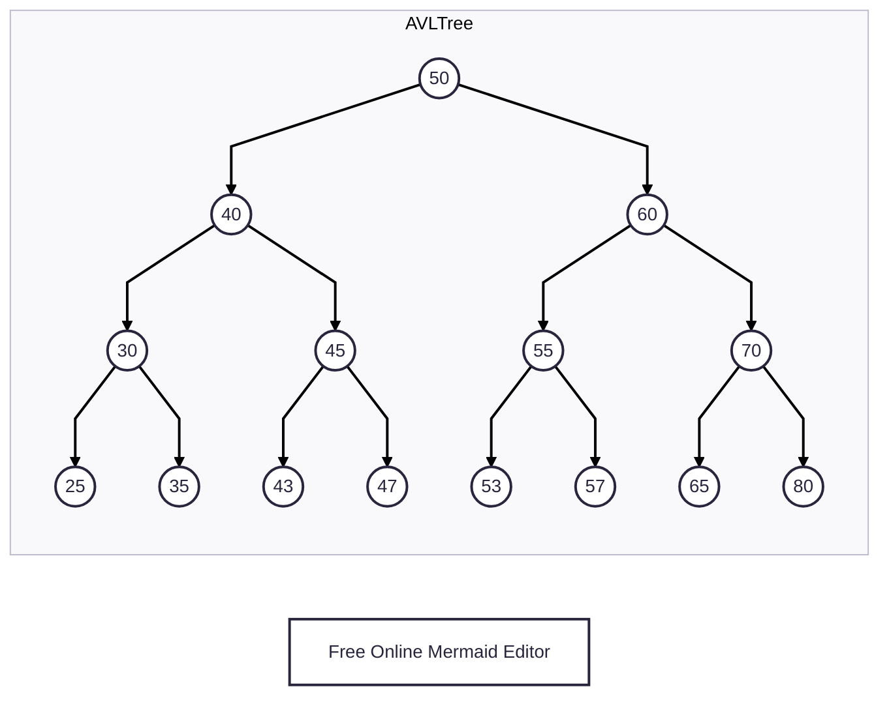

# AVLTree: Find $K^{th}$ small key

<!-- TOC -->
* [AVLTree: Find $K^{th}$ small key](#avltree-find-kth-small-key)
  * [Prerequisites/References](#prerequisitesreferences)
  * [Thought Process](#thought-process)
    * [Dry run when k = 7](#dry-run-when-k--7)
    * [Dry run when k = 9](#dry-run-when-k--9)
  * [Questions-Answers](#questions-answers)
  * [Next](#next)
<!-- TOC -->

## Prerequisites/References

* [Trees](../module01BasicDataStructures/section03trees/trees.md)
* [Basic Data Structure Questions](../module01BasicDataStructures/questionsOnBasicDataStructures.md)
* [Priority Queues](../module03priorityQueuesHeapsDisjointSets/section01priorityQueuesIntroduction/priorityQueues.md)
* [Binary Heap Trees](../module03priorityQueuesHeapsDisjointSets/section02priorityQueuesUsingHeaps/topic02BinaryHeapTrees/binaryHeapTrees.md)
* [Complete Binary Tree](../module03priorityQueuesHeapsDisjointSets/section02priorityQueuesUsingHeaps/topic03CompleteBinaryTrees/completeBinaryTrees.md)
* [Heap Sort](../module03priorityQueuesHeapsDisjointSets/section03HeapSort/heapSort.md)
* [Binary Search Trees](05binarySearchTrees.md)
* [Binary Search Trees: Basic Operations](10binarySearchTreesBSTsBasicOperations.md)
* [AVL Visualization](https://www.cs.usfca.edu/~galles/visualization/AVLtree.html)
* [Abdul Bari Sir: AVL Tree](https://youtu.be/jDM6_TnYIqE?si=ozgBIYnV79pJw8Nc)
* [AVL Insert](20avlTreeInsertOperation.md)
* [AVL Delete](25avlTreeDeleteOperation.md)
* [AVL Split](40avlTreeSplitOperation.md)
* [avlTreeImplementation.kt](../../../../../src/courses/uc/course02dataStructures/module05binarySearchTrees/010avlTreeImplementation.kt)

## Thought Process




* If we can add a new field, called `size`, to the `AvlNode` data class, we can find the $k^{th}$ smallest key quickly.
* So, in the given image above of an `AvlTree`, each node has this `size` field.
* Now, we have the following pseudocode: 

```kotlin

fun findKthSmallestKey(node: AvlNode, k: Int): AvlNode {
    val sizeOfLeft = node.left.size
    when {
        k == sizeOfLeft + 1 -> {
            return node
        }
        k < sizeOfLeft + 1 -> {
            return findKthSmallestKey(node.left, k)
        }
        k > sizeOfLeft + 1 -> {
            return findKthSmallestKey(node.right, k - sizeOfLeft - 1)
        }
    }
}

```

### Dry run when k = 7

`(node = 50, k = 7)`

* We start with the root node, `50`.
* `sizeOfLeft` = `50.left.size` = `40.size` = `7`
* `k < sizeOfLeft + 1`
* Call: `(node.left, k)` = `(50.left, 7)` = `(40, 7)`

`(node = 40, k = 7)`

* `sizeOfLeft` = `40.left.size` = `30.size` = `3`
* `k > sizeOfLeft + 1`
* Call: `(node.right, k - sizeOfLeft - 1)` = `(40.right, 7 - 3 - 1)` = `(45, 3)`

`(node = 45, k = 3)`

* `sizeOfLeft` = `45.left.size` = `43.size` = `1`
* `k > sizeOfLeft + 1`
* Call: `(node.right, k - sizeOfLeft - 1)` = `(45.right, 3 - 1 - 1)` = `(47, 1)`

`(node = 47, k = 1)`

* `sizeOfLeft` = `47.left.size` = `0`
* `k == sizeOfLeft + 1`
* `return 47`

### Dry run when k = 9

`(node = 50, k = 9)`

* `sizeOfLeft` = `node.left.size` = `50.left.size` = `40.size` = `7`
* `k > sizeOfLeft + 1`
* Call: `(node.right, k - sizeOfLeft - 1)` = `(50.right, 9 - 7 - 1)` = `(60, 1)`

`(node = 60, k = 1)`

* `sizeOfLeft` = `node.left.size` = `60.left.size` = `55.size` = `3`
* `k < sizeOfLeft + 1`
* Call: `(node.left, k)` = `(60.left, 1)` = `(55, 1)`

`(node = 55, k = 1)`

* `sizeOfLeft` = `node.left.size` = `55.left.size` = `53.size` = `1`
* `k < sizeOfLeft + 1`
* Call: `(node.left, k)` = `(55.left, 1)` = `(53, 1)`

`(node = 53, k = 1)`

* `sizeOfLeft` = `53.left.size` = `null.size` = `0`
* `k == sizeOfLeft + 1`
* `return 53`

## Caution

* Similar to the `height` field, we need to update the `size` field every time we change the structure.
* For example, every time we perform the `rotation`, we need to ensure that we also update the `size` field.
* Check the implementation here: 

[010avlTreeImplementation.kt](../../../../../src/courses/uc/course02dataStructures/module05binarySearchTrees/010avlTreeImplementation.kt)

## Questions-Answers

## Next