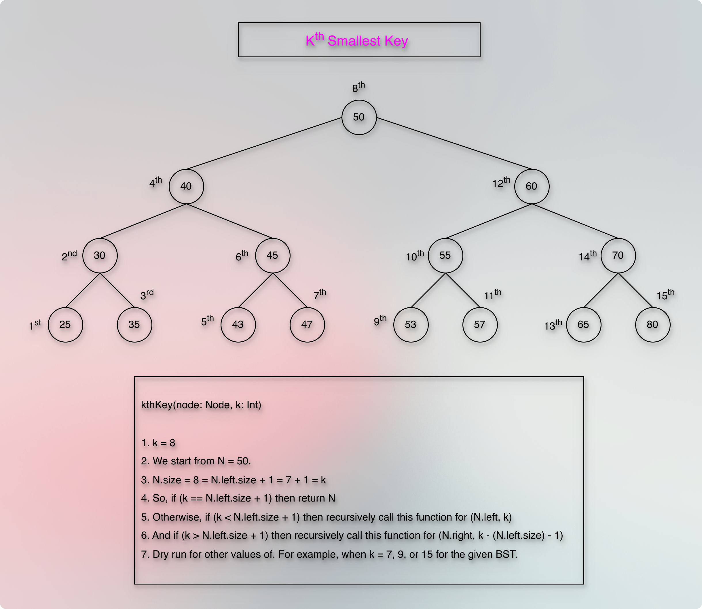
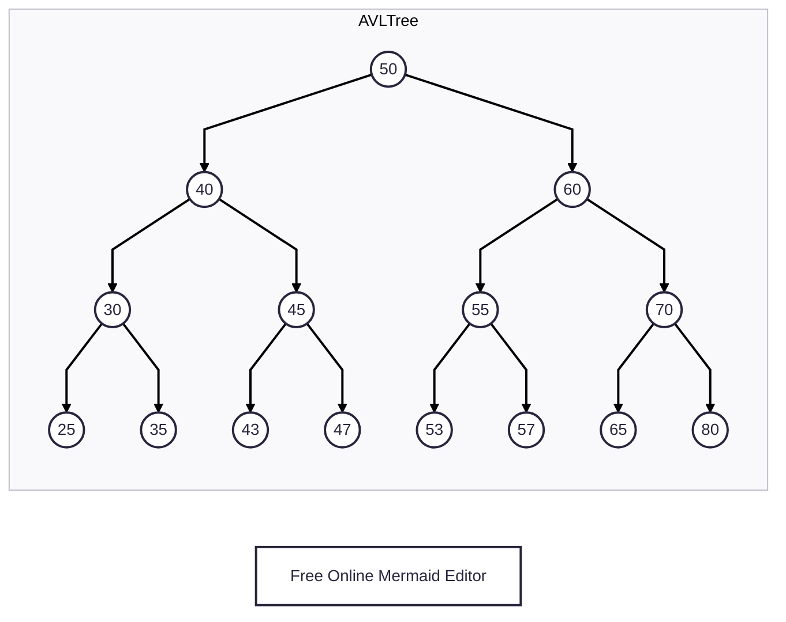

# AVLTree: Find $K^{th}$ small key

<!-- TOC -->
* [AVLTree: Find $K^{th}$ small key](#avltree-find-kth-small-key)
  * [Prerequisites/References](#prerequisitesreferences)
  * [Thought Process](#thought-process)
    * [Story (Mental Model)](#story-mental-model)
    * [Dry run when k = 7](#dry-run-when-k--7)
    * [Dry run when k = 9](#dry-run-when-k--9)
  * [Caution](#caution)
  * [Questions-Answers](#questions-answers)
  * [Next](#next)
<!-- TOC -->

## Prerequisites/References

* [Trees](../module01BasicDataStructures/section03trees/010trees.md)
* [Basic Data Structure Questions](../module01BasicDataStructures/questionsOnBasicDataStructures.md)
* [Priority Queues](../module03priorityQueuesHeapsDisjointSets/section01priorityQueuesIntroduction/priorityQueues.md)
* [Binary Heap Trees](../module03priorityQueuesHeapsDisjointSets/section02priorityQueuesUsingHeaps/topic02BinaryHeapTrees/binaryHeapTrees.md)
* [Complete Binary Tree](../module03priorityQueuesHeapsDisjointSets/section02priorityQueuesUsingHeaps/topic03CompleteBinaryTrees/completeBinaryTrees.md)
* [Heap Sort](../module03priorityQueuesHeapsDisjointSets/section03HeapSort/heapSort.md)
* [Binary Search Trees](05binarySearchTrees.md)
* [Binary Search Trees: Basic Operations](10binarySearchTreesBSTsBasicOperations.md)
* [Binary Tree Implementation](../../../../../src/courses/uc/course02dataStructures/module05binarySearchTrees/010binarySearchTree.kt)
* [AVL Visualization](https://www.cs.usfca.edu/~galles/visualization/AVLtree.html)
* [Abdul Bari Sir: AVL Tree](https://youtu.be/jDM6_TnYIqE?si=ozgBIYnV79pJw8Nc)
* [AVL Insert](20avlTreeInsertOperation.md)
* [AVL Delete](25avlTreeDeleteOperation.md)
* [AVL Merge](30avlTreeMergeOperation.md)
* [AVL Split](40avlTreeSplitOperation.md)
* [avlTreeImplementation.kt](../../../../../src/courses/uc/course02dataStructures/module05binarySearchTrees/030avlTreeImplementation.kt)

## Thought Process





```mermaid
---
config:
  theme: redux
  flowchart:
    curve: linear
---
flowchart LR
    subgraph AVLTree
        n1(("50")) --> n2(("40")) & n3(("60"))
        n2 --> n4(("30")) & n5(("45"))
        n3 --> n6(("55")) & n7(("70"))
        n4 --> n8(("25")) & n9(("35"))
        n5 --> n10(("43")) & n11(("47"))
        n6 --> n12(("53")) & n13(("57"))
        n7 --> n14(("65")) & n15(("80"))
    end
L[Free Online Mermaid Editor]
click L "https://mermaidchart.cello.so/zyYK3hSiX0M" "Online Mermaid Editor" _blank
```

* If we can add a new field, called `size`, to the `AvlNode` data class, we can find the $k^{th}$ smallest key quickly.
* So, in the given image above of an `AvlTree`, each node has this `size` field.

```kotlin

node.size = 1 + (node.left?.size ?: 0) + (node.right?.size ?: 0)

```

* Now, we have the following pseudocode: 

```kotlin

fun findKthSmallestKey(node: AvlNode, k: Int): AvlNode {
    val sizeOfLeft = node.left.size
    when {
        k == sizeOfLeft + 1 -> {
            return node
        }
        k < sizeOfLeft + 1 -> {
            return findKthSmallestKey(node.left, k)
        }
        k > sizeOfLeft + 1 -> {
            return findKthSmallestKey(node.right, k - sizeOfLeft - 1)
        }
    }
}

```

### Story (Mental Model)

* This is the story of a simple mathematical game.
* Assume that we have two sides: Left and right.
* For the convenient, we can also assume that the kids are divided by a line on the floor or a separator (divider).
* On each side, we have arranged the kids by their age, from younger to older.
* The arrangement starts from left and continues till the end of the right side.
* We do not have multiple kids having the same age.
* Each age is unique.
* Now, suppose that the left side has 3 kids.
* And if I ask you, on which side do we have the kid who is the 4th youngest kid?
* The number `4` is a mathematical variable and we can denote it as `k = 4`.
* Observe how the brain works, how it processes this simple mathematical problem.
* And this happens very quickly.
* We quickly set the number `4` as a mathematical variable.
* We know that the left side has only 3 kids.
* So, we immediately consider the left side as checked based on the total kids.
* We did not have to check each kid one by one on the left side.
* We simply and quickly consider the entire left side as checked based on the total kids on the left side.
* The left side has a total of 3 kids.
* So, we immediately conclude that we have checked all the 3 kids, and now we are going to check the right side.
* But before we start checking the kids on the right side, we reduce the original number.
* We reduce it from `4th youngest kid` to `1st youngest kid on the right side`.
* In the mathematical language, we just did: `k - leftSize`.
* Because we know that we have already checked 3 kids.
* And kids are already in the ascending order.
* We start with the right side.
* And the `1st youngest kid of the right side` becomes our answer.
* We are going to use the same mental model (approach) to solve the `kth smallest` in a binary search tree.

### Dry run when k = 7

`(node = 50, k = 7)`

* We start with the root node, `50`.
* `sizeOfLeft` = `50.left.size` = `40.size` = `7`
* `k < sizeOfLeft + 1`
* Call: `(node.left, k)` = `(50.left, 7)` = `(40, 7)`

`(node = 40, k = 7)`

* `sizeOfLeft` = `40.left.size` = `30.size` = `3`
* `k > sizeOfLeft + 1` = `7 > 4`
* This relation says that there are a total of `3` nodes to the left side.
* And we are standing on the 4th node.
* We are finding the 7th node.
* So, it is clear that the 7th node cannot be on the left side.
* And it is also clear that the node we are standing upon is the 4th node, not the 7th node.
* So, we conclude that we have checked all these 4 nodes.
* 3 nodes on the left side and 1 node is the current node upon which we are currently standing.
* Now, out of 7 nodes, we need to check the remaining 3 nodes.
* The mathematical way of saying it is:
* `k - (sizeOfLeft + 1)` = `k - sizeOfLeft - 1`.
* When we change the side, from left to right, we pass the same message:
* Call: `(node.right, k - sizeOfLeft - 1)` = `(40.right, 7 - 3 - 1)` = `(45, 3)`

`(node = 45, k = 3)`

* `sizeOfLeft` = `45.left.size` = `43.size` = `1`
* `k > sizeOfLeft + 1`
* Call: `(node.right, k - sizeOfLeft - 1)` = `(45.right, 3 - 1 - 1)` = `(47, 1)`

`(node = 47, k = 1)`

* `sizeOfLeft` = `47.left.size` = `0`
* `k == sizeOfLeft + 1`
* `return 47`

### Dry run when k = 9

`(node = 50, k = 9)`

* `sizeOfLeft` = `node.left.size` = `50.left.size` = `40.size` = `7`
* `k > sizeOfLeft + 1`
* Call: `(node.right, k - sizeOfLeft - 1)` = `(50.right, 9 - 7 - 1)` = `(60, 1)`

`(node = 60, k = 1)`

* `sizeOfLeft` = `node.left.size` = `60.left.size` = `55.size` = `3`
* `k < sizeOfLeft + 1`
* Call: `(node.left, k)` = `(60.left, 1)` = `(55, 1)`

`(node = 55, k = 1)`

* `sizeOfLeft` = `node.left.size` = `55.left.size` = `53.size` = `1`
* `k < sizeOfLeft + 1`
* Call: `(node.left, k)` = `(55.left, 1)` = `(53, 1)`

`(node = 53, k = 1)`

* `sizeOfLeft` = `53.left.size` = `null.size` = `0`
* `k == sizeOfLeft + 1`
* `return 53`

## Caution

* Similar to the `height` field, we need to update the `size` field every time we change the structure.
* For example, every time we perform the `rotation`, we need to ensure that we also update the `size` field.
* Check the implementation here: 

[010avlTreeImplementation.kt](../../../../../src/courses/uc/course02dataStructures/module05binarySearchTrees/030avlTreeImplementation.kt)

* It follows the same order in which we update the height field.
* So, first we update the size of the child node, and then the parent.

## Questions-Answers

## Next

* [Flip (Replace) Using An AvlTree](60flipReplaceWithAvlTree.md)
* [Splay Trees](70splayTrees.md)
* [Red-Black Trees](80redBlackTrees.md)