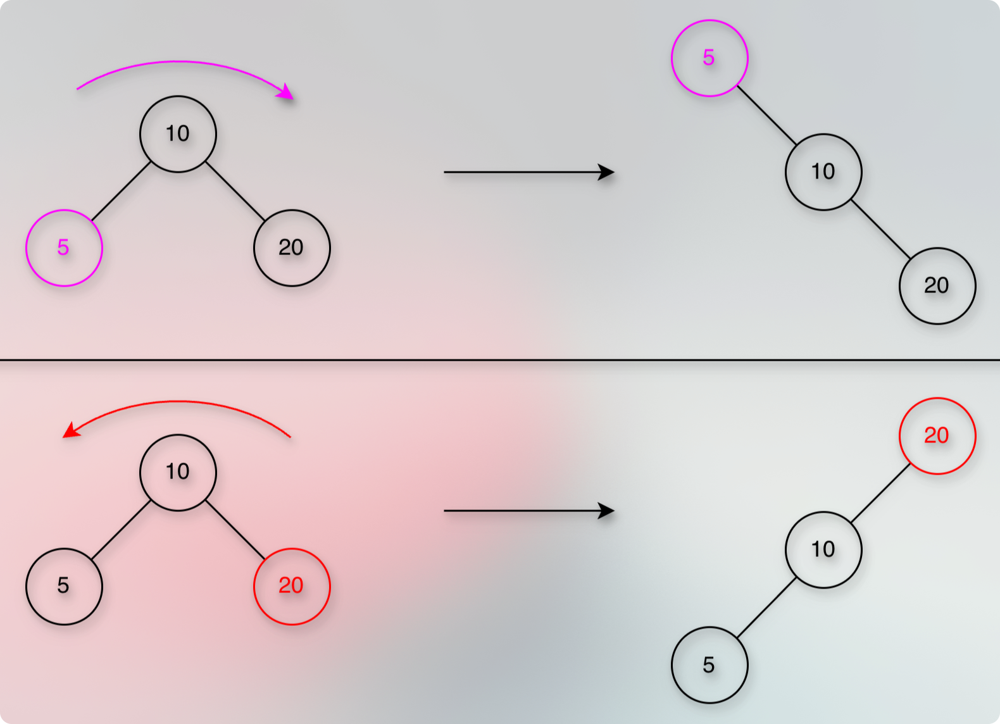
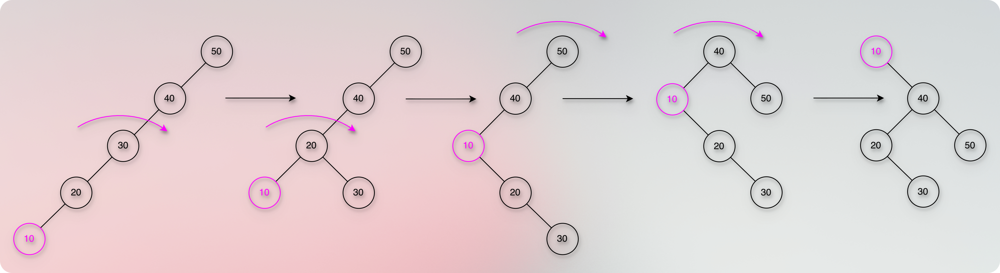
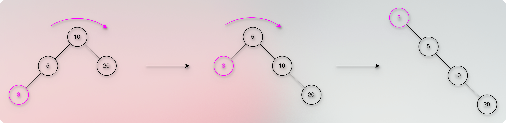

# Splay Trees

<!-- TOC -->
* [Splay Trees](#splay-trees)
  * [Prerequisites/References](#prerequisitesreferences)
  * [Purpose](#purpose)
  * [Rotations And Terminologies](#rotations-and-terminologies)
    * [Zig Rotations (Terminal Step)](#zig-rotations-terminal-step)
      * [Zig Rotation (Zig-Right)](#zig-rotation-zig-right)
      * [Zag Rotation (Zig-Left)](#zag-rotation-zig-left)
    * [Zig-Zig Rotations (Homogeneous Rotations)](#zig-zig-rotations-homogeneous-rotations)
      * [Zig-Zig Rotation (Zig-Zig Right)](#zig-zig-rotation-zig-zig-right)
      * [Zag-Zag Rotation (Zig-Zig Left)](#zag-zag-rotation-zig-zig-left)
    * [Zig-Zag Rotations (First-Parent-Then-Grandparent): Heterogeneous Rotations](#zig-zag-rotations-first-parent-then-grandparent-heterogeneous-rotations)
      * [Zig-Zag Rotation](#zig-zag-rotation)
      * [Zag-Zig Rotation](#zag-zig-rotation)
  * [Introduction](#introduction)
  * [Splay](#splay)
    * [Pseudocode Of Splay](#pseudocode-of-splay)
  * [Insert](#insert)
    * [Steps](#steps)
    * [Pseudocode Of Insert](#pseudocode-of-insert)
  * [Search (Find)](#search-find)
    * [Steps](#steps-1)
    * [Pseudocode Of Search](#pseudocode-of-search)
  * [Delete](#delete)
    * [Bottom-Up Delete](#bottom-up-delete)
    * [Top-Down-Splaying (Pointerless)](#top-down-splaying-pointerless)
    * [Splay-To-Root-Delete-Join](#splay-to-root-delete-join)
      * [Found The Subject?](#found-the-subject)
      * [No Subject?](#no-subject)
    * [Pseudocode Of Delete (Splay-To-Root-Delete-Join)](#pseudocode-of-delete-splay-to-root-delete-join)
  * [Split](#split)
    * [Pseudocode](#pseudocode)
  * [Merge](#merge)
    * [Pseudocode](#pseudocode-1)
  * [Implementation](#implementation)
  * [Amortized Analysis: Potential Theory](#amortized-analysis-potential-theory)
  * [Other Benefits](#other-benefits)
    * [Recency: Working Bound: Time Or Temporal Locality](#recency-working-bound-time-or-temporal-locality-)
    * [Frequency: Weighted Bound](#frequency-weighted-bound)
    * [Spatial Locality: Dynamic Finger Bound: Neighbour Benefit](#spatial-locality-dynamic-finger-bound-neighbour-benefit)
    * [Overall: Dynamic Optimality Conjecture: The Worst Case Constant](#overall-dynamic-optimality-conjecture-the-worst-case-constant)
  * [Time Complexity](#time-complexity)
  * [Space Complexity](#space-complexity)
  * [Questions-Answers](#questions-answers)
    * [Do we lose the BST invariant properties due to rotations?](#do-we-lose-the-bst-invariant-properties-due-to-rotations)
    * [What if we don't involve the grandparent and perform the splay (rotate-to-root) operation using the parent node only?](#what-if-we-dont-involve-the-grandparent-and-perform-the-splay-rotate-to-root-operation-using-the-parent-node-only)
    * [Why do we first rotate the grandparent in the `Zig-Zig rotations`?](#why-do-we-first-rotate-the-grandparent-in-the-zig-zig-rotations)
    * [Can a splay operation produce an unbalanced tree? If yes, why do we use splay trees?](#can-a-splay-operation-produce-an-unbalanced-tree-if-yes-why-do-we-use-splay-trees)
      * [Can a single operation (e.g., `find`) take `O(n)` time in a `splay tree`? If yes, why do we use the `splay tree`?](#can-a-single-operation-eg-find-take-on-time-in-a-splay-tree-if-yes-why-do-we-use-the-splay-tree)
    * [Why do we splay even when we don't find the node?](#why-do-we-splay-even-when-we-dont-find-the-node)
    * [What is the difference between the bottom-up and the splay-to-root-delete-join approaches of the delete operation in a splay tree?](#what-is-the-difference-between-the-bottom-up-and-the-splay-to-root-delete-join-approaches-of-the-delete-operation-in-a-splay-tree)
    * [Why don't we store `balance` information in `SplayTrees` like `AVLTrees`?](#why-dont-we-store-balance-information-in-splaytrees-like-avltrees)
    * [Is a `SplayTree` as efficient as a `Static Binary Balanced Tree`?](#is-a-splaytree-as-efficient-as-a-static-binary-balanced-tree)
    * [When should we use `SplayTrees`?](#when-should-we-use-splaytrees)
    * [When should we not use `SplayTrees`?](#when-should-we-not-use-splaytrees)
    * [Why can't we use `SplayTrees` for a highly concurrent read-heavy cache?](#why-cant-we-use-splaytrees-for-a-highly-concurrent-read-heavy-cache)
  * [ToDos](#todos)
  * [Next](#next)
<!-- TOC -->

## Prerequisites/References

* [Trees](../module01BasicDataStructures/section03trees/trees.md)
* [Basic Data Structure Questions](../module01BasicDataStructures/questionsOnBasicDataStructures.md)
* [Priority Queues](../module03priorityQueuesHeapsDisjointSets/section01priorityQueuesIntroduction/priorityQueues.md)
* [Binary Heap Trees](../module03priorityQueuesHeapsDisjointSets/section02priorityQueuesUsingHeaps/topic02BinaryHeapTrees/binaryHeapTrees.md)
* [Complete Binary Tree](../module03priorityQueuesHeapsDisjointSets/section02priorityQueuesUsingHeaps/topic03CompleteBinaryTrees/completeBinaryTrees.md)
* [Heap Sort](../module03priorityQueuesHeapsDisjointSets/section03HeapSort/heapSort.md)
* [Binary Search Trees](05binarySearchTrees.md)
* [Binary Search Trees: Basic Operations](10binarySearchTreesBSTsBasicOperations.md)
* [AVL Visualization](https://www.cs.usfca.edu/~galles/visualization/AVLtree.html)
* [Abdul Bari Sir: AVL Tree](https://youtu.be/jDM6_TnYIqE?si=ozgBIYnV79pJw8Nc)
* [AVL Insert](20avlTreeInsertOperation.md)
* [AVL Delete](25avlTreeDeleteOperation.md)
* [AVL Split](40avlTreeSplitOperation.md)
* [Find Kth Smallest Using An AVLTree](50avlTreeFindKthSmallKey.md)
* [Flip the values using an AVLTree](60flipReplaceWithAvlTree.md)
* [avlTreeImplementation.kt](../../../../../src/courses/uc/course02dataStructures/module05binarySearchTrees/010avlTreeImplementation.kt)
* [Splay Tree Introduction By Jenny's Lectures](https://youtu.be/qMmqOHr75b8?si=o84h4uQAOPIwNALb)
* [Splay Tree: Insert Operation By Jenny's Lectures](https://youtu.be/1HeIZNP3w4A?si=s0xuQMVg8OBzpmP8)
* [Splay Tree: Delete Operation Bottom-Up Splaying By Jenny's Lectures](https://youtu.be/ewRSYHStdSA?si=aVfdewuntlW501EE)
* [Splay Tree: Delete Operation Top-Down-Join By Jenny's Lectures](https://youtu.be/MumJoiP84J0?si=01Pn1u3lGC6z0egS)

## Purpose

* To reduce the time of the search operation.
* We make the recently accessed node the root.
* Next time, it takes `O(1)` only.
* That is the reason we use it for `caches`.

## Rotations And Terminologies

* Each rotation preserves the BST properties (invariant).
* `keys (left) < node.key < keys (right)`

### Zig Rotations (Terminal Step)


#### Zig Rotation (Zig-Right)


**General Overview: Understanding The Right Rotation**

* It is also known as **Zig-Right Rotation**.
* The node on which we perform the rotation does not have any grandparent.
* It means that the parent of the node is the root.
* So, we perform a single rotation on the node.
* We rotate the parent node in the right-side direction (clockwise).
* It pulls the subject node upward.

**Main Points: Right Rotation**

* A few nodes change their child-parent pointers.
* The order of these three nodes is:
    1. Right child of the target node.
    2. The target node.
    3. Current node (Current parent node of the target).

**Pseudocode: Right Rotation**

```kotlin

/**
 * The reason we call it [parent] is to help us remember.
 * The node that we pass to the `rotate` functions is the `parent` of the subject node.
 * The subject node is the one that we want to make the root.
 * If the param name [parent] seems confusing, feel free to replace it with a simple `node` or `current`.
 * Just remember that it should be the `parent` of the subject node.
 */
fun rotateRight(parent: Node<T>) {
    // 1. Find the target node.
    // In a right-side rotation, the target node is the left child.
    val target = parent?.left ?: return

    // 2. The right child of the target node becomes the left child of the current parent node.
    parent.left = target.right
    target.right?.parent = parent

    // 3. The target node replaces its parent.
    // The parent of the current parent node becomes the parent of the target node.
    target.parent = parent.parent
    // It might make the target node the root, left, or right child.
    if (target.parent == null) root = target
    else if (parent.isLeftChild()) parent.parent?.left = target
    else parent.parent?.right = target

    // 4. The current parent node becomes the right child of the target node
    target.right = parent
    parent.parent = target
}
```

#### Zag Rotation (Zig-Left)


**General Overview: Understanding The Left Rotation**

* It is also known as **Zig-Left Rotation**.
* The node on which we perform the rotation does not have any grandparent.
* So, we perform a single rotation on the node.
* When we rotate a node in the left-side direction (anti-clockwise).

**Main Points: Left Rotation**

* A few nodes change their child-parent pointers.
* The order of these three nodes is:
    1. Left child of the target node.
    2. The target node.
    3. Current node (Current parent of the target node).

**Pseudocode: Left Rotation**

```kotlin

/**
 * The reason we call it [parent] is to help us remember.
 * The node that we pass to the `rotate` functions is the `parent` of the subject node.
 * The subject node is the one that we want to make the root.
 * If the param name [parent] seems confusing, feel free to replace it with a simple `node` or `current`.
 * Just remember that it should be the `parent` of the subject node.
 */
fun rotateLeft(parent: Node<T>) {
    // 1. Find the target node.
    // For the left rotation, the target node is the right child of the current parent node.
    val target = parent.right ?: return

    // 2. The left child of the target node becomes the right child of the current parent node.
    parent.right = target.left
    target.left?.parent = parent

    // 3. The target node replaces the parent node.
    // The parent of the parent node becomes the parent of the target node.
    // It might make the target node the root, left, or right child.
    target.parent = parent.parent
    if (target.parent == null) root = target
    else if (parent.isRightChild()) parent.parent?.right = target
    else parent.parent?.left = target

    // 4. Finally, the current parent node becomes the left child of the target node.
    // The target node becomes the parent of the current node.
    target.left = parent
    parent.parent = target
}

```

### Zig-Zig Rotations (Homogeneous Rotations)

#### Zig-Zig Rotation (Zig-Zig Right)


* Right-Right Rotation.
* It is also known as **Zig-Zig Right Rotations**.
* The node on which we perform the rotation(s), has grandparent.
* So, we perform double rotations.
* When we perform two rotations.
* Both the parent and the grandparent are on the left side.
* Both rotations are in the right direction (clockwise).
* First, we pull the grandparent in the right direction.
* And then we pull the parent in the right direction.

#### Zag-Zag Rotation (Zig-Zig Left)


* Left-Left Rotation.
* It is also known as **Zig-Zig Left Rotations**.
* The node on which we perform the rotation(s), has grandparent.
* So, we perform double rotations.
* When we perform two rotations.
* Both the parent and the grandparent are on the right side.
* Both the rotations are in the left direction (anti-clockwise).
* First, we pull the grandparent in the left direction.
* And then we pull the parent in the left direction.

### Zig-Zag Rotations (First-Parent-Then-Grandparent): Heterogeneous Rotations

#### Zig-Zag Rotation


* Right-Left Rotation.
* The node on which we perform the rotation(s), has grandparent.
* So, we perform double rotations.
* When we perform two rotations.
* First, we perform the rotation on the parent.
* The first rotation is in the right direction (clockwise).
* It means that the parent is having the node in the left direction.
* So, we rotate the parent in the right direction.
* Then, we perform the rotation on the grandparent.
* And the second rotation is in the left direction (anti-clockwise).
* It means that the parent node is in the right direction of the grandparent node.
* So, we rotate the grandparent in the left direction.

#### Zag-Zig Rotation


* Left-Right Rotation.
* The node on which we perform the rotation(s), has grandparent.
* So, we perform double rotations.
* When we perform two rotations.
* First, we perform the rotation on the parent.
* The first rotation is in the left direction (anti-clockwise).
* It means that the parent is having the node in the right direction.
* So, we rotate the parent in the left direction.
* Then, we perform the rotation on the grandparent.
* And the second rotation is in the right direction (clockwise).
* It means that the parent node is to the left of the grandparent node.
* So, we rotate the grandparent in the right direction.

## Introduction

* [AVLTrees](../../../../../src/courses/uc/course02dataStructures/module05binarySearchTrees/010avlTreeImplementation.kt)
  are strictly balanced binary search trees.
* Splay trees are roughly balanced binary search trees.
* //ToDo: Elaborate
* In a splay tree, the recently accessed node becomes the root.
* The search or insert operation follows the splay operation.
* It means that after every search or insert operation, we have to rearrange the tree.
* The resultant tree may not be perfectly (strictly) balanced.
* But it still maintains the amortized cost as `O(log n)`.
* Because we reduce the access time of the recent node to `O(1)`.
* That's the reason we use `Splay Trees` for `Caches`.

## Splay

* After `search(find)`, `insert`, or `delete` operation, we perform the `splay` operation on the node.
* The purpose of the `splay` operation is to make the recently accessed node the root node.
* Now, depending upon the position of the recently accessed node, we might perform various (one or multiple and
  different) rotations on the node to make it the root node.
* We have already seen various [rotations](#rotations-and-terminologies).
* If we find that the node has no grandparent, then we perform one of the `zig rotations`.
* Otherwise, we perform either one of the `zig-zig` or one of the `zig-zag` rotations.
* We keep performing these rotations until the node becomes the root.

### Pseudocode Of Splay

```kotlin

fun splay(node: Node<T>) {
    // Keep performing the rotations until the node becomes the root.
    // It means that keep performing the rotations until the node becomes `parentless`.
    while (node.parent != null) {
        // To decide the rotation, we use the parent and the grandparent.
        val parent = node.parent
        val grandParent = parent?.parent

        if (grandParent == null) {
            // If there is no grandparent, it is one of the `zig rotations`.
            // If the node is a left child, we rotate the parent to the right side.
            // Otherwise, we rotate the parent to the left side.
            // In both cases, the rotation brings the parent down and the child up.
            // Note that we pass the `parent` to the `rotate` functions.
            // Because we have designed the `rotate` functions in that way. 
            // It expects the parent, because that's the node on which we perform the rotation.
            if (node.isLeftChild()) rotateRight(parent)
            else rotateLeft(parent)
        } else {
            // If there is a grandparent, we have 4 possible rotations.
            // Zig-Zig-Right, Zag-Zag-Left, Zig-Zag-Right-Left, and Zag-Zig-Left-Right.
            // We check the node and its parent to determine the rotations.
            // If both the node and parent are on the left side (left aligned), it is Zig-Zig-Right.
            if (node.isLeftChild() && parent.isLeftChild()) {
                // First, we rotate the grandparent.
                rotateRight(grandParent)
                // Then, we rotate the parent.
                rotateRight(parent)
            } else if (node.isRightChild() && parent.isRightChild()) {
                // First, rotate the grandparent.
                rotateLeft(grandParent)
                // Then, rotate the parent.
                rotateLeft(parent)
            } else if (node.isLeftChild() && parent.isRightChild()) {
                // Rotate the parent first.
                rotateRight(parent)
                // Then, rotate the grandparent.
                rotateLeft(grandParent)
            } else {
                // Node is a right child, and parent is a left child.
                // First, rotate the parent.
                rotateLeft(parent)
                // Then, rotate the grandparent.
                rotateRight(grandParent)
            }
        }
    }
}

```

## Insert


### Steps

* This is a typical binary tree insert operation followed by the splay operation.
* If the root is null, this new node becomes the root.
* Otherwise, we perform the standard binary search traversal.
* We select the left direction if the value is less than the current node.
* We select the right direction if the value is greater than the current node.
* If the value is equal to the current node, we return.
* That is to say, we don't allow duplicate values.
* Once we reach the leaf node, we attach this new node as a child.
* We update the respective (relevant) pointers for this child and the parent node.
* And finally, we perform the splay operation on this newly inserted node.

### Pseudocode Of Insert

```kotlin

fun insert(key: T) {
    val node = Node(key) // `parent`, `left`, and `right` are null at the moment.
    if (root == null) {
        root = node
        return
    }
    var curr = root
    var parent = curr
    while (curr != null) {
        parent = curr
        if (key < curr.key) {
            curr = curr.left
        } else if (key > curr.key) {
            curr = curr.right
        } else {
            // The node already exists.
            // Next: splay
            splay(curr)
            return
        }
    }
    if (key < parent.key) {
        parent.left = node
    } else {
        parent.right = node
    }
    node.parent = parent
    splay(node)
}

```

## Search (Find)

### Steps

* Perform the typical binary search to find the subject node.
* Perform the splay operation on the subject node.
* If we don't find the subject node, perform the splay operation on the last accessed node. (Don't forget this!)

### Pseudocode Of Search

```kotlin

fun search(key: T): Node? {
    if (root == null) return null
    var curr = root
    var lastAccessed = curr
    while (curr != null) {
        lastAccessed = curr
        if (key < curr.key) {
            curr = curr.left
        } else if (key > curr.key) {
            curr = curr.right
        } else {
            splay(curr)
            return curr
        }
    }
    // We did not find the node.
    // We still perform the splay operation on the `lastAccessed` node.
    splay(lastAccessed)
    // We return `null` to indicate that we could not find the subject node.
    return null
}

```

## Delete

### Bottom-Up Delete


* Delete the target node and perform the splay operation on the parent node.
* If we don't find the target node, we still perform the splay operation on the parent node for which the target node
  could have been a child.
* In that case, the last node we reach in a standard binary search traversal is the parent of this target ghost node.

### Top-Down-Splaying (Pointerless)

* //ToDo

### Splay-To-Root-Delete-Join


#### Found The Subject?

* Splay the target node (Make the target node the root).
* Delete the target node (Now, the root).

**Two Children: Left and Right Subtrees**

* We might get two orphan children: The left subtree and the right subtree.
* Perform the splay operation on the maximum key of the left subtree.
* The key with the maximum value becomes the root node in the left subtree.
* Make the right subtree the right child of this new root.
* Done. This is our final tree.

**Only The Right Child: Only The Right Subtree. No Left Subtree.**

* Suppose that after deleting the target node, we only have a right-side child of it.
* In this case, the right subtree is the final tree.

**Only The Left Child: Only The Left Subtree. No Right Subtree.**

* Suppose that after deleting the target node, we only have a left-side child of it.
* In this case, we still perform the splay operation on the maximum key of the left subtree.
* So, the node with the maximum value becomes the root of the left subtree.
* And that will be the final tree.

#### No Subject?

* If we don't find the target node, we still perform the splay operation on the parent node for which the target node
  could have been a child.
* In that case, the last node we reach in a standard binary search traversal is the parent of this target ghost node.
* So, even if we don't find the subject node, we still perform the splay operation.

### Pseudocode Of Delete (Splay-To-Root-Delete-Join)

```kotlin

fun delete(key: T) {
    // The search operation internally performs the splay operation, too. 
    val target = search(key)
    if (target == null || target.key != key) {
        return
    }
    val leftRoot = target.left
    val rightRoot = target.right
    
    // Disconnect to delete the target
    leftRoot?.parent = null
    rightRoot?.parent = null
    target.left = null
    target.right = null
  
    // If the `leftRoot` is null
    if (leftRoot == null) {
        root = rightRoot
        return
    }
  
    // Find max of the leftRoot
    var max = leftRoot
    while (max.right != null) {
        max = max.right
    }
    splay(max)
    
    // Now, the `max` is the `root` of the `leftRoot`
    max.right = rightRoot
    rightRoot?.parent = max
  
    // Update the root (Don't forget this!)
    root = max
}

```

## Split

* We `splay` for the given `split key`.
* Now, we may or may not find the `split key`.
* So, we end up with three possibilities:

`split.key < root.key`

* In this case, we would return: `root.left`, and `root`.

`split.key > root.key`

* In this case, we would return: `root.right`, and `root`.

`split.key == root.key`

* In this case, we can return: `root`, and `root.right`.
* Or, we can return: `root.left`, and `root`.

### Pseudocode

```kotlin

fun split(key: T): SplitResult {
    val root = find(key)
    when {
        key < root.key -> {
            return cutLeft(root)
        }
        key > root.key -> {
            return cutRight(root)
        }
        key == root.key -> {
            // Return cutLeft(root) or cutRight(root)
            // If we want to keep the `root` as a part of `right tree`, return `cutLeft(root)`. (root.left Vs. root).
            // Otherwise, return `cutRight(root)`. (root Vs. root.right).
            return cutRight(root) 
        }
    }
}

private fun cutLeft(root: Node<T>): SplitResult {
    val left = root.left
    left.parent = null
    root.left = null
    return SplitResult(left, root)
}

private fun cutRight(root: Node<T>): SplitResult {
    val right = root.right
    root.right = null
    right.parent = null
    return SplitResult(root, right)
}

```

## Merge

> Assuming that all the keys in the left tree are smaller than the right tree.

* We find the largest element in the left subtree and splay it.
* And then, we just attach the right tree as a right child of it.

### Pseudocode

```kotlin

fun merge(left: Node<T>, right: Node<T>): Node<T> {
    val root = findMax(left) // `findMax` internally performs the `splay` operation on the `max`.
    root.right = right
    right.parent = root
    return root
}

```

## Implementation

[splayTreeImplementation.kt](../../../../../src/courses/uc/course02dataStructures/module05binarySearchTrees/020splayTreeImplementation.kt)

## Amortized Analysis: Potential Theory

* Potential energy is defined using the subtree size.
* Technically, we say that if the tree is highly unbalanced, like a linear chain, it has the higher potential compared to the tree that is more balanced.
* So, if the insertion is cheap (that produces the highly unbalanced tree like a chain), we end up with the high potential tree.
* The more unbalanced the tree is, the higher its potential energy.
* And just because we are talking about the energy, we would say that we need more energy to bring the node up.
* So during the rotations, as the node goes up, it consumes the energy, and if the node goes down, it releases the energy.
* Nodes closer to the root have higher ranks and higher potentials, because it has consumed (collected) good amount of energy.
* When we perform various rotations as a part of the `splay` operation on a leaf node, it's potential energy increases as it becomes the root node.
* But many nodes along the way loses their potential energy as they move down.
* That decrease pays for the rotations.
* This drop in ranks and potential cancel out the cost of rotations.
* It is like ancestor nodes volunteerly donates their energy to push the subject node up during the splay operation.
* And this nice collaboration and support make the tree more balanced.
* As the tree gets balanced, its potential energy decreases.
* So, we can say that this converstion, this transformation from higher potential to lower potential energy pays for all the hard work (rotations) we perform to make a leaf (or any other) node the root node. 
* So the next time we want to perform the `splay` operation on a leaf node, we will need less energy, because the tree is already balanced.
* When we go deep to a leaf node, and we perform a lot of `splay` operations (rotations) on it to make it the root node, we burn a lot of potential energy.
* We get this energy from the ancestors as they go down along the way.
* So, even though the actual cost (work) might be linear `O(n)`, we get help from the ancestors as they release and donate their potential energy (potential difference) and it makes the amortized cost of any sequence of operations `O(log n)`.

## Other Benefits

### Recency: Working Bound: Time Or Temporal Locality 

* The fresher the recency, the faster the access.
* The subsequent access of recent and repeatedly accessed items take less time.
* As the item becomes old and less frequently accessed, it goes deep down.
* This forms a nice order where most recently and frequently accessed items take less time than the old and less frequently accessed items.
* And this happens automatically.
* For example, if we access `x`, and we want to access it immediately again, it only takes `O(1)`.
* And if we access 3 other items after that, then accessing `x` again takes only `log 3`.
* So, the time of accessing a particular item depends on the recent access or the last access of the same item.
* Or in other words, accessing a particular item depends on how many other items we have accessed since the last access of the current subject.
* This is particularly helpful for caching.

### Frequency: Weighted Bound

* The higher the frequency, faster the access.
* If we access a particular item more frequently, it means that the item is more important to us and in this sense, it has more weight.
* Frequently accessed items stay near to the root.
* So that we can access them faster than the less frequently accessed items.

### Spatial Locality: Dynamic Finger Bound: Neighbour Benefit

* The nearby key takes less time than the far-apart (far away) key.
* So, if we want to access the items in order, it is much faster.
* So, walking through a sorted data is faster.
* This is particularly helpful in range queries, ordered iteration, and cursor-based navigation.

### Overall: Dynamic Optimality Conjecture: The Worst Case Constant

* All these benefits together confirms that even if we build a perfect static binary search tree that knows the future access sequence, the splay tree that doesn't know about the sequence performs the same with a constant factor.

## Time Complexity

* After the `splay` operation, subsequent immediate access takes `O(1)`.
* We maintain the amortized cost of `search`, `insert`, and `delete` operations to `O(log n)`.

## Space Complexity

* `O(n)` where `n` is the number of nodes.

## Questions-Answers

### Do we lose the BST invariant properties due to rotations?

* No. `Splay Trees` and `Splaying` maintain the BST invariants (properties).

### What if we don't involve the grandparent and perform the splay (rotate-to-root) operation using the parent node only?


* The unbalanced tree remains unbalanced.
* It might make a balanced tree unbalanced beyond the acceptable range.
* Then, each operation might take `O(n)`.
* We might access the recent node in `O(1)`, but overall, it becomes costly. 
* The amortized cost increases in this case from `O(log n)` to `O(n)`.
* It means that we get linear time cost.
* It means that a simple, non-optimal rotate-to-root strategy degrades (downgrades) the performance from logarithmic expectation to linear result.
* We want a solution that helps us access the recent node faster, while maintaining the amortized cost `O(log n)`.

### Why do we first rotate the grandparent in the `Zig-Zig rotations`?

* Rotating the grandparent first in the `Zig-Zig Rotations` is the key to re-balance the tree and maintain the amortized cost at `O(log n)`.
* If we don't rotate the grandparent first, we don't improve the overall balance and amortized cost.

### Can a splay operation produce an unbalanced tree? If yes, why do we use splay trees?

#### Can a single operation (e.g., `find`) take `O(n)` time in a `splay tree`? If yes, why do we use the `splay tree`?





* Yes, a splay operation can temporary produce an unbalanced tree.
* And a single operation (for example, `find`) can take `O(n)` time.
* But the tree gets re-balanced after a few splay operations.
* Each expensive splay operation makes the tree more balanced.
* In such a way that it maintains the amortized cost at `O(log n)`.
* In addition, we get recently accessed node at `O(1)`.
* That's the reason we use `splay trees` for `caching`.

### Why do we splay even when we don't find the node?

* To maintain the amortized cost at `O(log n)`.
* For example, suppose that we have the below splay tree.



* Now, we try to find `1`.
* We start with `10`. 
* **Step: 1:** `1` < `10`. So, we go to the left side of `10`.
* **Step: 2:** `1` < `5`. So, we go to the left side of `5`.
* **Step: 3:** `3` < `5`. So, we go to the left side of `3`.
* **Result:** But `3` does not have any child. So, we could not find `1`.
* But we still perform the `splay` operation on `3`.
* Now, the next time we try to find `1`, we take less time.
* We start with `3`.
* **Step: 1:** `1` < `3`. So, we go to the left side of `3`.
* **Result:** But `3` does not have any child. So, we could not find `1`.

### What is the difference between the bottom-up and the splay-to-root-delete-join approaches of the delete operation in a splay tree?

**Bottom-up**

* We perform the standard BST delete operation.
* And then we perform the `splay` operation on the parent node.
* If we could not find the subject node, we still perform the `splay` operation on the last accessed node.

**Splay-To-Root-Delete-Join**

* We perform the `splay` operation on the subject node.
* We perform the `split` operation as below:
* We delete the `root`.
* We perform the `splay` operation on the `max` of the `left subtree` of the deleted `root`.
* The `max` of the `left subtree` becomes the root.
* We attach the `right subtree` to this new root.
* If we don't find the subject node, we still perform the `splay` operation on the last accessed node, and then we stop.
* If there is no left subtree of the deleted root, then the `right subtree` is the final tree.
* If there is no right subtree of the deleted root, we still perform `splay` on `max` of `left`.

**Comparison**

* Both the approaches are valid and give the same performance.

### Why don't we store `balance` information in `SplayTrees` like `AVLTrees`?

* Because in `SplayTrees`, we trade `balance` for `amortized cost`.
* At some point, the tree can be linear.
* But we focus on `sequence of operations` instead of `one operation`.
* We still maintain the `amortized cost` to `O(log n)` with an additional benefit where immediate access of recently `splayed` node takes `O(1)`.

### Is a `SplayTree` as efficient as a `Static Binary Balanced Tree`?

* Yes. Even if we don't know that which node we are going to access frequently, the `SplayTree` makes it the root node after `splaying`.
* So initially, the `SplayTree` might take more time than the static balanced tree.
* But then immediate subsequent access time will be `O(1)` in the `SplayTree`, where it could be more in the static balanced tree.
* This is known as `Static Optimality Theorem`.
* Overall, we maintain the amortized cost to `O(log n)`.

### When should we use `SplayTrees`?

* Caching

### When should we not use `SplayTrees`?

* Real-time systems
* Hard latency SLAs
* Concurrent workloads without locks

### Why can't we use `SplayTrees` for a highly concurrent read-heavy cache?

* Because a `find` operation in a `splayTree` is a `write` operation.
* We perform the `splay` operation during the `find` operation.
* And a `splay` operation changes the structure of the tree.
* So, if multiple threads are trying to read values, we have to use several `write-locks`, and it creates bottlenecks.

## ToDos

* Top-Down-Splaying (Pointerless)
* Translation of each step, comparison, check, decision, operation, etc., into pseudocode.
* Standard improvement process.

## Next

* [Red-Black Trees](80redBlackTrees.md)
* Tries?
* B+ Trees?