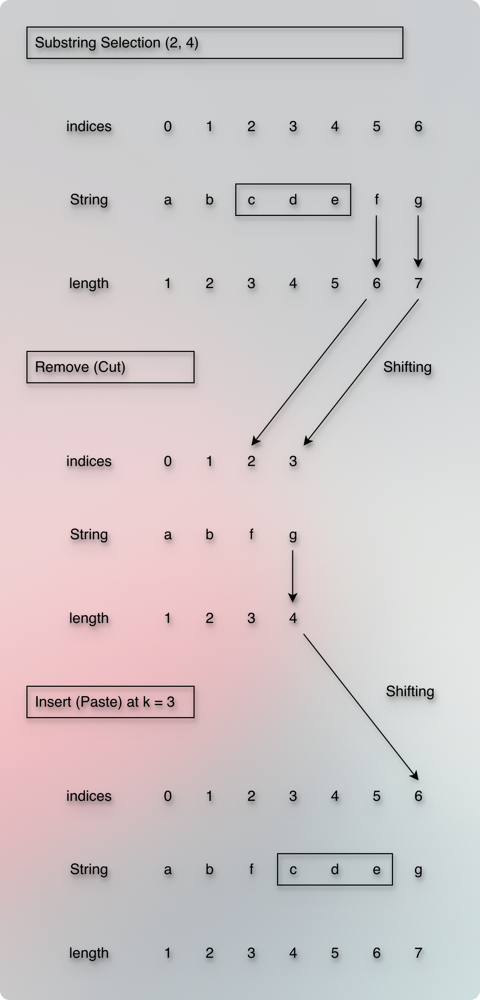
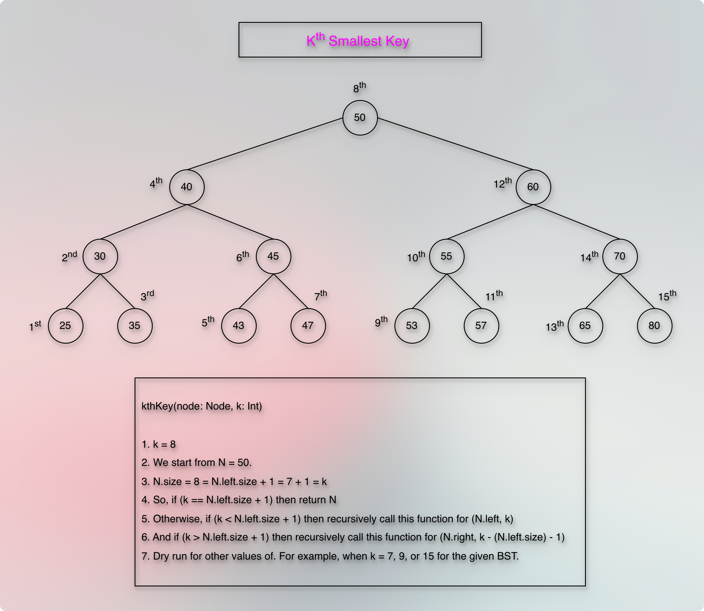
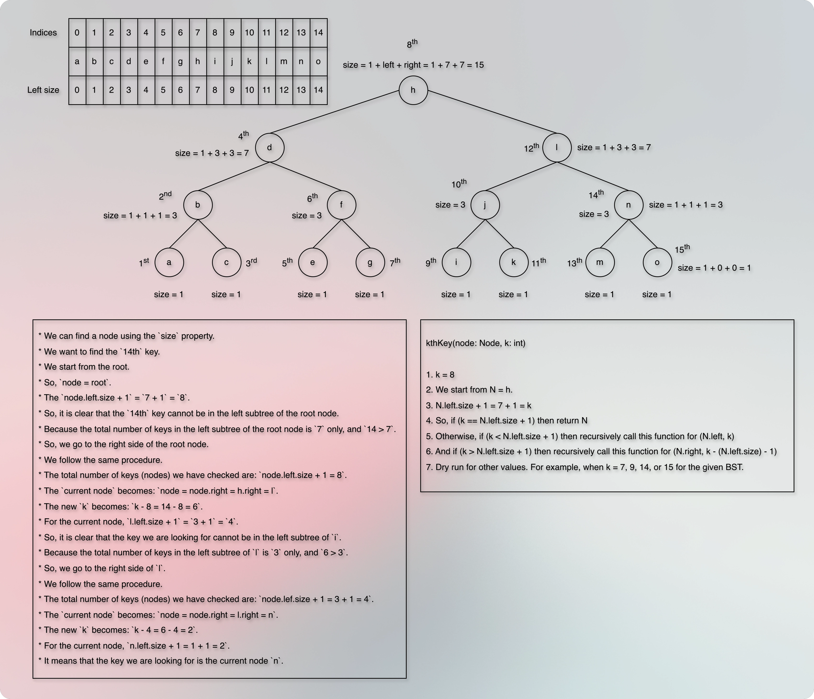
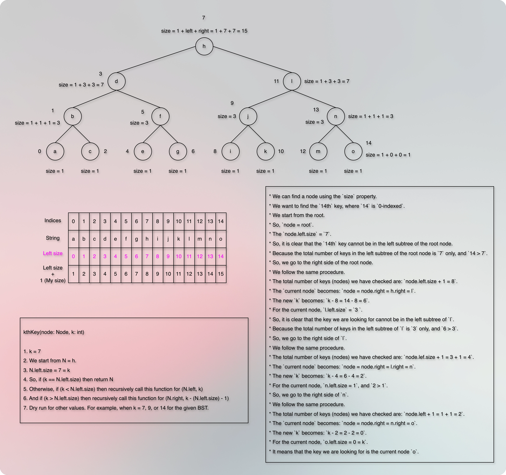
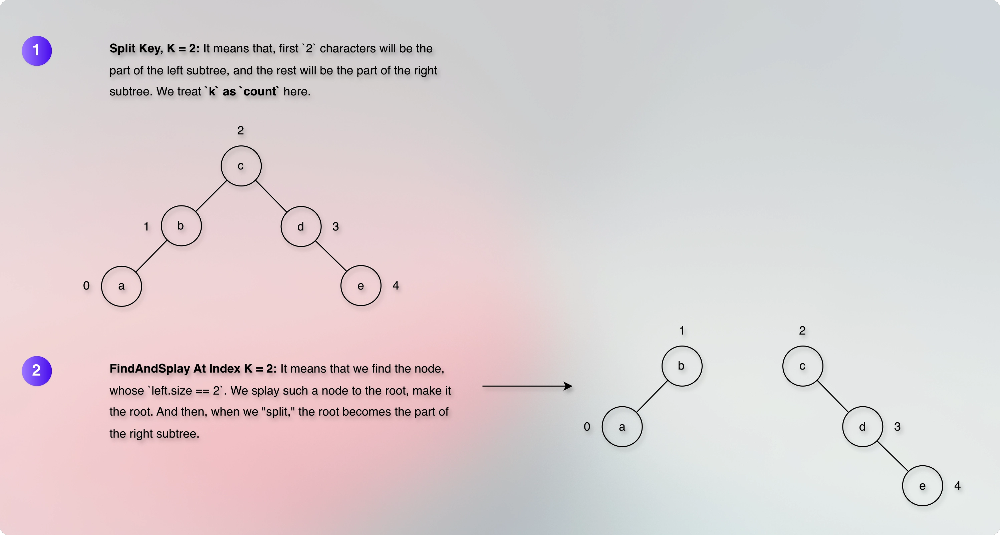

# Problem

* A string `S` of length `n` is given.
* There are `q` queries.
* Each query has three integers: `i`, `j`, and `k`.
* `i` and `j` represent the start and end indices of a substring of `S` respectively.
* Cut the substring.
* Paste the substring at the `k-th` position.
* `1 <= |S| <= 300000`
* `1 <= q <= 100000`

## Prerequisites/References

* [Doc: Splay Tree](70splayTrees.md)
* [Implementation: Splay Tree](../../../../../src/courses/uc/course02dataStructures/module05binarySearchTrees/040splayTreeImplementation.kt)

## Thought Process
 
* A `String`, `StringBuilder`, `Substring`, and `append` stores characters in a contiguous array.
* To cut a substring, and to paste a substring, it travels through the array.
* To cut a substring, it travels from the start index to the end index.



* So, it is `O(length of the substring)` operation.
* To cut the substring, we need to perform the `remove` operation that removes the substring from the original string.
* When we remove the substring, all the characters after the substring are shifted to the left.
* It takes `O(string length n - substring end index + 1)`, that is a linear time operation.
* And when we paste the substring, it can again cause shifting.
* That is another linear time operation.
* If the string length is `300000` and there are `100000` queries, it will take `300000 * 100000 = TLE` time!

### Perspective

* In the previous lecture, we saw that we cannot use a contiguous data structure.  
* 
**What else can we use?**  
* 
* What are we doing here? What operations do we perform here?
* Cut and paste. 
* How are we supposed to do it? What process can do it?
* A `String` contains characters.
* These characters are arranged in a particular order (sequence).
* To cut (remove) a substring, we have the start and end indices of the substring.
* The characters that we want to remove are between these start and end indices (range).
* In that sense, a substring is a set of characters within a particular range.
* We remove (delete) this substring from the original string.
* And then, we paste (insert) the substring at the given position.
* The delete and insert operations change the order of the characters.
* We can say that we are keep changing the order of the characters.
* We keep manipulating the order of the characters.
* So, it is a sequence or order manipulation problem.
* We keep re-ordering the characters.
* This re-ordering is not an automatic consequence, like shifting in an array.
* This re-ordering is a controlled re-ordering, where we need to establish and maintain a particular order.

**Which data structure keeps things in order?**  
**Which data structure do we use to perform deletion, insertion, and controlled re-ordering efficiently?**

* When the `data` has a particular order, and we want to perform deletion, insertion, and re-ordering efficiently, we use an ordered data structure.
* Trees are pointer-based ordered data structures.
* An ordered data structure uses a `key` (as a `value`) to compare and arrange the data.
* What if we consider a `character` as a `key` of a `node`?
* It becomes a value based ordered data structure.
* Trees are good value based ordered data structure that supports fast insert and fast delete.
* But in a normal tree, we need to travel more to find a specific character.
* That applies to a binary tree, too.
* If we use a `Binary Search Tree`, it can be skewed.
* So, we look for the self-balancing binary search tree.
* An AVL-Tree is a strict self-balancing binary search tree.
* It means that it requires more rotations to balance itself.
* A Splay-Tree is a flexible self-balancing binary search tree.
* It means that it requires fewer rotations to balance itself.
* So, we use a Splay-Tree.  
* 
**But, how do we use a character as a key?**   
**How do we use the character key to navigate and traverse the tree?**

* In a binary search tree, we find a particular node by comparing the value of the node with the value of the root or current node.
* If `currentNode.key > target.key`, we go to the left side of the current node.
* If `currentNode.key < target.key`, we go to the right side of the current node.
* If `currentNode.key == target.key`, we have found the target node.
* So, we compare the `key` value and traverse the tree.
* The comparison based traversal works because we know that if it is a valid binary search tree, then `node.left.key < node.key < node.right.key`.
* And we also know that if it is a valid binary search tree, then the `in-order` traversal of the tree will give us the sorted order (ascending) of the keys.

```markdown

+----+---+---+---+---+---+----+
|  1 | 2 | 3 | 4 | 5 | 6 | 7  |
+----+---+---+---+---+---+----+

```

* Now, let us simply replace these numbers with characters.

```markdown

┌────│───│───│───│───│───│────┐
│    │   │   │   │   │   │    │
│  a │ b │ c │ d │ e │ f │ g  │
│    │   │   │   │   │   │    │
└────│───│───│───│───│───│────┘

```

* We compare the `key` value to find the target node.
* But we can do it in a different way as well using an additional property called `size`.
* For example, let us give each character the `size` property. 

```

             +----+---+---+---+---+---+----+
             |    |   |   |   |   |   |    |
Indices      |  0 | 1 | 2 | 3 | 4 | 5 | 6  |
             |    |   |   |   |   |   |    |
             +----+---+---+---+---+---+----+
             |    |   |   |   |   |   |    |
             |  a | b | c | d | e | f | g  |
             |    |   |   |   |   |   |    |
             +----+---+---+---+---+---+----+
             |    |   |   |   |   |   |    |
Left size    |  0 | 1 | 2 | 3 | 4 | 5 | 6  |
             |    |   |   |   |   |   |    |
             +----+---+---+---+---+---+----+
Left size    |    |   |   |   |   |   |    |
    +        |  1 | 2 | 3 | 4 | 5 | 6 | 7  |
1 (My size)  |    |   |   |   |   |   |    |
             +----+---+---+---+---+---+----+

```

* Now, each character knows how many characters are on its left side.
* For example, `a` knows that there are `0` characters on its left side.
* `b` knows that there are `1` characters on its left side.
* `c` knows that there are `2` characters on its left side, and so on.
* Now, whether we say "Character at 4th index," or we say the "5th Character," or we say "The character before which there are 4 characters," it is the same thing.
* When we say "Character at 4th index," we focus on the current index of the node and traverse accordingly.
* When we say "The 5th Character", we focus on the "count" (or "1-based-indexed-syste) that starts from `1`.
* And when we say "The node before which there are 4 characters," we focus on the `node.left.size` property of the current node and traverse accordingly.
* Suppose that the root node is `d`, and we want to find the `4th` character.
* Note that `4th` is a `1-based-index` here.
* For the `0-based-index`, it would be the `3rd` character.
* We know that `d` has `3` characters on its left side.
* So, `d` is the `4th` character for the `1-based-index` and `3rd` character for the `0-based-index`.
* So, `d` is the character we are looking for.
* So, for a `1-based-index-system`, if `left size + 1` is equal to the target position, then the current node is the target node.
* And for a `0-based-index-system`, if `left size` is equal to the target position, then the current node is the target node.

> [!IMPORTANT]
> 1. If it is a `0-based-index-system,` then finding the `kth` character is equal to finding a node who has `k` characters before it on its left side.  
> 2. So, if `left.size == k`, then the current node is the target node that we are looking for.  
> 3. If it is a `1-based-index-system,` then it is `index + 1`.
> 4. Which means, `characters before me on my left side + 1`.
> 5. Which means, `left.size + 1`.
> 6. So, if `left.size + 1 == k`, then the current node is the target node that we are looking for.

* Now, suppose that we want to find the `2nd` character.
* Note that `2nd` is a `1-based-index` here.
* For the `0-based` index, it would be the `1st` character.
* We are at `d`.
* `d` has `3` characters on its left side.
* So, if `left.size + 1` is greater than the target position, then we go to the left side of the current node.
* Now, suppose that we want to find the `6th` character.
* We are at `d`.
* `d` has `3` characters on its left side.
* So, if `left.size + 1` is less than the target position, then we go to the right side of the current node.
* So, the conclusion is that if we know the `size` property of each node, then we can find the `kth` character using the `left.size` formula.









* The formula for the `size` property is `size = 1 + leftSize + rightSize`.
* This is something we have learned in the previous module:
  * [Reference: Kth Smallest Element in a BST](50avlTreeFindKthSmallKey.md)
---
* Now, if we want to find the `14th` key, and if we start from the root node, we know that the `14 > 8`, so we go to the right side of the root node.
* `8.right` is `12` and `14 > 12`, so we go to the right side of `12`.
* `12.right` is `14` and that is our target node.
* Notice that we compare the position for the traversal and not the `key` value.
* We still need to convert this idea into code.
---
* We can find a node using the `size` property also.
* We want to find the `14th` key (`1-based-index`).
* We start from the root.
* So, `node = root`.
* The `node.left.size + 1` = `7 + 1` = `8`.
* So, it is clear that the `14th` key cannot be in the left subtree of the root node.
* Because the total number of keys in the left subtree of the root node is `7` only, and `14 > 7`.
* So, we go to the right side of the root node.
* We follow the same procedure.
* The total number of keys (nodes) we have checked are: `node.left.size + 1 = 8`.
* The `current node` becomes: `node = node.right = h.right = l`.
* The new `k` becomes: `k - 8 = 14 - 8 = 6`.
* For the current node, `l.left.size + 1` = `3 + 1` = `4`.
* So, it is clear that the key we are looking for cannot be in the left subtree of `l`.
* Because the total number of keys in the left subtree of `l` is `3` only, and `6 > 3`.
* So, we go to the right side of `l`.
* We follow the same procedure.
* The total number of keys (nodes) we have checked are: `node.lef.size + 1 = 3 + 1 = 4`.
* The `current node` becomes: `node = node.right = l.right = n`.
* The new `k` becomes: `k - 4 = 6 - 4 = 2`.
* For the current node, `n.left.size + 1 = 1 + 1 = 2`.
* It means that the key we are looking for is the current node `n`.
---

---
**Perspective**

* Characters in a string are in a particular order.
* We can represent the string using the `in-order` traversal of a binary search tree.
* The binary search tree is not an index based data structure.
* But, we can know how many characters are in left side of a particular character using the `size` property.
* This gives us implicit index behavior (as a by-product) that we can use to find a character.


* The number of characters before a particular character in a string is equal to the `node.left.size` (the number of nodes in its left subtree) in the `in-order` traversal of the binary search tree.
* If it is a leaf node or a right node, then we consider and include ancestors.
* For example, `c` is the leaf node, and it is the right node of `b`.
* It does not have any left subtree.
* But, the size of the `parent (itself)` is `1` + `parent.left.size` is `1`.
* So, the number of characters before `c` is `2`.
---

---

**Perspective**

**How cut-and-paste of a string is split-and-merge in a splay tree?**

* Suppose, we have the following string:

```

             +----+---+---+---+---+---+----+
             |    |   |   |   |   |   |    |
Indices      |  0 | 1 | 2 | 3 | 4 | 5 | 6  |
             |    |   |   |   |   |   |    |
             +----+---+---+---+---+---+----+
             |    |   |   |   |   |   |    |
             |  a | b | c | d | e | f | g  |
             |    |   |   |   |   |   |    |
             +----+---+---+---+---+---+----+
             |    |   |   |   |   |   |    |
Left size    |  0 | 1 | 2 | 3 | 4 | 5 | 6  |
             |    |   |   |   |   |   |    |
             +----+---+---+---+---+---+----+

```

* Now, we want to cut "[i, j] = [2, 4]  = c  d  e" from the string.
* Then, we can represent (split) the given string into three segments (substrings):

```markdown

// 1. The substring before the cut
[A] = [a, b]

// 2. The substring that we want to cut
[B] = [c, d, e]

// 3. The substring after the cut
[C] = [f, g]

```

* So, the cut operation splits the given string into three segments (substrings).
* Now, we remove the cut substring.
* Once we remove the cut substring, we are left with the remaining two segments (substrings).
* [A] and [C].
* And if we notice, once we remove the cut substring, it is the merge operation of the remaining two segments (substrings).
* So, it becomes: [A, C].

```

            +-----|-----|-----|-----+
            |     |     |     |     |
Indices     |  0  |  1  |  2  |  3  |
            |     |     |     |     |
            +-----|-----|-----|-----+
            |     |     |     |     |
            |  a  |  b  |  f  |  g  |
            |     |     |     |     |
            +-----|-----|-----|-----+
            |     |     |     |     |
Left size   |  0  |  1  |  2  |  3  |
            |     |     |     |     |
            +-----|-----|-----|-----+

```

* Now, we paste the cut string at k = 3.
* We can represent it into three segments (substrings):

```markdown

// 1. The substring part that ends before `k`
[A] = [a, b, f]

// 2. The substring part that starts from `k`, where we would paste the cut substring
[B] = [g]
```

* Now, we have a total of three segments (substrings). 

```markdown

// 1. The substring part that ends before `k`
[A] = [a, b, f]

// 2. The cut substring that we would paste at `k
[B] = [c, d, e]

// 3. The substring part that starts from `k`, where we would paste the cut substring
[C] = [g]
```

* Now, we merge two segments (substrings).
* The substring part that ends before `k` and the cut substring that we would paste at `k`.

```markdown

[A, B] = [a, b, f, c, d, e]

```

* Finally, we merge the last remaining segment (substring), which is the substring part that starts from `k`.

```markdown

[A, B, C] = [a, b, f, c, d, e, g]

```

* So, it becomes:

```

            +-----|-----|-----|-----|-----|-----|-----+
            |     |     |     |     |     |     |     |
Indices     |  0  |  1  |  2  |  3  |  4  |  5  |  6  |
            |     |     |     |     |     |     |     |
            +-----|-----|-----|-----|-----|-----|-----+
            |     |     |     |     |     |     |     |
            |  a  |  b  |  f  |  c  |  d  |  e  |  g  |
            |     |     |     |     |     |     |     |
            +-----|-----|-----|-----|-----|-----|-----+
            |     |     |     |     |     |     |     |
Left size   |  0  |  1  |  2  |  3  |  4  |  5  |  6  |
            |     |     |     |     |     |     |     |
            +-----|-----|-----|-----|-----|-----|-----+


```

**Conclusion on cut-and-paste representation (translation) as split-and-merge**

> Cut the substring: Two Splits + One Merge

**Split**

* Split [A, B, C] into two parts.
* [A] and [B, C].
* [A] The part before the cut point.
* Split [B, C] into two parts.
* [B] The part that we want to cut.
* [C] The part after the cut.

**Merge**

* [A] and [C] => [A, C]

> Paste the cut substring at `k`: One Split + Two Merges

**Split**

* Split [A, C] into two parts.
* [A] The part before `k`.
* [C] The part from `k`.

**Merge**
 
* [A] The part before `k`.
* [B] The part that we want to insert (paste).
* [A, B] => [A, B].

**Merge**

* [C] The part from `k`.
* [A, B] + [C] = [A, B, C].

---

**Perspective**

* We treat the given original string structure as a valid binary search tree.


* Once we set up the binary search tree, the cut-and-paste operations become "split" and "merge" operations of a splay tree.
* In this way, we take less time to find a node, or multiple nodes in the given range.

## How do we form the initial binary search tree? Do we have to perform many insertions?

* Each insertion is `O(log n)` time in a splay tree.
* So, if the length of the string is `n`, then the time complexity is `O(n log n)`.
* Now, we get the original input string in one shot.
* We are not getting the original input string character by character.
* So, we don't have to perform insertion per character.
* We already know the order of the characters in the original input string.
* We already know the middle character of the original input string.
* So, we get the middle character of the original input string, and make it the root node.
* All the characters before the middle character go to the left subtree.
* All the characters after the middle character go to the right subtree.
* We update the size of the root node.
* We do the same for the left and right subtrees.
* The input keeps changing, but the process remains the same.
* So, this is a recursive process.
* We access each character in `O(1)`.
* And then, we update the pointers and properties like `size`, which is `O(1)`.
* So, if the length of the string is `n`, then the time complexity of building the BST is `O(n)`.

### Perspective: Building the BST

* This is like building a binary search tree from a sorted array.

### Pseudocode for building the BST

**Prerequisite/Reference**
  * [Merge Sort's Recursion](../../../../../src/courses/uc/course01algorithmicToolbox/module04DivideAndConquer/020mergeSortExample.kt)

**Function Header**

* We need to find the middle character of the original input string.
* So, we need to have the original input string from which we can find the middle character.
* To find the middle character, we need to have the "range" from which we can find the middle character.
* A range is a pair of start and end indices.
* The function returns a root node, that represents the replica of the original input string in the form of a BST.
* It means that the function expects the following parameters:
  * The original input string.
  * The start index of the range.
  * The end index of the range.

```kotlin

fun buildBST(input: String, start: Int, end: Int): Node {
    
}

```

**Function Body**

* We find the middle character of the original input string from the given range.

```kotlin

val middle = (start) + (end - start) / 2

```

* After finding the middle character, we create a node, and assign the middle character to the node.

```kotlin

val node = Node(input[middle]) // Node(char) 

```

* Now, the left part of the original input string becomes the left subtree of the node.

```kotlin

node.left = buildBST(input, start, middle - 1)

```

* Similarly, the right part of the original input string becomes the right subtree of the node.

```kotlin

node.right = buildBST(input, middle + 1, end)

```

* After assigning the left and right subtrees to the node, we assign the node as their parent.

```kotlin

node.left?.parent = node
node.right?.parent = node
```

* Once the bidirectional relationship is established, we need to update the size of the node (as the node has got new family members, the subtrees).

```kotlin

update(node)

```

* And finally, we return the node.

```kotlin

return node

```

* Now, a recursion function must have a base case.
* In this case, we want to continue the recursion as long as the start and end indices are valid.
* If the start index is greater than the end index, it means that it is an invalid range, and we return `null`.

```kotlin

if (start > end) return null

```

**buildBst: The complete pseudocode**

```kotlin

fun buildBst(input: String, start: Int, end: Int): Node {
    if (start > end) return null
    val mid = start + (end - start) / 2
    val node = Node(input[mid])
    node.left = buildBst(input, start, mid - 1)
    node.right = buildBst(input, mid + 1, end)
    node.left?.parent = node
    node.right?.parent = node
    update(node)
    return node 
}

```

## Designing the "Node" class

**What information do we need and use?**

* Pointers: left, right, and parent
* Key value to store the character
* Size for navigating the splay tree

```kotlin

private class Node(val key: Char) {
    var left: Node? = null
    var right: Node? = null
    var parent: Node? = null
    var size: Long = 1 // The initial size of a node is 1
}

```

## Pseudocode: The "update" function

* What do we want to update? The size of the node.
* What is the formula?

```kotlin

size = 1 + left.size + right.size

```

```kotlin

fun update(node: Node?) {
    if (node == null) return
    node.size = 1 + (node.left?.size ?: 0) + (node.right?.size ?: 0)
}

```

## Pseudocode: The `rotate` function

```kotlin

fun rotate(target: Node?) {
    if (target == null) return
    val parent = target.parent ?: return
    val grandParent = parent.parent
    if (parent.left == target) {
        // Right rotation
        parent.left = target.right
        target.right?.parent = parent
        target.right = parent
    } else {
        // Left rotation
        parent.right = target.left
        target.left?.parent = parent
        target.left = parent
    }
    parent.parent = target
    target.parent = grandParent
    if (grandParent != null) {
        if (grandParent.left == parent) grandParent.left = target
        else grandParent.right = target
    }
    update(parent)
    update(target)
}

```

* Note that the `rotate` function does not need the `root (Node)` as a parameter.
* Because all we need and use is the `target`, `parent`, and `grandParent`.
* The `rotate` function proceeds based on whether the `target` is a left or right child of the `parent`, and whether the `parent` is a left or right child of the `grandParent`.
* So that it can perform the appropriate rotation and update the pointers accordingly.

## Pseudocode: The `splay` function

```kotlin

fun splay(target: Node?): Node? {
    if (target == null) return null
    while (target.parent != null) {
        val parent = target.parent
        val grand = parent?.parent
        if (grand == null) {
            rotate(target)
        } else if ((grand.left == parent) == (parent.left == target)) {
            // Zig-Zig or Zag-Zag rotation
            rotate(parent)
            rotate(target)
        } else {
            rotate(target)
            rotate(target)
        }
    }
    // The `rotate` function calls `update(target)` internally to maintain the invariants.
    return target
}

```

* Note that the `splay` function does not need the `root (Node)` as a parameter.
* Because all we need and use is the `target`, `parent`, and `grandParent`.
* The `splay` function proceeds based on whether the `target` has a `grandParent`, and based on whether it is the `zig-zig,` `zag-zag`, or `zig-zag` structure.
* So that it can pass the appropriate `node` in an appropriate order to the `rotate` function.

## Pseudocode: Find the `K-th` Node (Element, Item)

```

             +----+---+---+---+---+---+----+
             |    |   |   |   |   |   |    |
Indices      |  0 | 1 | 2 | 3 | 4 | 5 | 6  |
             |    |   |   |   |   |   |    |
             +----+---+---+---+---+---+----+
             |    |   |   |   |   |   |    |
String       |  a | b | c | d | e | f | g  |
             |    |   |   |   |   |   |    |
             +----+---+---+---+---+---+----+
             |    |   |   |   |   |   |    |
Left size    |  0 | 1 | 2 | 3 | 4 | 5 | 6  |
             |    |   |   |   |   |   |    |
             +----+---+---+---+---+---+----+
Left size    |    |   |   |   |   |   |    |
    +        |  1 | 2 | 3 | 4 | 5 | 6 | 7  |
1 (My size)  |    |   |   |   |   |   |    |
             +----+---+---+---+---+---+----+

```


* Here, `k` is 0-indexed.
* For example, if `k == 3`, it means we are looking for the node at index 3.
* So, if `node.left.size == k`, then the current node is the `k-th` node.

```kotlin

fun findKthNode(root: Node?, kth: Int): Node? {
    var curr = root
    var index = kth
    while (curr != null) {
        val leftSize = curr.left?.size ?: 0
        when {
            leftSize == index -> {
                break
            }
            leftSize < index -> {
                curr = curr.left
            }
            else -> {
                curr = curr.right
                // Do you understand why is it (leftSize + 1)?
                index -= (leftSize + 1) 
            }
        }
    }
    return splay(curr)
}

```

* Note that the `findKthNode` function needs and uses the `root` parameter in addition to the `kth` parameter.
* We need and use the `root` parameter because to find the `k-th` node, we need to traverse the splay tree.
* And to traverse the splay tree, we need some starting point.
* Notice that when we go to the right side, we reduce `k` from `k` to `k - (leftSize + 1)`.
* It indicates that we have already checked `leftSize + 1` nodes.
* So, we subtract `leftSize + 1` from `k`.
* Another way to look at it is that we discard `leftSize + 1` nodes, because we are sure that the original `k-th` node is not in that range.
* We don't need to traverse through these `leftSize + 1` nodes.
* It saves us a lot of time.

## Pseudocode: The `split` function

* To split the splay tree, we need a `splitKey`.
* We `find` the `splitKey` in the splay tree.
* To `find` the `splitKey`, we need to traverse the splay tree.
* To traverse the splay tree, we need some starting point.
* It means that we expect `root: Node?`, and `splitkey: Int` parameters.

```kotlin

fun split(root:Node?, splitKey: Int): SplitResult {
    
}

```

**The meaning of the `splitKey`**

* The `splitKey` is `k`.
* The problem says:

> Each query is described by three integers 𝑖, 𝑗, 𝑘 and means to cut substring 𝑆[𝑖..𝑗] (𝑖 and 𝑗 are 0-based) from the string and then insert it after the 𝑘-th symbol of the remaining string (if the symbols are numbered from 1). If 𝑘 = 0, 𝑆[𝑖..𝑗] is inserted in the beginning.

* It clearly says that if it is `1-based-indexed-system,` we insert **after the `k-th` symbol**.
* The input treats `k` as `1-based-indexed-system`.
* It means that the input treats `k` as `count` that starts from `1`.
* Consequently, we treat `k` as `count` for the `split` function.
* So, `splitKey` parameter of the `split` function is `k`, and we treat it as `count`.



**Why do we treat `k` as `count` for the `split` function, but as `index` for the `findAndSplay` function?**

* Because, the `split` function deals with the input.
* And the input considers `k` as `1-based-indexed-system`.
* `1-based-indexed-system` refers to `count`.
* So, we treat `k` as `count` for the `split` function.
* The `split` function splits the tree into two subtrees.
* The first `k` characters are in the left subtree.
* The remaining characters, from the `k + 1` to `root.size`, are in the right subtree.
* Whereas, the navigation (tree traversal) is based on the definition of the `size` property.
* The `node.left.size` indicates the number of nodes in the `left subtree`.
* It represents the number of nodes before the current node.
* And it aligns with the `0-based-indexed-system`.
* For example, for the very first node (the leaf node), `node.left.size = 0`.
* The second node has `node.left.size = 1`.
* The third node has `node.left.size = 2`.
* And so on.
* Clearly, it aligns with the `0-based-indexed-system`.
* So, we treat `k` as `index` for the `findAndSplay` function.

**Whose part is the node before which there are `k` characters?**


* If a node has `k` characters before it, then the node itself has the `k + 1` character.
* So, the node itself becomes the part of the right subtree.
* We can look at this in a different way, too.
* First `k` characters will be the part of the `left subtree`, and the remaining characters will be the part of the `right subtree`.
* So, the node that has the `k + 1` character becomes the part of the `right subtree`.

**Base Conditions**

* If the root is null, we return `SplitResult(null, null)` 

```kotlin

if (root == null) return SplitResult(null, null)

```

**What if `k` is `0`?**

* If `k == 0`, it means first `0` characters will be the part of the `left subtree`.
* It means that the left subtree should have `0` characters.
* It means that the left subtree should be empty.
* So, we return the `SplitResult(null, root)`.
* So, it becomes:

```kotlin

if (k == 0) return SplitResult(null, root)

```

**What if `k == root.size`?**

* The first `k` characters will be the part of the `left subtree`.
* `k == root.size`
* So, all the characters will be the part of the `left subtree`.
* It means that the `right subtree` will be empty.
* So, we return the `SplitResult(root, null)`.
* So, it becomes:

```kotlin

if (k == root.size) return SplitResult(root, null)

```

* After applying the base conditions on the `root` and the `k`, we call `findAndSplay`.
* The `findAndSplay` function finds and splays a node, and makes it the root.
* The root becomes the part of the `right subtree,` and the `left child` becomes the part of the `left subtree`.
* The root loses its `left child`.
* So, we need to update the `root` before we return the result.

```kotlin

val root = findAndSplay(root, k)
val leftChild = root.left
leftChild?.parent = null
root.left = null
update(root)
return SplitResult(leftChild, root) 
```

* So, the complete code becomes:

```kotlin

fun split(root: Node?, k: Int): SplitResult {
    if (root == null) return SplitResult(null, null)
    if (k == 0) return SplitResult(null, root)
    if (k == root.size) return SplitResult(root, null)
  
    val root = findAndSplay(root, k)
    val leftChild = root.left
    leftChild?.parent = null
    root.left = null
    update(root)
    return SplitResult(leftChild, root)
}

```


## Summary of representation (re-expression, reconciliation, translation, conversion, transformation, mapping) of the "rope string, substring cut-paste" problem as a splay tree problem

## Questions

### Why didn't we use Array/String/Linked-List for the rope substring cut-paste problem?

* Finding a character, finding a set of characters in a given range, shifting of characters after removing a set of characters, and shifting of characters after inserting a set of characters are all `O(n)` operations in an Array/String/Linked-List.

### Why didn't we use the segment tree for the rope substring cut-paste problem?

* Hard to rewire the segments.
* Not pointer-friendly.

### Why didn't we use the AVL-Tree or the Red-Black Tree for the rope substring cut-paste problem?

* It is a balanced binary search tree, which is a good thing to find, insert, and delete a node efficiently.
* However, it is a strictly balanced binary search tree.
* It means that it performs more rotations.
* So, it increases the complexity.
* On top of that, split and merge operations are also complex.

### Why didn't we use a Treap for the rope substring cut-paste problem?

* Split and merge operations are easy in a Treap.
* It also provides implicit indices.
* However, it needs randomization.
* ToDo: How does it need randomization? Why is it a problem?

### Why did we use a Splay Tree for the rope substring cut-paste problem?

* The cut-and-paste operations are re-ordering operations.
* We can simulate the cut-and-paste operations using the split and merge operations of a Splay Tree.
* Maintains the order.
* It is a flexible-balanced binary search tree.
* So, it performs fewer rotations.
* Split and merge operations are easy in a Splay Tree.
* Amortized complexity is `O(log n)`.

#### But what do we compare and how do we compare to traverse the Splay Tree?

* We compare the position for the traversal and not the `key` value.

#### Why did we store `size` instead of `index` in the Splay Tree?

* If we store `index`, then we need to update the `index` of many nodes after we change the structure due to shifting.
* If we store `size`, then we need to update the `size` of 3-4 nodes only after we change the structure by performing rotations as we mainly change grandparent, parent, and the child node.
* This difference in the number of nodes to be updated is huge, and it makes the difference in the complexity.

## Step-11: Mental Model

## Real-World Application

* Text editor.