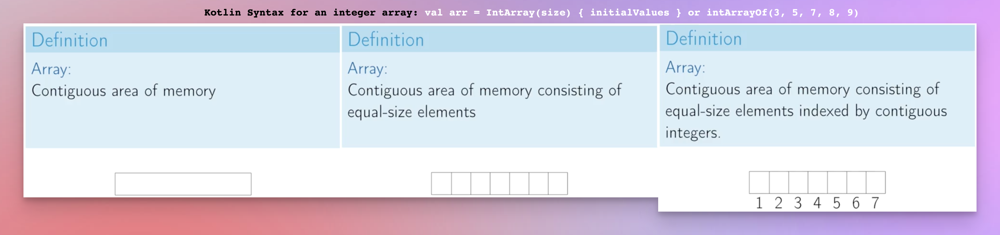
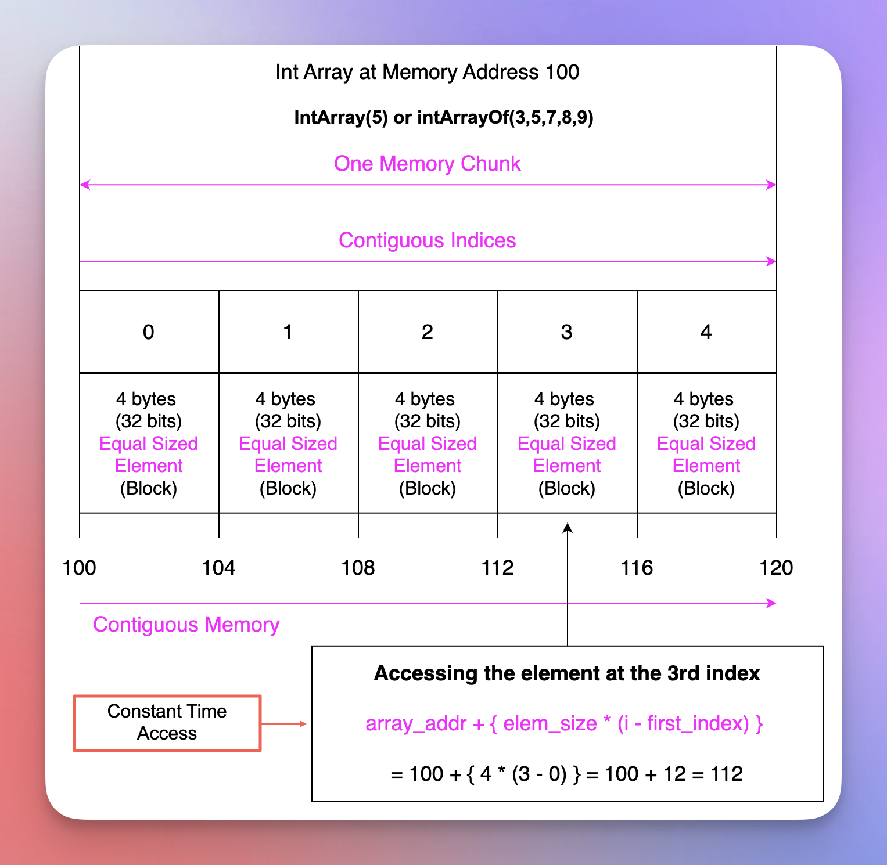
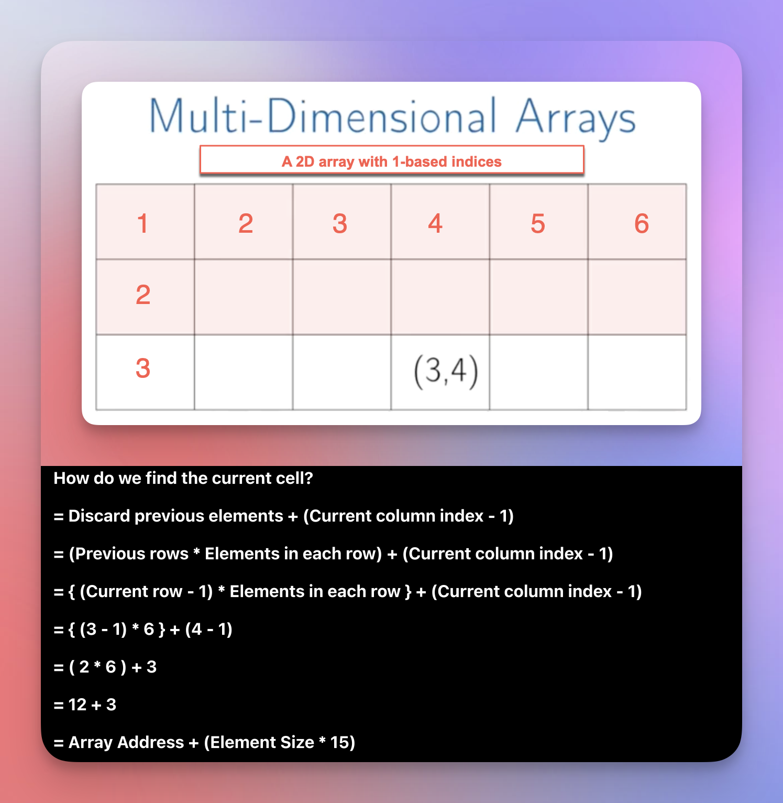
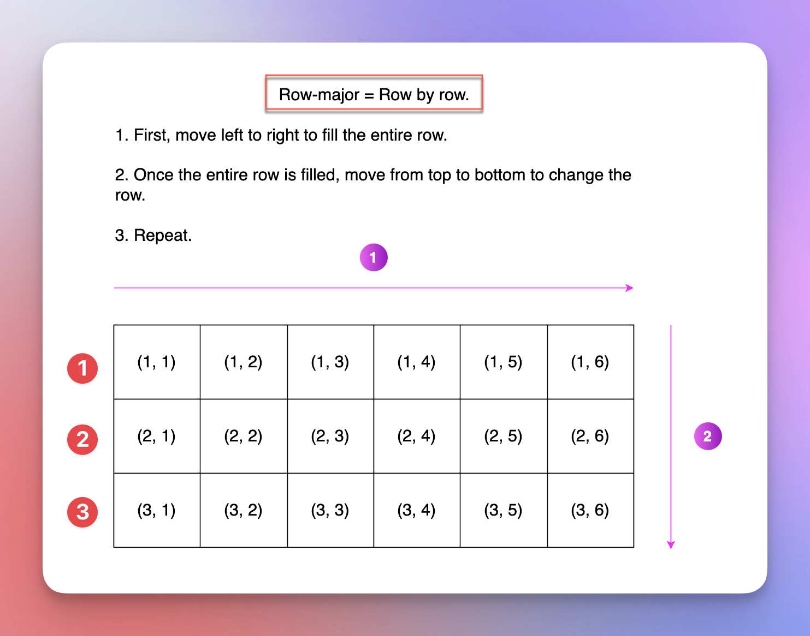
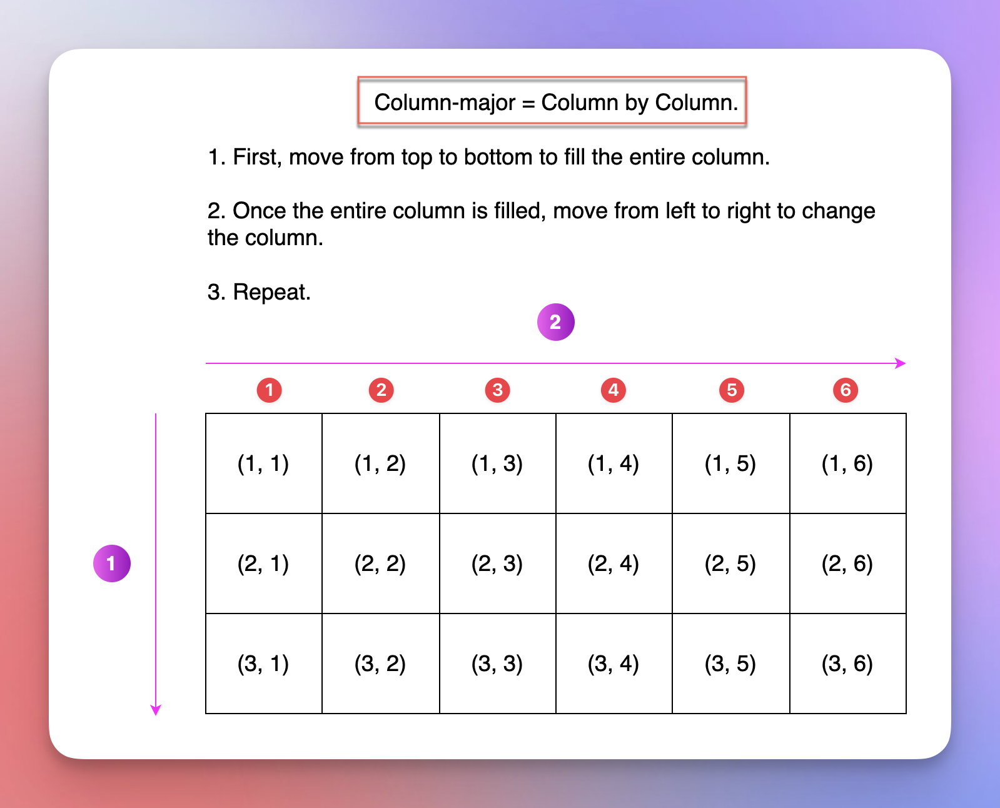
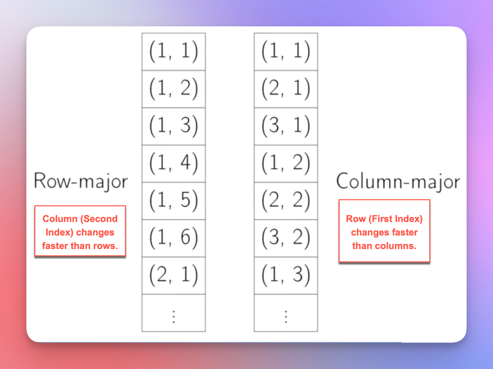
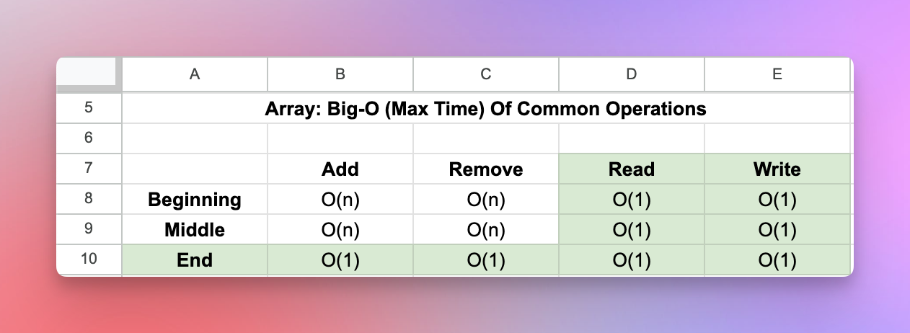

# Arrays

<!-- TOC -->
* [Arrays](#arrays)
  * [Includes](#includes)
  * [Prerequisites](#prerequisites)
  * [References / Resources](#references--resources)
  * [What](#what)
  * [Solves](#solves)
  * [How](#how)
  * [Problem/s](#problems)
  * [Next](#next)
<!-- TOC -->

## Includes

* Which need led us this transition from one data structure to another
* What changes along the way: 
  * The underlying data structure
  * Supported operations
  * Time and space complexity of each supported operation
  * Miscellaneous
* Progressive comparison 
  * Access, find, insert, update, delete, etc. 
  * Best case, average case, worst-case with notes
  * Pros and cons
  * The drawback that the next data structure solves
* Miscellaneous

## Prerequisites

* It is required to study each data structure in detail before jumping onto this revision section.

## References / Resources

* [Google Sheet](https://docs.google.com/spreadsheets/d/12aumAgS5zvI7XryTnDCltWPE4PlpDWswkie7VvgtBwE/edit?usp=sharing)
* 

## What

* In a 2D-Array, the first index represents the row, and the second index represents the column.
* In a row-major 2D-Arrays, the column index changes rapidly.
* In a column-major 2D-Arrays, the row index changes rapidly.

## Solves

* 

## How

* 

## Problem/s

* It is a fixed-sized static array.
* So, once we declare it with certain size, we cannot resize it.
* If we get more elements than what we were supposed to get, we can't add these additional elements, and we might lose the data.
* If we get fewer elements than what we were supposed to get, we waste too much memory - allocated but unused memory.
* To solve this, we use [Dynamic Arrays](#dynamic-arrays).

## Next

* 