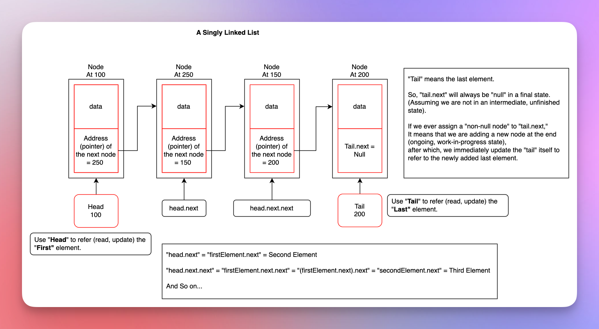

# Linked Lists

## Includes

* Which need led us this transition from one data structure to another
* What changes along the way:
    * The underlying data structure
    * Supported operations
    * Time and space complexity of each supported operation
    * Miscellaneous
* Progressive comparison
    * Access, find, insert, update, delete, etc.
    * Best case, average case, worst-case with notes
    * Pros and cons
    * The drawback that the next data structure solves
* Miscellaneous

## Prerequisites / Previously

* [Arrays.md](010arrays.md)
* [Dynamic Arrays.md](020dynamicArrays.md)

## References / Resources

* 

## What

* We have seen it earlier that contiguous data structures like [Arrays.md](010arrays.md) and [Dynamic Arrays.md](020dynamicArrays.md) causes shifting cost. 
* To eliminate the shifting cost, we take non-contiguous data structure.
* But when we abandon the contiguous structure, we also lose the math that gives us random access in $O(1)$.
* So, to access the data, we rely on the pointers of the head, node, and tail.

* The data itself must hold the memory address of the next data.
* Such a data structure is called a linked list.
* And the block that holds the data, and information of the next block, is called node.
* If the node holds the address of only the next node, then it is a singly linked list.
* If the node holds the address of both the next and the previous node, then it is called doubly linked list.
* We will have the address of the head only.
* The head is the first node.
* We keep the reference of the head through which we can travel through all the other nodes.
* The head will have the address of the next node.
* The next node will have the address of its next node.
* And so on... 
* At some point, the `next` value in a particular node will be null or empty.
* In other words, at some point, we reach a node whose `next` pointer will point to `null`.
* It means that there is no more `next` node.
* That will be the last node.
* So, the node whose `next` pointer points to `null`, is the last node.
* We can keep the last node handy same as the head, but it is optional.
* If we hold and maintain the reference of the last node, we call it the tail.
* With tail, getting the last element (node) is cheap.
* Without tail, to get the last element, we have to travel from the head down to the last node.

## Solves

* No shifting cost when we insert or remove an element.

## How

* Using a non-contagious and pointer based structure.
* Each node holds the memory address of the next node.

## Next (Types)

*  [Singly Linked List Without Tail.md](035singlyLinkedListWithoutTail.md)  
* [Singly Linked List With Tail.md](037singlyLinkedListWithTail.md)  
* [Doubly Linked List Without Tail.md](040doublyLinkedListWithoutTail.md)  
* [Doubly Linked List With Tail.md](045doublyLinkedListWithTail.md)