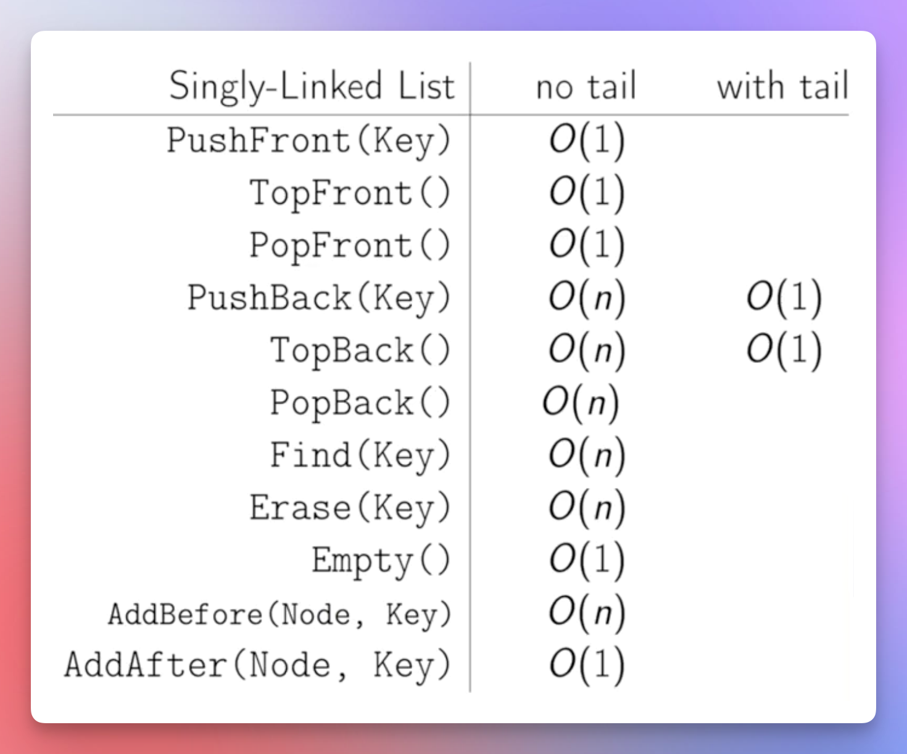

# Singly Linked List Without Tail

<!-- TOC -->
* [Singly Linked List Without Tail](#singly-linked-list-without-tail)
  * [Includes](#includes)
  * [Prerequisites / Previously](#prerequisites--previously)
  * [References / Resources](#references--resources)
  * [What](#what)
  * [Solves](#solves)
  * [How](#how)
  * [Implementation](#implementation)
  * [Problem/s](#problems)
  * [Next](#next)
<!-- TOC -->

## Includes

* Which need led us this transition from one data structure to another
* What changes along the way:
    * The underlying data structure
    * Supported operations
    * Time and space complexity of each supported operation
    * Miscellaneous
* Progressive comparison
    * Access, find, insert, update, delete, etc.
    * Best case, average case, worst-case with notes
    * Pros and cons
    * The drawback that the next data structure solves
* Miscellaneous

## Prerequisites / Previously

* [Arrays](010arrays.md)
* [Dynamic Arrays.md](020dynamicArrays.md)
* [Linked Lists](030linkedLists.md)

## References / Resources

* 

## What

* A non-contagious and pointer based data structure.
* Each node holds the address of the next node through a pointer.

## Solves

* No shifting cost for inserting or removing an element.

## How

* Whenever we insert or remove an element, we change the pointers of a couple of nodes.
* And changing the pointers is $O(1)$ time operation only.

## Implementation

* [Singly Linked List Without Tail.kt](../../../../../src/courses/uc/course02dataStructures/module01/section01arraysAndLinkedLists/video02LinkedLists/03SinglyLinkedList.kt)

## Problem/s

* Inserting an element in the end requires the full traversal from the head to the last node, which is $O(n)$.
* Similarly, getting the last element requires the full traversal from the head down to the last node, which is $O(n)$.
* Removing the last element is also $O(n)$, because it requires getting the last element, which is $O(n)$.
* Inserting an element before a particular node is also $O(n)$, because we have to change the pointer of the future previous node to make it point to this future new node that we are going to insert after it.
* Finding an arbitrary element is $O(n)$ because this is not a contiguous (index based) data structure.
* Similarly, removing an arbitrary element is also $O(n)$, because to remove an element, we first need to find it, which is $O(n)$.

## Next

* [Singly Linked List Without Tail](035singlyLinkedListWithoutTail.md)
* [Singly Linked List With Tail](037singlyLinkedListWithTail.md)
* [Doubly Linked List With Tail](045doublyLinkedListWithTail.md)
* [Queues](050queues.md)
* [Stacks](060stacks.md)
* [Trees](070trees.md)
* [Priority Queues](080priorityQueues.md)
* [Disjoint Sets](090disjointSets.md)
* [Hash Tables](100hashTables.md)
* [Hash Map](105hashMap.md)
* [Hash Set](110hashSet.md)
* [Binary Search Trees](120binarySearchTrees.md)
* [Self Balancing Binary SearchTrees](130selfBalancingBinarySearchTrees.md)
* [AvlTree](135avlTree.md)
* [SplayTree](140splayTree.md)
* [Trie](145trie.md)
* [Graph](200graph.md)
* [Overview](300overview.md)
* [Comparison](comparison.md)
* [Data Structure Questions](dataStructureQuestions.md)
