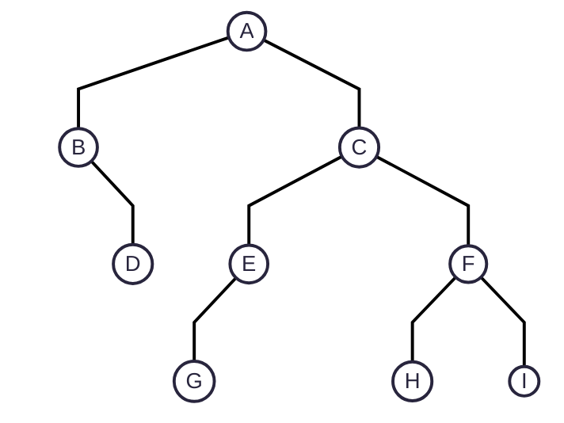

# Tree Data Structure

## Table Of Contents

- [What does it represent?](#what-does-it-represent)
- [Terminologies](#terminologies)
- [Forest](#forest)
- [Tree Definition](#tree-definition)
- [A Degenerate Or Pathological Tree](#a-degenerate-or-pathological-tree)
- [Can a tree have a cycle?](#can-a-tree-have-a-cycle)
- [Nodes at level `l`](#what-are-the-maximum-number-of-nodes-at-level-l-in-a-binary-tree)
- [Real-world examples of tree data structure](#real-world-examples-where-the-tree-data-structure-is-used)
- [Tree Traversal](#tree-traversal)

## What does it represent?

- [A Sentence Structure](#a-sentence-structure)
- [A Syntax Tree For A Mathematical Expression](#a-syntax-tree-for-a-mathematical-expression)
- [Geographical Hierarchy](#geographical-hierarchy)
- [Categorization or Classification (Types & Subtypes)](#categorization-classification-types-and-subtypes-etc)
- [Abstract Syntax Tree For Code](#abstract-syntax-tree-for-code)
- [Binary Search Tree](#binary-search-tree)

### A Sentence Structure

```

             I ate the plum                     
                                            
                                            
                                            
            Sentense                        
                                            
             /   \                          
         1  /     \ 2                       
           /       \                        
          /         \                       
                                            
  Noun Phrase    Verb Phrase                
                                            
   │              /        \                
1  │          1  /          \ 2             
   │            /            \              
   │           /              \             
                                            
   I        Verb          Noun Phrase       
                                            
             │             /        \       
          1  │         1  /          \  2   
             │           /            \     
             │          /              \    
                                            
            ate      Determiner       Noun  
                                            
                        │               │   
                        │               │   
                     1  │               │  1
                        │               │   
                                            
                       the             plum 


```

1. We have this sentence: I ate the plum
2. A sentence can be represented as a grammatical structure.
3. Our sentence has two main parts: Noun Phrase and Verb Phrase.
4. The Noun Phrase has a child, "I".
5. The Verb Phrase has two main parts: Verb and Noun Phrase.
6. The Verb is: ate
7. The noun phrase has two main parts: determiner and noun.
8. The determiner has one child: the
9. The noun has one child: plum
10. So, we represented a sentence structure using a tree.
11. Hence, we can use a tree to represent a structure.

### A Syntax Tree For A Mathematical Expression

```

   2 Sin(3z - 7)        
                        
                        
                        
                        
        x               
                        
      /   \             
  1  /     \ 2          
    /       \           
   /         \          
                        
  2          sin        
                        
              │         
           1  │         
              │         
              │         
                        
              -         
          /        \    
      1  /          \  2
        /            \  
       /              \ 
                        
      x                7
                        
    /   \               
1  /     \  2           
  /       \             
 /         \            
                        
3           z           

```

1. We have this expression: `2 sin(3z - 7)`
2. So, there is a final multiplication between `2` and `sin(3z - 7)`
3. Hence, we can consider multiplication at the root as a final destination (the last operation).
4. So, the root multiplication has two children: `2` and `sin(3z - 7)`.
5. Inside the sine, we have a subtraction between `3z` and `7`.
6. So, sin has one child "minus" and "minus" has two children: `3z` and `7`.
7. 3z is a multiplication between `3` and `z`.
8. If we notice, we keep branching until there are no more children.
9. And if we travel from the bottom to top, we get the original expression.
10. For example, we have a multiplication between `3` and `z` at the bottom. So, it is `3z`.
11. Then, we have a subtraction between `3z` and `7`. So, it becomes `3z - 7`.
12. Then, we have the sine of `3z - 7`. So, it becomes `sin(3z - 7)`.
13. Then, we have multiplication between 2 and the sine value. So, it becomes `2 sin(3z - 7)`, which is the original expression.
14. So, this is how we can use a syntax tree to represent a mathematical expression.

### Geographical Hierarchy

```

Geography Hierarchy

World
├── United States
│   ├── Wyoming
│   │   ├── Jackson
│   │   └── Cheyenne
│   ├── ...
│   └── Alabama
│       ├── Montgomery
│       └── Mobile
├── ...
└── United Kingdom
    ├── Wales
    ├── Scotland
    ├── Northern Ireland
    └── England


```

```

                                        Jackson   
                                                  
                                       /          
                                      /           
                                     /            
                                    /             
                            Wyoming               
                                    \             
                             /       \            
                            /         \           
                           /           \          
                          /                       
                         /              Cheyenne  
           United States    •••••••               
                         \              Montgomery
               /          \                       
              /            \            /         
             /              \          /          
            /                \        /           
           /                         /            
          /                 Alabama               
   World   ••••••••••                \            
          \                           \           
           \                           \          
            \                           \         
             \                                    
              \                         Mobile    
               \                                  
                \                                 
                                                  
          United Kingdom                          
                                                  
         /    / •  \    \                         
        /    /  •   \    \                        
       /    /   •    \    \                       
      /    /    •     \    \                      
     /    /     •      \    \                     
         /              \                         
Wales   /                \   England              
       /                  \                       
      /                    \                      
     /                      \                     
                                                  
 Scotland            Northern Ireland             

```

1. We can represent a hierarchy also.
2. For example, we can have `world` as a root.
3. And then, we can have various `countries` as children. For example, United States and United Kingdom.
4. And then each country can have various `states` within. For example, the United States have various `states` such as Wyoming, Alabama, etc.
5. And then each state can have various `cities` in it. For example, Wyoming has Jackson, Cheyenne, etc.
6. So, we can use a tree data structure to represent a hierarchy.

### Categorization (Classification, Types and Subtypes, etc.)

```

                                Arachnid               
                               /                       
                              /                        
                             /                         
                            /                          
                           /                           
              Invertebrate  ••••••••                   
                           \               Butterflies 
            /               \             /            
           /                 \           /             
          /   Reptile         \         /              
         /                     \       /               
        /    /                  Insect ────────── Flies
       /    /                          \               
      /    /                            \              
     /    /      Amphibian               \             
    /    /                                \            
   /    /       /                          Beetles     
  /    /       /                                       
 /    /       /                                        
             /                                         
A n i m a l   ••••••••••                               
             \                                         
 \    \       \                                        
  \    \       \                                       
   \    \       \                                      
    \    \       Bird                                  
     \    \                                            
      \    \                                           
       \    Fish       Rodents                        
        \             /                                
         \           /                                 
          \         /   Carnivores                     
           \       /   /                               
            \     /   /                                
             \   /   /                                 
                    /                                  
             Mammal ••••••••••                         
                    \                                  
                \    \                                 
                 \    \                                
                  \    \                               
                   \    Primates                       
                    \                                  
                     \                                 
                      \                                
                       Marsupials                      


```

1. We can use a tree to represent categorization, classification, types and subtypes, etc.
2. For example, we can use a tree to represent the Animal classification (types and subtypes).

### Abstract Syntax Tree For Code

```

while (x < 0) {
    x = x + 2
    foo(x)
} 

                          while
                         /     \
                        /       \
            compare op: <         block
              /        \         /     \
             /          \       /       \
         var: x       const: 0 assign   procedure call
                               /    \           /      \
                              /      \         /        \
                          var: x   binop: +  var: foo   var: x
                                    /   \
                                   /     \
                               var: x   const: 2


```

1. To represent a code, we can use a tree.
2. For example, we have a while loop. So, `while` is a root of the tree.
3. Then, we have a `condition` to continue the while loop and the `block` (logic, body).
4. So, the node `while` has two children: The `condition` and the `block`.
5. The `condition` has a comparison operator `<` between `x` and `0`.
6. It means, the `condition` uses the comparison operator `<`, and it has two children: `x` and `0`.
7. Next, we have the `block`. The `block` has two operations. `Assignment` and `function call (= procedure call)`.
8. It means, the `block` has two children: `Assignment` and `Procedure Call`.
9. The `assignment` has left side `x` and right side `x + 2`.
10. It means, the `assignment` node has two children: `x` and `binary operator +`.
11. The node `binary operator +` is applied between `x` and `2`.
12. It means, the `binary operator +` has two children: `x` and `2`.
13. For the `Procedure Call,` we have the function `foo` for which we pass the argument `x`.
14. It means, the `procedure call` has two children: The function call `foo` and the argument `x`.
15. So, this is how we can use an abstract syntax tree to represent a code.

### Binary Search Tree

```
                        Les
                       /   \
                      /     \
                     /       \
                Cathy         Sam
                /   \         /   \
               /     \       /     \
           Alex    Frank  Nancy   Violet
                                   /    \
                                  /      \
                               Tony     Wendy

```

```

              /\          
             /  \         
            /    \        
           /      \       
          /        \      
         /          \     
        /            \    
\      /              \   
 \    /                \  
  \  /                  \ 
   \/                    \


```

1. We can use a binary tree to represent relationships between nodes where a node cannot have more than two children.
2. Here, the node is greater than the left side children and smaller than the right side children.
3. For example, in the given ASCII diagram, the root `Les` comes after (greater than) the left side child, `Cathy`.
4. We can say it another way like: The left side children are smaller (comes before) than the node.
5. Similarly, the node `Les` comes before (smaller than) the right side child, `Sam`.
6. Again, we can say it other way like: The right side children are greater (comes after) than the node.
7. To remember this relationship, we can use the diagram given below the binary search tree.
8. So, it starts with the `greater than` symbol on the left side, moves towards the `root`, and goes down to form the `less than` symbol on the right side.
9. It signifies that the `node` is `greater` than the `left side`, and `smaller` than the `right side`.
10. These predefined rules help us find a child quickly.
11. For example, if we want to find `Tony` and we start from the root node, `Les`.
12. We know that `Tony` comes after `Les`. Hence, we need to travel to the right side of the `Les`.
13. Now, we know that `Tony` comes after `Sam`. So, we go towards the right side of `Sam`.
14. Now, we know that `Tony` comes before `Violet`.  So, we go towards the left side of the `Violet` and we find the target: `Tony`.

## Terminologies:

```
                        Les
                       /   \
                      /     \
                     /       \
                Cathy         Sam
                /   \         /   \
               /     \       /     \
           Alex    Frank  Nancy   Violet
                                   /    \
                                  /      \
                               Tony     Wendy

```

Let us also understand a few terminologies.

### `Node`: 

1. A node has a key, an optional parent, and an optional child or children. 
2. If it does not have a parent node, it is called the `Root Node`. 
3. If it does not have any children, it is called a `Leaf` node.

### `Root Node`:

1. A node that does not have any parent. 
2. The top node of the tree is called the `Root Node`.

### `Key`: 

1. Each node has a key. For example, the node `Les` has the key, `Les`. 
2. Similarly, the node `Wendy` has the key `Wendy`. 
3. A `Key` is a value of a node that we can use to refer a node.

### `Parent`: 

1. Each node has one parent except the root node. 
2. A parent node is a node directly connected with the target node through an edge. 
3. It is just above the target node. 
4. For example, `Cathy` is a parent for `Alex` and `Frank`. 
5. Similarly, `Violet` is a parent for `Tony` and `Wendy`.

### `Children`: 

1. A child node is a node directly connected with a target node through an edge, just below the target node. 
2. Each node can have one or more children. 
3. For a `Binary Search Tree`, a node can have `maximum two children`. 
4. For example, the node `Les` has two direct children: `Cathy` and `Sam`. 
5. Similarly, the node `Violet` has two children: `Tony` and `Wendy`.

### `Siblings`: 

1. All the nodes that has the same parent node, are `siblings` of each other.

### `Ancestor`: 

1. For a particular node, its parent node, the parent's parent node, and so on until we reach to the root node are called `ancestors` of the node. 
2. For example, `Cathy` and `Les` are `ancestors` of `Alex`.

### `Proper Ancestor`:

1. When we do not include the target node itself as an `ancestor` of itself, the remaining `ancestors` are called `Proper Ancestor` of the node.
2. For example, `Sam` and `Les` are `ancestors` of `Sam`. But only `Les` is a `Proper Ancestor` of `Sam`. 

### `Descendants`: 

1. For a particular node, its children node, the children's children node, and so on until we reach to the bottom of the tree after which there are no more children, are called `descendants` of the node. 
2. For example, `Cathy`, `Alex`, `Tony`, (basically, all the nodes) are `descendants` of the root node, `Les`.
3. `Tony` and `Wendy` are `descendants` of `Sam`.
4. `Alex` and `Frank` are `descendants` of `Les`.

### `Proper Descendants`:

1. When we do not include the node itself as a `descendant` of itself, the remaining `descendants` are called `Proper Descendants` of the node.
2. For example, `Violet`, `Tony`, and `Wendy` are `descendants` of `Violet`. But, only `Tony` and `Wendy` are `proper descendants` of `Violet`. 

### `Subtree`:

1. Any node and all its descendants form a subtree.
2. For example, `Sam` and its descendants form a subtree.

### `Leaf`: 

1. A node that does not have any children is called a `Leaf`. 
2. For example, `Alex`, `Frank`, `Nancy`, `Tony`, and `Wendy`.

### `Internal Nodes` or `Interior Nodes`:

1. All the nodes that have children are called `Internal Nodes` or `Interior Nodes`. 
2. So, `Les`, `Cathy`, `Sam`, and `Violet` are `Internal Nodes`. 
3. Another way to remember it is, all the nodes that are `non-leaf`, are called `Internal Nodes`.

### `Height`: 

1. How far down from the target node? The answer gives us height for the node. 
2. The distance between the target node and the leaf is height of the target node. 
3. To calculate height of a particular node, we go downwards. 
4. We can also say that the height of a particular node is number of edges between the node and the leaf. 
5. For example, there are two edges between the node `Sam` and the farthest down leaf node, `Tony` or `Wendy`. 
6. Hence, the height of the node, `Sam` is 2. 
7. Similarly, the height of the node `Cathy` is 1 because there is only 1 edge between the node `Cathy` and the farthest down, longest path down to a leaf node (`Alex` or `Frank`).

### `Depth`: 

1. Number of edges between the root node and the target node. 
2. Here, we go upside towards the root node. 
3. For example, the depth of the leaf node, `Tony` is `3` because there are 3 `edges` between the target node, `Tony` and the root node, `Les`.

### `Level`: 

1. If we consider that the root node is at level 1, then level of any node is `1 + Number of edges between the root and the target node`. 
2. However, `Number of edges between the root node and the target node = Depth`. So, `Level = 1 + Depth`. 
3. For example, the level of the target node, `Frank`, is `1 + Depth` = `1 + Number of edges between the root node and the target node` = `1 + 2` = `3`. 
4. The level of the root node, `Les` is 1, because it is the root node. 
5. However, some resources use 0-based level where the root node is considered at level 0. 
6. In that case, a level of any node is equal to the number of edges between the root and the target node. 
7. In short, `Level` is either `1 + depth` or equal to `depth`.

### `Size`: 

1. The size of a tree is equal to (defined as) the `total number of nodes` in the tree.
2. We calculate it recursively as: `1 (the size of the current node) + the size of the left-tree + the size of the right-tree`.

## How to remember the difference between the height, the depth, and the level? 

### `Height`: 

1. Imagine that we are at the 5th floor of a building, and we want to see the height between the 5th floor and the ground. 
2. So, we look at the downside, towards the ground to understand the height.
3. Number of edges from the target node to the leaf node.

### `Depth`: 

1. Imagine we are at the bottom of a well. 
2. Now, we look upside to learn how deep we have come.
3. Number of edges from the root node to the target node.

### `Level`:

1. Either `1 + Depth` or `Depth`.
2. If we consider root level `1`, then it is `1 + Depth`.
3. If we consider root level `0`, then it is `0 + Depth` = `Depth`.

## Forest

```
        Kate                   Sally
      /      \                   ╷  
     /        \                  ╷  
    /          \                 ╷  
   /            \                ╷  
  /              \               ╷  
                                    
Sam             Hugh            Jim 


```

* Multiple root nodes form a forest, where each root node represents an individual tree.
* A forest is a collection of multiple disjoint trees.

## Tree Definition

1. A tree is a hierarchical data structure that contains one or more nodes where each node must have a key, an optional parent, and an optional child or children nodes.
2. A tree is an acyclic data structure. It means, a tree cannot have a cycle.
3. If a tree has a cycle, it becomes a graph data structure.

## A Degenerate or Pathological Tree

1. A degenerate tree is a tree where each parent has only one child, making it a linked list.

## Can a tree have a cycle?

1. No. A tree cannot have a cycle by definition.
2. A tree with a cycle becomes a graph data structure.

## What are the maximum number of nodes at level `l` in a binary tree?

1. `2^l` (Where root level is considered as 0).

## Real world examples where the tree data structure is used.

1. File Systems (Directory Structure).
2. HTML / XML DOM (Document Object Model) Trees (Tags inside Tags).
3. Organization Charts.
4. Database Indexing (B-trees).
5. Expression Parsing (Syntax trees).
6. Routing Algorithms (trie, prefix trees).

## Tree Traversal



### Depth-First

1. We completely travel and finish one subtree before starting a sibling traversal.
2. For example, we may travel A-B-D (finishing one subtree) followed by C-E-G, F-H, and I.
3. However, there are 3 different ways (rules, orders) to finish one subtree.
4. `In-Order`, `Pre-Order`, and `Post-Order`.
5. As we know, the main parts of a node are the `Root`, `Left`, and `Right` sides.
6. These order names indicate the order of the `Root` part.
7. For example, the `In-Order` sequence for the travelling is: `Left-Root-Right`. So, the `Root` comes inside `Left` and `Right`.
8. Then, we have the `Pre-Order` sequence where the `Root` comes before the `Left` and the `Right` sides. So, it becomes: `Root-Left-Right`.
9. Finally, we have the `Post-Order` sequence where the `Root` comes after the `Left` and the `Right` sides. So, it becomes `Left-Right-Root`.
10. We will study each order in detail.

### Breadth-Search

1. Here, we travel level-by-level.
2. So, first we finish travelling with all the siblings.
3. And then, we gradually move towards the last level.
4. For example, we may travel in this order: A-B-C-D-E-F-G-H-I.

#### In-Order (Left-Root-Right)

##### Resources:

[Jenny's Lecture](https://youtu.be/-b2lciNd2L4?si=tB3crtV88O9ncEuu)

1. `Root` comes inside the `Left` and the `Right` sides.
2. So, the order becomes: `Left-Root-Right`.
3. Hence, the `in-order` traversal for the given example will be as below:
4. We start with the root node, `A`. Does it have the `Left` side? Yes.
5. The `in-order` sequence prioritizes the `Left` side first, before the `Root` part.
6. So, we continue the depth traversal.
7. The root node `A` has two children. `B` and `C`.
8. The `in-order` sequence prioritizes the `left` part first.
9. So, we traverse through the left side, `B`. Does it have the `Left` side? No. 
10. So, now we can consider `B`. ------------------------------------------------------------------------------(1).
11. Node `B` does not have the `Left` side. So, we considered `B`. Now, does it have the `Right` side? Yes.
12. So, now we consider the right side of `B`, which is `D`.
13. Hence, it becomes: `B -- D`. ------------------------------------------------------------------------------(2).
14. As the `Right` side of `B` is finished, we can move backward.
15. The subtree `B` is covered. So, we move backward (upward).
16. The subtree `B` was the `Left` side of the `Root` node, `A`.
17. It means we have finished the `Left` part of the `Left-Root-Right` for the `Root` node, `A`.
18. So, now comes the turn of the `Root` node, `A`.
19. Hence, it becomes: `B -- D -- A`. -------------------------------------------------------------------------(3).
20. For the root node `A`, we have covered the `Left-Root` parts of the `Left-Root-Right` sequence.
21. Now, we need to cover the `Right` side of the root node, `A`.
22. So, we start with `C`. Does `C` have `Left` side? Yes. 
23. We know that we need to take the left side before taking the root. Right?
24. So, we travel towards the left side of the `C`.
25. We get `E`. Does it have a left side? Yes.
26. So, we travel to the left side of `E`. 
27. We get `G`. Does it have a left side? No. 
28. So, we calculate `G`.
29. Hence, it becomes: `B -- D -- A -- G`. --------------------------------------------------------------------(4).
30. `G` does not have any children. So, we move backward (upward).
31. We get `E`. Can we take it? Yes. Why? Because we have already covered its left side.
32. So, now it becomes: `B -- D -- A -- G -- E`. --------------------------------------------------------------(5).
33. Does `E` have the right side? No.
34. So, we move backward (upward).
35. We get `C`. Should we take it? Yes. Why? Because we have already covered the left side of `C`.
36. So, it becomes: `B -- D -- A -- G -- E -- C`. -------------------------------------------------------------(6).
37. What is next? We have covered the left side of `C`, the root `C`, and now, we need to cover the right side of `C`.
38. So, we travel to the right side of `C`.
39. We get `F`. Should we take it? Well, does it have a left side? If yes, the left side will get the priority. 
40. We get `H`. Should we take it? Well, does it have a left side? If not, then only we can take it.
41. `H` does not have a left side. So, we can take it.
42. So, it becomes: `B -- D -- A -- G -- E -- C -- H`. --------------------------------------------------------(7).
43. What is next? Does `H` have a right side? No. So, we can move backward (upward).
44. We get `F`. Should we take it? Well, did we cover the left side of it? Yes. Then, we can take it.
45. So, it becomes: `B -- D -- A -- G -- E -- C -- H -- F`. ----------------------------------------------(8).
46. What is next? Did we cover the right side of `F`? No. So, let us cover it.
47. We get `I`. Should we take it? Well, did we cover the left side of it? It does not have any. Then, we can take it.
48. So, it becomes: `B -- D -- A -- G -- E -- C -- H -- F -- I`. -----------------------------------------(9).
49. What is next? Did we cover the right of `I`? Well, it does not have any. So, we can move backward (upward).
50. We have already taken F, C, and A.
51. All the subtrees have been covered. The entire tree has been covered.
52. We travelled and covered one subtree after another.
53. And the path we travelled is:
54. `B -- D -- A -- G -- E -- C -- H -- F -- I`. ----------------------------------------------(10).

#### Pre-Order (Root-Left-Right)

#### Post-Order (Left-Right-Root)